---
## Front matter
lang: ru-RU
title: Лабороторная работа №1
author:
  - Кичигина Полина Евгеньевна
institute:
  - Российский университет дружбы народов, Москва, Россия
date: 05 марта 2025

## i18n babel
babel-lang: russian
babel-otherlangs: english

## Formatting pdf
toc: false
toc-title: Содержание
slide_level: 2
aspectratio: 169
section-titles: true
theme: metropolis
header-includes:
 - \metroset{progressbar=frametitle,sectionpage=progressbar,numbering=fraction}
---

## Цель

- Целью данной работы является приобретение практических навыков установки операционной системы на виртуальную машину, настройки минимально необходимых для дальнейшей работы сервисов.

## Задание

- Установка операционной системы на виртуальную машину, настройки минимально необходимых для дальнейшей работы сервисов.

## Установка Fedora Sway

Установим дистрабутив Fedora  Sway на виртуальную машину скачав с сайта

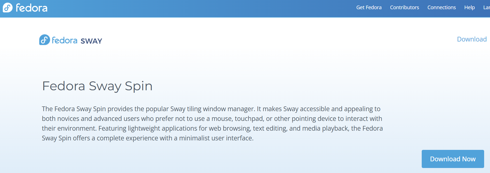{#fig:001 width=70%}

## Установка Fedora Sway

Создаем и настраиваем виртуальную машину

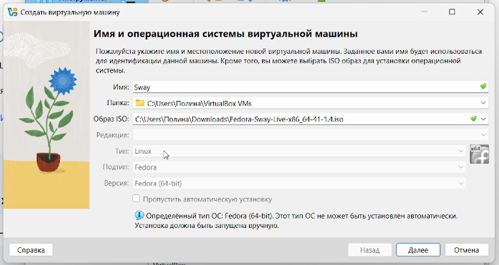{#fig:002 width=70%}

## Установка Fedora Sway

В терминале запустите liveinst

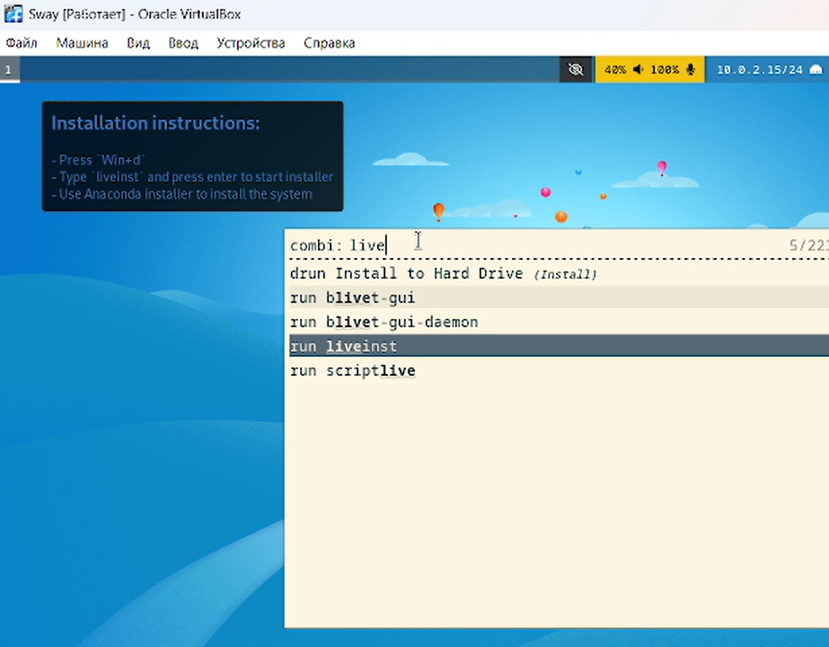{#fig:003 width=50%}

## Запуск приложения для установки системы

Установите средства разработки и обновите все пакеты

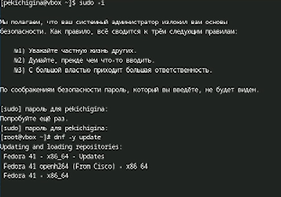{#fig:004 width=50%}

## Автоматическое обновление 

Установка программного обеспечения

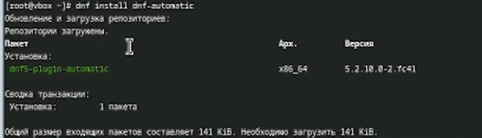{#fig:005 width=70%}

## Автоматическое обновление

Запустите таймер

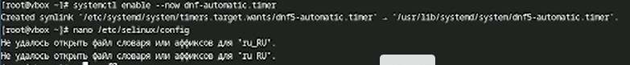{#fig:006 width=70%}

## Отключение SELinux 

В файле замените значение

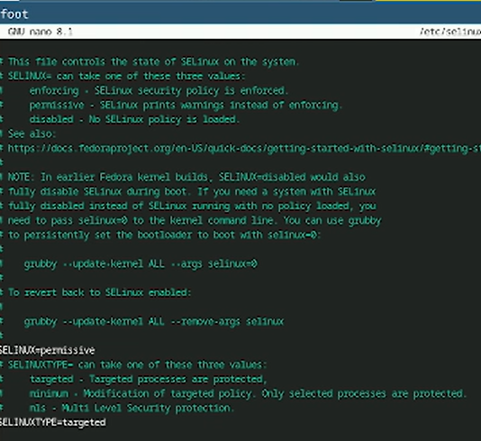{#fig:007 width=40%}

## Настройка расскладки клавиатуры

Создайте конфигурационный файл и отредактируйте его

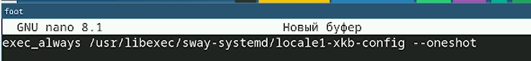{#fig:008 width=70%}

## Настройка расскладки клавиатуры

Отредактируйте конфигурационный файл

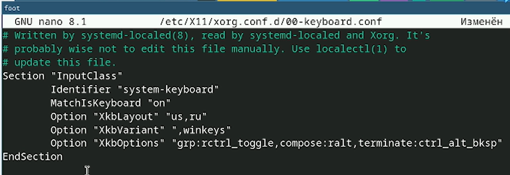{#fig:009 width=70%}

## Установка имени пользователя и название хоста

Создайте пользователя, задайте пароль для пользователя и установите имя хоста

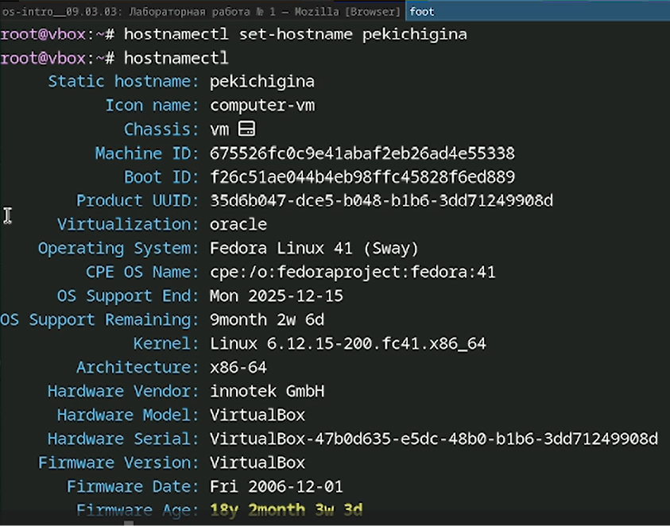{#fig:010 width=40%}

## Установка программного обеспечения для создания документации

Устанавливаем pandoc

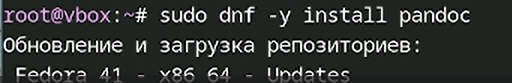{#fig:011 width=70%}

## Работа с языком разметки Markdown

Устанавливаем pandoc-crossref вручную

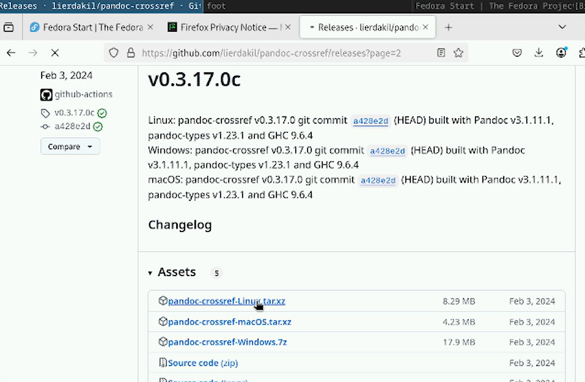{#fig:012 width=50%}

## Работа с языком разметки Markdown

Скачайте соответствующую версию, распакуйте архивы и поместите их в каталог user/local/bin

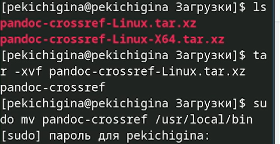{#fig:013 width=70%}

## texlive

Установим дистрибутив TeXlive

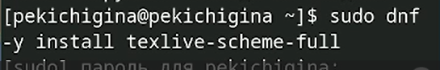{#fig:014 width=70%}

## {.standout}

Спасибо за внимание!
