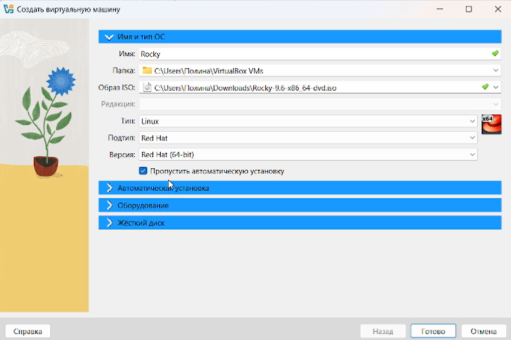
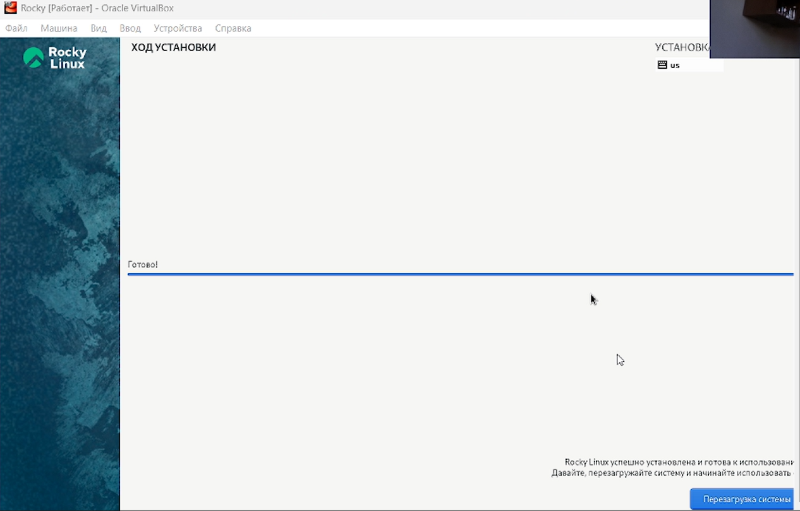
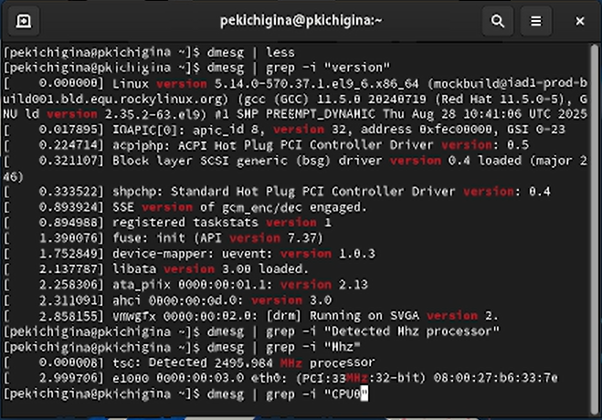

---
## Front matter
lang: ru-RU
title: Лабороторная работа № 1
author:
  - Кичигина Полина Евгеньевна
institute:
  - Российский университет дружбы народов, Москва, Россия
date: 06 сентября 2025

## i18n babel
babel-lang: russian
babel-otherlangs: english

## Formatting pdf
toc: false
toc-title: Содержание
slide_level: 2
aspectratio: 169
section-titles: true
theme: metropolis
header-includes:
 - \metroset{progressbar=frametitle,sectionpage=progressbar,numbering=fraction}
---

## Цель работы

Целью данной работы является приобретение практических навыков установки операционной системы на виртуальную машину, настройки минимально необходимых для
дальнейшей работы сервисов.

## Выполнение лабораторной работы

 Установим дистрабутив Rocky  на виртуальную машину скачав с сайта. Создаем и настраиваем виртуальную машину

{#fig:001 width=50%}

## Настраиваем образ установки 

{#fig:002 width=70%}

## Ждем установку 

{#fig:003 width=70%}

## Подключаем образ дополнительной гостевой ОС 

{#fig:004 width=70%}

# Домашнее задание 

Получите следующую информацию.
1. Версия ядра Linux (Linux version).
2. Частота процессора (Detected Mhz processor).
3. Модель процессора 

{#fig:005 width=45%}

## Объем доступной оперативной памяти (Memory available).
5. Тип обнаруженного гипервизора (Hypervisor detected).
6. Тип файловой системы корневого раздела.
7. Последовательность монтирования файловых систем

{#fig:006 width=45%}

## Выводы

Мы приобретели практических навыков установки операционной системы на виртуальную машину, настройки минимально необходимых для дальнейшей работы сервисов.

## {.standout}

Спасибо за внимание!
