---
## Front matter
title: " Отчёт по лабораторной работе №1"
subtitle: "Отчет"
author: "Кичигина Полина Евгеньевна"

## Generic otions
lang: ru-RU
toc-title: "Содержание"

## Bibliography
bibliography: bib/cite.bib
csl: pandoc/csl/gost-r-7-0-5-2008-numeric.csl

## Pdf output format
toc: true # Table of contents
toc-depth: 2
lof: true # List of figures
lot: true # List of tables
fontsize: 12pt
linestretch: 1.5
papersize: a4
documentclass: scrreprt
## I18n polyglossia
polyglossia-lang:
  name: russian
  options:
	- spelling=modern
	- babelshorthands=true
polyglossia-otherlangs:
  name: english
## I18n babel
babel-lang: russian
babel-otherlangs: english
## Fonts
mainfont: IBM Plex Serif
romanfont: IBM Plex Serif
sansfont: IBM Plex Sans
monofont: IBM Plex Mono
mathfont: STIX Two Math
mainfontoptions: Ligatures=Common,Ligatures=TeX,Scale=0.94
romanfontoptions: Ligatures=Common,Ligatures=TeX,Scale=0.94
sansfontoptions: Ligatures=Common,Ligatures=TeX,Scale=MatchLowercase,Scale=0.94
monofontoptions: Scale=MatchLowercase,Scale=0.94,FakeStretch=0.9
mathfontoptions:
## Biblatex
biblatex: true
biblio-style: "gost-numeric"
biblatexoptions:
  - parentracker=true
  - backend=biber
  - hyperref=auto
  - language=auto
  - autolang=other*
  - citestyle=gost-numeric
## Pandoc-crossref LaTeX customization
figureTitle: "Рис."
tableTitle: "Таблица"
listingTitle: "Листинг"
lofTitle: "Список иллюстраций"
lotTitle: "Список таблиц"
lolTitle: "Листинги"
## Misc options
indent: true
header-includes:
  - \usepackage{indentfirst}
  - \usepackage{float} # keep figures where there are in the text
  - \floatplacement{figure}{H} # keep figures where there are in the text
---

# Цель работы

Целью данной работы является приобретение практических навыков установки операционной системы на виртуальную машину, настройки минимально необходимых для дальнейшей работы сервисов.

# Задание

Установка операционной системы на виртуальную машину, настройки минимально необходимых для дальнейшей работы сервисов.

# Выполнение лабораторной работы
1. Установим дистрабутив Fedora  Sway на виртуальную машину скачав с сайта(рис. [-@fig:001])

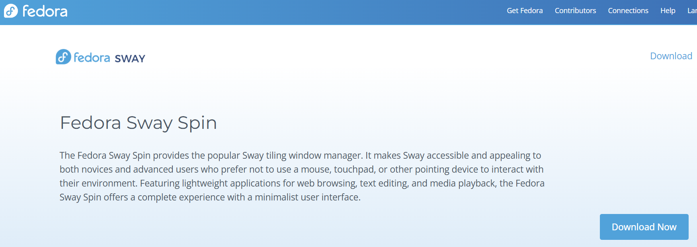{#fig:001 width=70%}

2. Создаем и настраиваем виртуальную машину(рис. [-@fig:002])

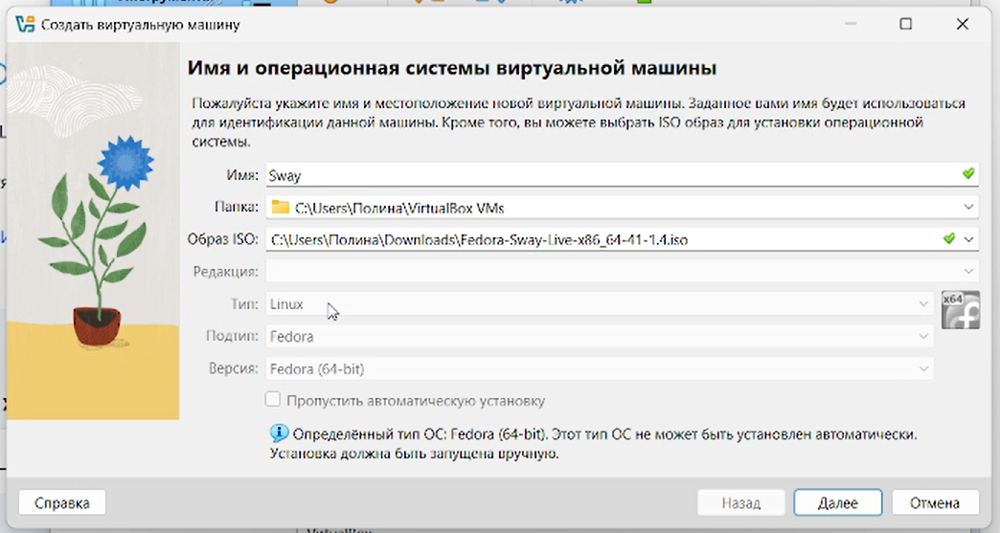{#fig:002 width=70%}

3. В терминале запустите liveinst(рис. [-@fig:003])

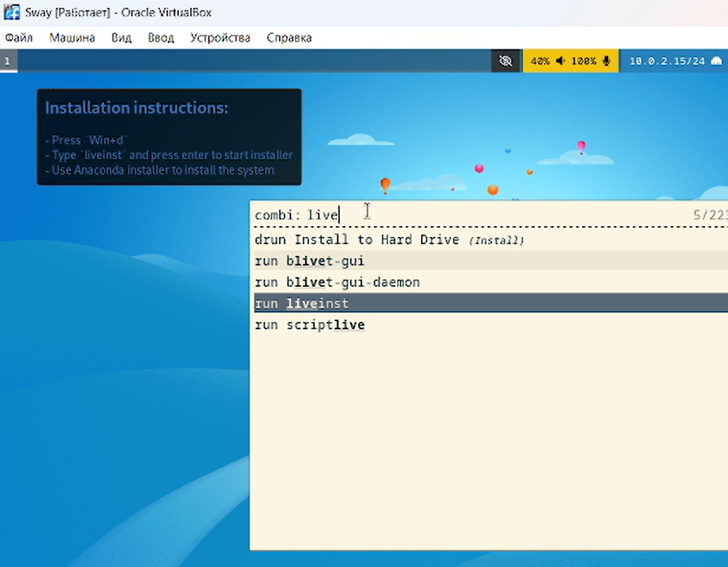{#fig:003 width=70%}

4. Установите средства разработки и обновите все пакеты(рис. [-@fig:004])

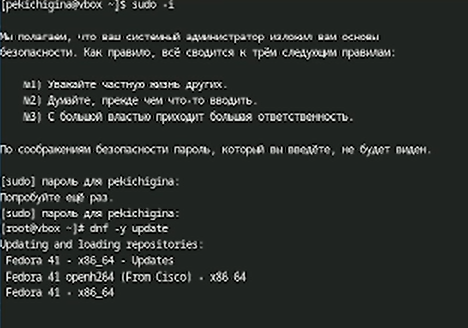{#fig:004 width=70%}

5. Установка программного обеспечения(рис. [-@fig:005])

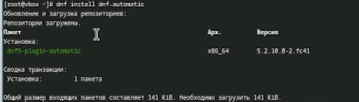{#fig:005 width=70%}

6. Запустите таймер(рис. [-@fig:006])

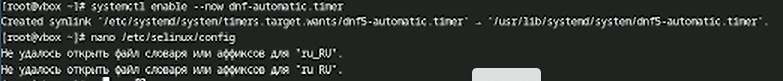{#fig:006 width=70%}

7. В файле замените значение(рис. [-@fig:007])

{#fig:007 width=70%}

8. Создайте конфигурационный файл и отредактируйте его(рис. [-@fig:008])

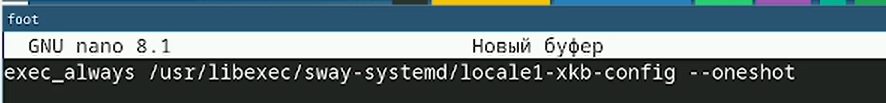{#fig:008 width=70%}

9. Отредактируйте конфигурационный файл(рис. [-@fig:009])

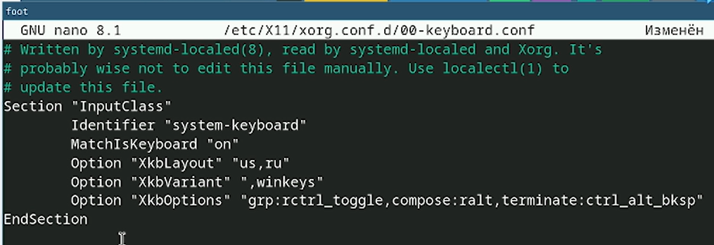{#fig:009 width=70%}

10. Создайте пользователя, задайте пароль для пользователя и установите имя хоста(рис. [-@fig:010])

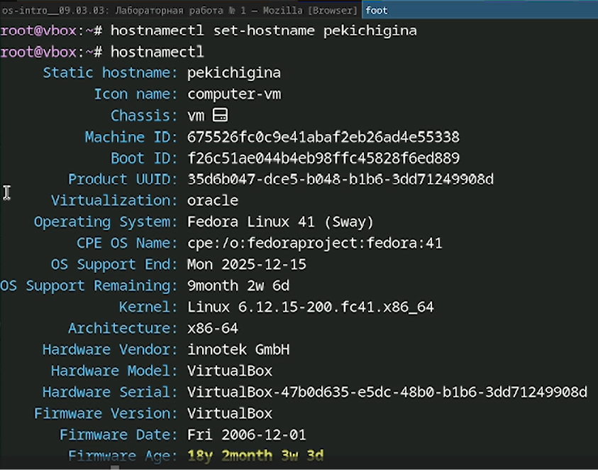{#fig:010 width=70%}

11. Устанавливаем pandoc(рис. [-@fig:011])

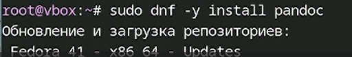{#fig:011 width=70%}

12. Устанавливаем pandoc-crossref вручную(рис. [-@fig:012])

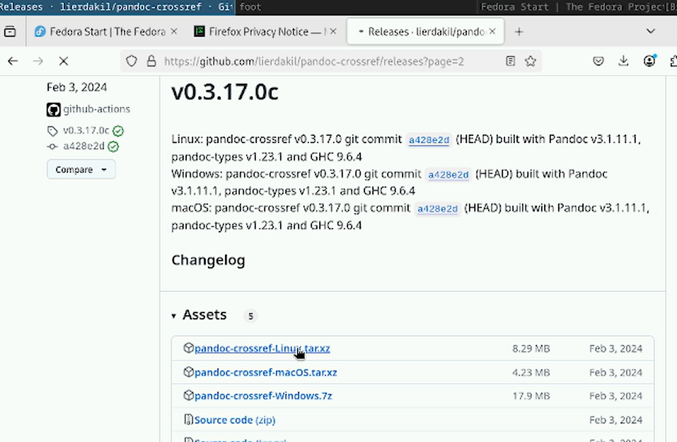{#fig:012 width=70%}

13. Скачайте соответствующую версию, распакуйте архивы и поместите их в каталог user/local/bin(рис. [-@fig:013])

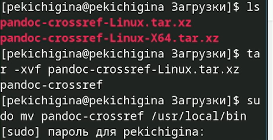{#fig:013 width=70%}

14. Установим дистрибутив TeXlive(рис. [-@fig:014])

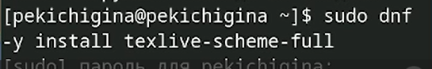{#fig:014 width=70%}

# Домашнее задание 

Получите следующую информацию

1. Версия ядра Linux

У меня версия 6.12.15-200.fc41.x86_64(рис. [-@fig:015])

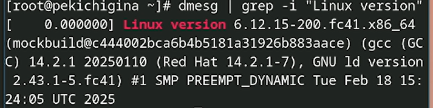{#fig:015 width=70%}

2. Частота процессора

Моя частота 2495.982 MHz(рис. [-@fig:016])

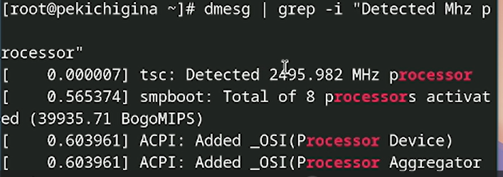{#fig:016 width=70%}

3. Модель процессора

Моя модель intel core i5(рис. [-@fig:017])

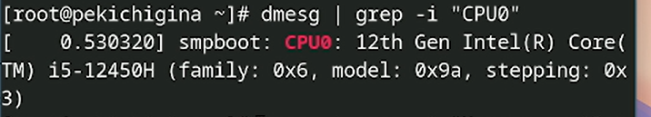{#fig:017 width=70%}

4. Объём доступной оперативной памяти

У меня 807392К(рис. [-@fig:018])

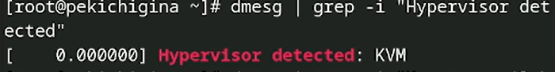{#fig:018 width=70%}

5. Тип обнаруженного гипервизора 

У меня это KMV(рис. [-@fig:019])

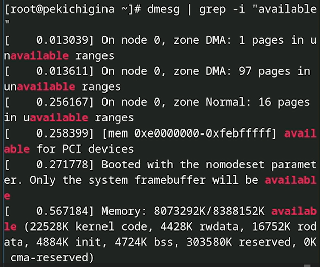{#fig:019 width=70%}

6. Тип файловой системы корневого раздела и последовательность монтирования файловых систем

Тип файловой системы корневого раздела это BTRFS, последовательность: сначала BTRFS, потом EXT4(рис. [-@fig:020])

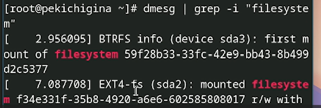{#fig:020 width=70%}

# Контрольные вопросы

Ответы:

1. Имя пользователя, пароль, домашний каталог.
2. 
для получения справки по команде man ls
для перемещения по файловой системе cd ~/home/pekichigina
для просмотра содержимого каталога ls 
для определения объёма каталога du
для создания / удаления каталогов / файлов  mkdir, touch / rmdir /
для задания определённых прав на файл / каталог chomod
для просмотра истории команд history
3. Способ организации и хранения файлов.
EXT4: Стандартная для Linux, надежная, быстрая.
BTRFS: Современная, поддерживает снапшоты, копирование при записи.
FAT32: Для переносимых устройств, ограничение размера файлов.
NTFS: Стандартная для Windows.
4. mount, df -h
5. kill 

# Выводы

Мы приобрели практические навыки установки операционной системы на виртуальную машину, настройки минимально необходимых для дальнейшей работы сервисов.

