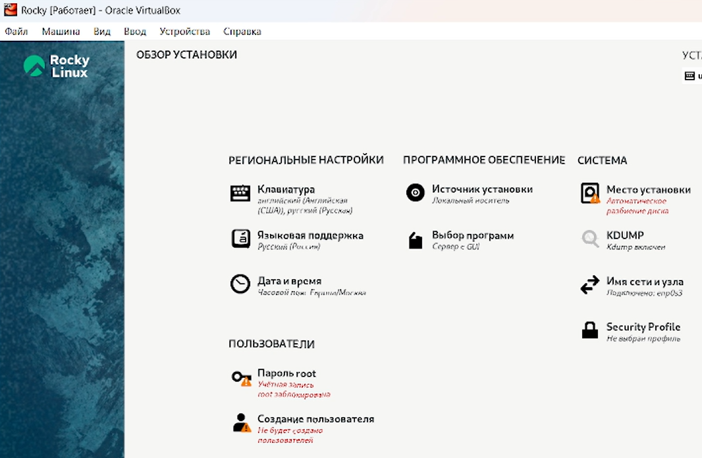
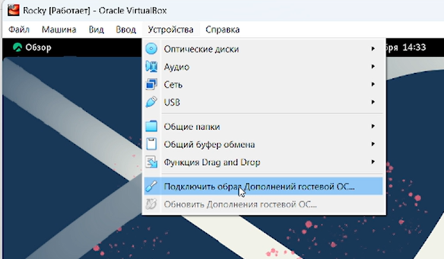
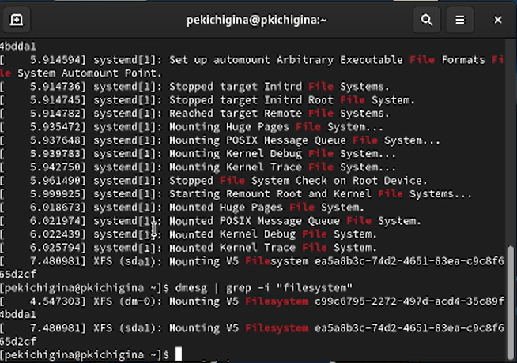

---
## Front matter
title: " Отчёт по лабораторной работе №1"
subtitle: "Отчет"
author: "Кичигина Полина Евгеньевна"

## Generic otions
lang: ru-RU
toc-title: "Содержание"

## Bibliography
bibliography: bib/cite.bib
csl: pandoc/csl/gost-r-7-0-5-2008-numeric.csl

## Pdf output format
toc: true # Table of contents
toc-depth: 2
lof: true # List of figures
lot: true # List of tables
fontsize: 12pt
linestretch: 1.5
papersize: a4
documentclass: scrreprt
## I18n polyglossia
polyglossia-lang:
  name: russian
  options:
	- spelling=modern
	- babelshorthands=true
polyglossia-otherlangs:
  name: english
## I18n babel
babel-lang: russian
babel-otherlangs: english
## Fonts
mainfont: IBM Plex Serif
romanfont: IBM Plex Serif
sansfont: IBM Plex Sans
monofont: IBM Plex Mono
mathfont: STIX Two Math
mainfontoptions: Ligatures=Common,Ligatures=TeX,Scale=0.94
romanfontoptions: Ligatures=Common,Ligatures=TeX,Scale=0.94
sansfontoptions: Ligatures=Common,Ligatures=TeX,Scale=MatchLowercase,Scale=0.94
monofontoptions: Scale=MatchLowercase,Scale=0.94,FakeStretch=0.9
mathfontoptions:
## Biblatex
biblatex: true
biblio-style: "gost-numeric"
biblatexoptions:
  - parentracker=true
  - backend=biber
  - hyperref=auto
  - language=auto
  - autolang=other*
  - citestyle=gost-numeric
## Pandoc-crossref LaTeX customization
figureTitle: "Рис."
tableTitle: "Таблица"
listingTitle: "Листинг"
lofTitle: "Список иллюстраций"
lotTitle: "Список таблиц"
lolTitle: "Листинги"
## Misc options
indent: true
header-includes:
  - \usepackage{indentfirst}
  - \usepackage{float} # keep figures where there are in the text
  - \floatplacement{figure}{H} # keep figures where there are in the text
---

# Цель работы

Целью данной работы является приобретение практических навыков установки операционной системы на виртуальную машину, настройки минимально необходимых для
дальнейшей работы сервисов.

# Выполнение лабораторной работы

1. Установим дистрабутив Rocky  на виртуальную машину скачав с сайта. Создаем и настраиваем виртуальную машину(рис. [-@fig:001])

{#fig:001 width=70%}

2. Настраиваем образ установки (рис. [-@fig:002])

{#fig:002 width=70%}

3. Ждем установку (рис. [-@fig:003])

{#fig:003 width=70%}

4. Подключаем образ дополнительной гостевой ОС (рис. [-@fig:004])

{#fig:004 width=70%}

# Домашнее задание 

Дождитесь загрузки графического окружения и откройте терминал. В окне терминала проанализируйте последовательность загрузки системы, выполнив команду dmesg.

Получите следующую информацию.
1. Версия ядра Linux (Linux version).
2. Частота процессора (Detected Mhz processor).
3. Модель процессора (CPU0).(рис. [-@fig:005])

{#fig:005 width=70%}

4. Объем доступной оперативной памяти (Memory available).
5. Тип обнаруженного гипервизора (Hypervisor detected).
6. Тип файловой системы корневого раздела.
7. Последовательность монтирования файловых систем.(рис. [-@fig:006])

{#fig:006 width=70%}

# Контрольные вопросы

Ответы:

1. Команды терминала и примеры:
Получение справки: Команда man [команда] или [команда] --help предоставит подробную информацию о любой команде.
Перемещение по файловой системе: Команда cd [путь]позволяет перемещаться между каталогами, cd .. поднимает на уровень выше, а cd ~возвращает в домашний каталог.
Просмотр содержимого каталога: ls показывает список файлов и каталогов, а ls -lпредоставляет детальную информацию о них.
Определение объёма каталога:Команда du -sh [путь_к_каталогу] покажет общий размер каталога в удобочитаемом формате.
Создание / удаление каталогов / файлов: mkdir и rmdir создают и удаляют каталоги (последний только пустые), touch создает файлы, а rm удаляет файлы или каталоги (с опцией -r).
Задание определённых прав на файл / каталог: Команда chmod [права] [файл/каталог]изменяет права доступа к файлам и каталогам, например chmod 644 myfile.txt.
Просмотр истории команд:Команда history отображает список ранее введенных команд.

2. Информация в учётной записи пользователя и команды:
Учётная запись пользователя включает имя, ID, домашний каталог, оболочку и членство в группах, а команды id [имя_пользователя] и whoami позволяют просмотреть эту информацию.

3. Файловая система:
Файловая система — это структура организации данных на диске, например ext4, XFS или NTFS, определяющая, как файлы хранятся и доступны.

4. Просмотр смонтированных файловых систем:
Команды mount и df -hпоказывают, какие файловые системы в данный момент доступны в операционной системе.

5. Удаление зависшего процесса:
Зависший процесс удаляется с помощью команды kill [PID], а при необходимости более принудительно — kill -9 [PID], предварительно определив его PID командами psили pgrep.

# Выводы

Мы приобретели практических навыков установки операционной системы на виртуальную машину, настройки минимально необходимых для дальнейшей работы сервисов.

