---
## Front matter
lang: ru-RU
title: Лабораторная работа №2
author:
  - Кичигина Полина Евгеньевна
institute:
  - Российский университет дружбы народов, Москва, Россия
date: 06 марта 2025

## i18n babel
babel-lang: russian
babel-otherlangs: english

## Formatting pdf
toc: false
toc-title: Содержание
slide_level: 2
aspectratio: 169
section-titles: true
theme: metropolis
header-includes:
 - \metroset{progressbar=frametitle,sectionpage=progressbar,numbering=fraction}
---

## Цель работы

Изучить идеологию и применение средств контроля версий.
Освоить умения по работе с git.

## Задание

  
  Создать базовую конфигурацию для работы с git.
  Создать ключ SSH.
  Создать ключ PGP.
  Настроить подписи git.
  Зарегистрироваться на Github.
  Создать локальный каталог для выполнения заданий по предмету.

## Выполнение лабораторной работы

 Установка git и gh 

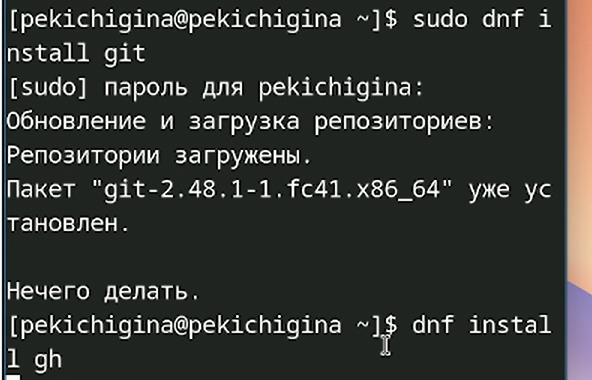{#fig:001 width=50%}

## Базовая настройка git

 Зададим имя и email владельца репозитория и настроим utf-8 в выводе сообщений git 

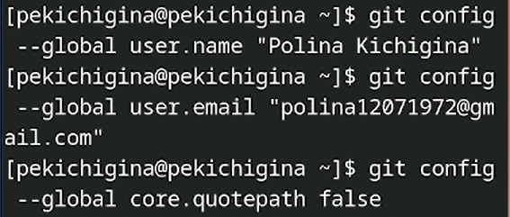{#fig:002 width=70%}

## Базовая настройка git

Зададим имя начальной ветки

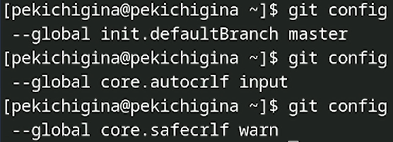{#fig:003 width=70%}

## Создайте ключи ssh

 Создаем ssh ключи

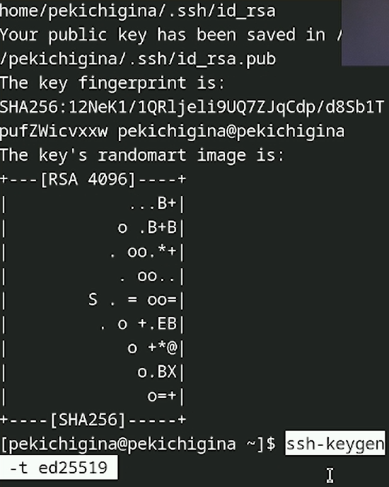{#fig:004 width=30%}

## Создайте ключи pgp

 Генерируем ключ pgp

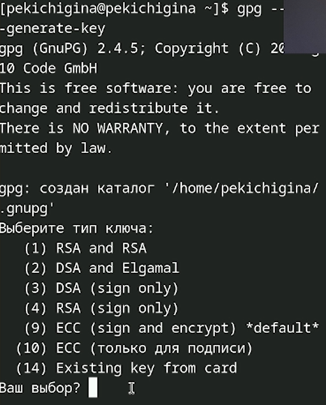{#fig:005 width=30%}

## Добавление pgp ключа в github

Выводим список ключей и копируем отпечаток приватного ключа

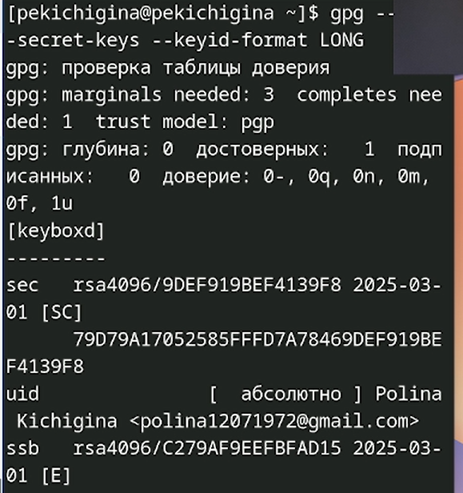{#fig:006 width=35%}

## Настройка автоматических подписей коммитов git 

Используя введёный email, укажите Git применять его при подписи коммитов

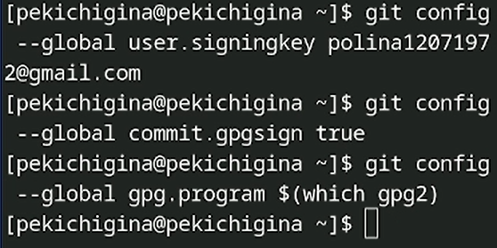{#fig:007 width=70%}

## Настройка gh

Для начала необходимо авторизоваться

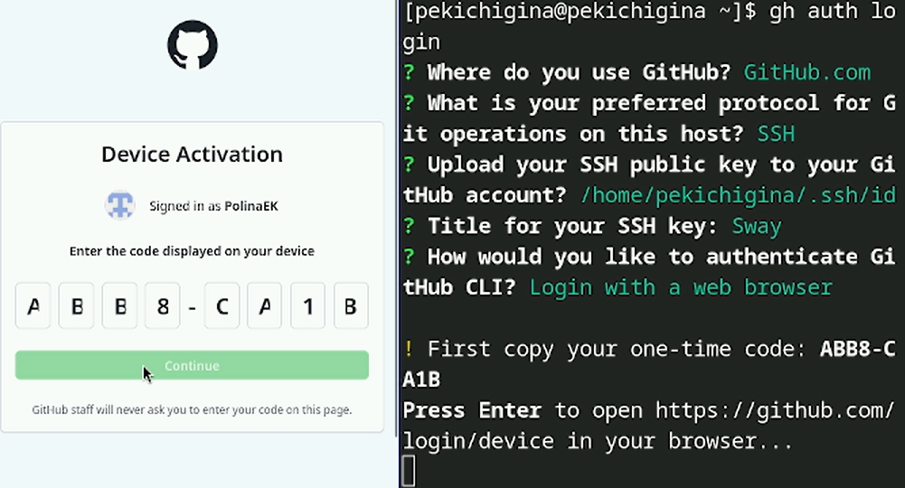{#fig:008 width=70%}

## Шаблон для рабочего пространства

 Создание репозитория курса на основе шаблона

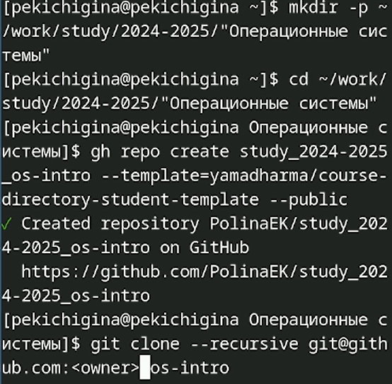{#fig:009 width=40%}

## Каталог курса

Настройка каталога курса

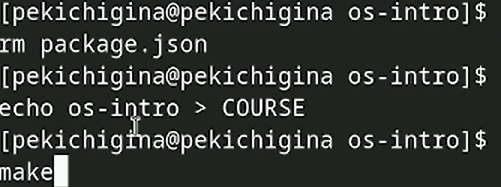{#fig:010 width=70%}

## Каталог курса

Отправьте файлы на сервер

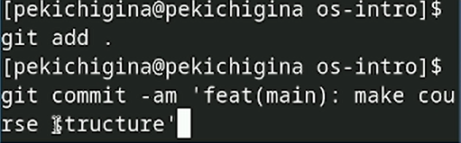{#fig:011 width=70%}

## Выводы

Мы изучили идеологию и применение средств контроля версий и освоили умения по работе с git.

## {.standout}

Спасибо за внимание!

