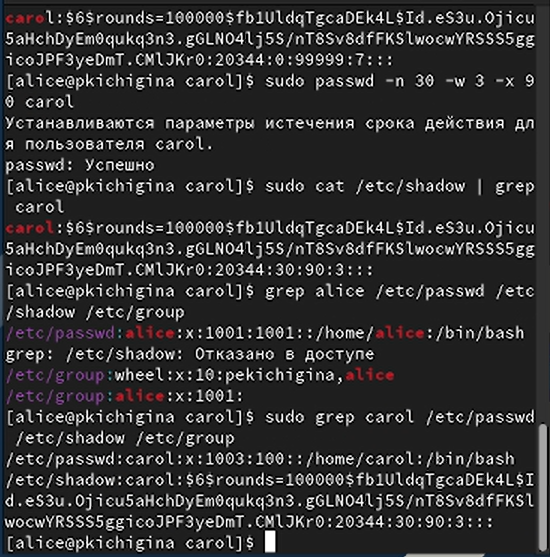
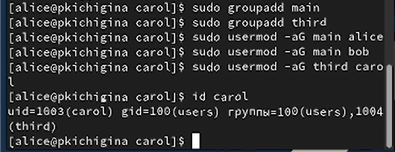

---
## Front matter
lang: ru-RU
title: Лабораторная работа №2
author:
  - Кичигина Полина Евгеньевна
institute:
  - Российский университет дружбы народов, Москва, Россия
date: 13 сентября 2025

## i18n babel
babel-lang: russian
babel-otherlangs: english

## Formatting pdf
toc: false
toc-title: Содержание
slide_level: 2
aspectratio: 169
section-titles: true
theme: metropolis
header-includes:
 - \metroset{progressbar=frametitle,sectionpage=progressbar,numbering=fraction}
---

## Цель работы

Получить представление о работе с учётными записями пользователей и группами
пользователей в операционной системе типа Linux.

## Выполнение лабораторной работы
Войдите в систему как обычный пользователь и откройте терминал.
Определите, какую учётную запись пользователя вы используете.
Выведите на экран более подробную информацию. Используйте команду su для переключения к учётной записи root.

{#fig:001 width=40%}

## Убедитесь, что в открытом с помощью visudo файле присутствует строка
%wheel ALL=(ALL) ALL
Создайте пользователя alice, входящего в группу wheel. Убедитесь, что пользователь alice добавлен в группу wheel.
Задайте пароль для пользователя alice. Переключитесь на учётную запись пользователя alice. Создайте пользователя bob.

{#fig:002 width=35%}

## Создание учётных записей пользователей.
Переключитесь в терминале на учётную запись пользователя root. Откройте файл конфигурации /etc/login.defs для редактирования. Перейдите в каталог /etc/skel.
Создайте каталоги Pictures и Documents.

{#fig:003 width=40%}

## Посмотрите и прокомментируйте информацию о пользователе carol, проверьте,
в какую первоначальную группу входит пользователь carol; также убедитесь, что
каталоги Pictures и Documents были созданы в домашнем каталоге пользователя
carol. 

{#fig:004 width=40%}

## Измените свойства пароля пользователя carol следующим образом.
В этой записи срок действия пароля истекает через 90 дней (-x 90). За три дня до
истечения срока действия пользователь получит предупреждение (-w 3). 

{#fig:005 width=35%}

## Работа с группами
 Находясь под учётной записью пользователя alice, создайте группы main и third. Используйте usermod для добавления пользователей alice и bob в группу main,
а carol, dan, dave и david — в группу third.

{#fig:006 width=70%}

## Вывод

Мы получили представление о работе с учётными записями пользователей и группами
пользователей в операционной системе типа Linux.

## {.standout}

Спасибо за внимание!

