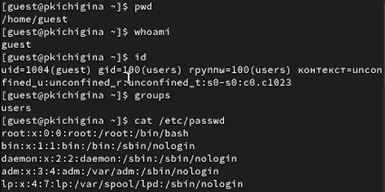
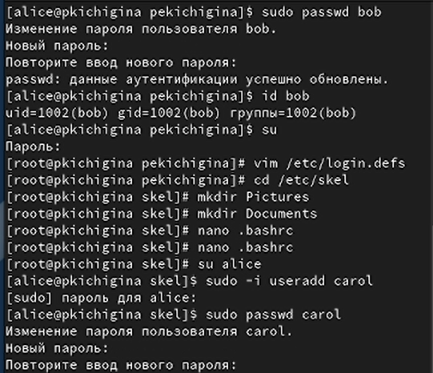

---
## Front matter
lang: ru-RU
title: Лабораторная работа №2
author:
  - Кичигина Полина Евгеньевна
institute:
  - Российский университет дружбы народов, Москва, Россия
date: 7 марта 2026

## i18n babel
babel-lang: russian
babel-otherlangs: english

## Formatting pdf
toc: false
toc-title: Содержание
slide_level: 2
aspectratio: 169
section-titles: true
theme: metropolis
header-includes:
 - \metroset{progressbar=frametitle,sectionpage=progressbar,numbering=fraction}
---

## Цель работы

Получение практических навыков работы в консоли с атрибутами фай-
лов, закрепление теоретических основ дискреционного разграничения до-
ступа в современных системах с открытым кодом на базе ОС Linux1.

##

В установленной при выполнении предыдущей лабораторной работы
операционной системе создайте учётную запись пользователя guest, задайте пароль, войдите в систему от имени пользователя guest.

{#fig:001 width=70%}

##

Определите директорию, в которой вы находитесь, командой pwd. Уточните имя вашего пользователя командой whoami. Уточните имя вашего пользователя, его группу, а также группы, куда входит пользователь, командой id.
Найдите в нём свою учётную запись.

{#fig:002 width=70%}

##

Определите существующие в системе директории командой
ls -l /home/. Проверьте, какие расширенные атрибуты установлены на поддиректо-
риях, находящихся в директории /home, командой: lsattr /home. 

{#fig:003 width=70%}

##

Создайте в домашней директории поддиректорию dir1. Попытайтесь создать в директории dir1 файл file1 командой
echo "test" > /home/guest/dir1/file1.

{#fig:004 width=70%}

## Вывод

Мы получили практические навыки работы в консоли с атрибутами фай-
лов, закрепление теоретических основ дискреционного разграничения до-
ступа в современных системах с открытым кодом на базе ОС Linux1.

## {.standout}

Спасибо за внимание!

