---
## Front matter
title: "Шаблон отчёта по лабораторной работе №2"
subtitle: "Отчёт"
author: "Кичигина Полина Евгеньевна"

## Generic otions
lang: ru-RU
toc-title: "Содержание"

## Bibliography
bibliography: bib/cite.bib
csl: pandoc/csl/gost-r-7-0-5-2008-numeric.csl

## Pdf output format
toc: true # Table of contents
toc-depth: 2
lof: true # List of figures
lot: true # List of tables
fontsize: 12pt
linestretch: 1.5
papersize: a4
documentclass: scrreprt
## I18n polyglossia
polyglossia-lang:
  name: russian
  options:
	- spelling=modern
	- babelshorthands=true
polyglossia-otherlangs:
  name: english
## I18n babel
babel-lang: russian
babel-otherlangs: english
## Fonts
mainfont: IBM Plex Serif
romanfont: IBM Plex Serif
sansfont: IBM Plex Sans
monofont: IBM Plex Mono
mathfont: STIX Two Math
mainfontoptions: Ligatures=Common,Ligatures=TeX,Scale=0.94
romanfontoptions: Ligatures=Common,Ligatures=TeX,Scale=0.94
sansfontoptions: Ligatures=Common,Ligatures=TeX,Scale=MatchLowercase,Scale=0.94
monofontoptions: Scale=MatchLowercase,Scale=0.94,FakeStretch=0.9
mathfontoptions:
## Biblatex
biblatex: true
biblio-style: "gost-numeric"
biblatexoptions:
  - parentracker=true
  - backend=biber
  - hyperref=auto
  - language=auto
  - autolang=other*
  - citestyle=gost-numeric
## Pandoc-crossref LaTeX customization
figureTitle: "Рис."
tableTitle: "Таблица"
listingTitle: "Листинг"
lofTitle: "Список иллюстраций"
lotTitle: "Список таблиц"
lolTitle: "Листинги"
## Misc options
indent: true
header-includes:
  - \usepackage{indentfirst}
  - \usepackage{float} # keep figures where there are in the text
  - \floatplacement{figure}{H} # keep figures where there are in the text
---

# Цель работы

Изучить идеологию и применение средств контроля версий.
Освоить умения по работе с git.

# Задание

Создать базовую конфигурацию для работы с git.
Создать ключ SSH.
Создать ключ PGP.
Настроить подписи git.
Зарегистрироваться на Github.
Создать локальный каталог для выполнения заданий по предмету.

# Выполнение лабораторной работы

1. Установка git и gh (рис. [-@fig:001])

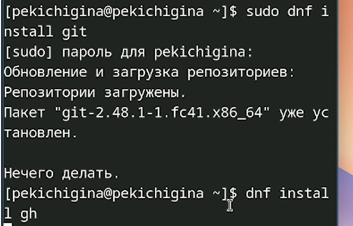{#fig:001 width=70%}

2. Зададим имя и email владельца репозитория и настроим utf-8 в выводе сообщений git (рис. [-@fig:002])

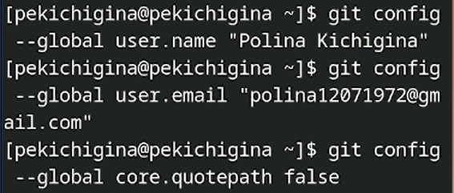{#fig:002 width=70%}

Зададим имя начальной ветки(рис. [-@fig:003])

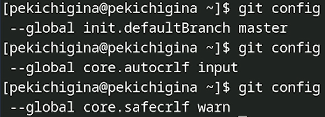{#fig:003 width=70%}

3. Создаем ssh ключи(рис. [-@fig:004])

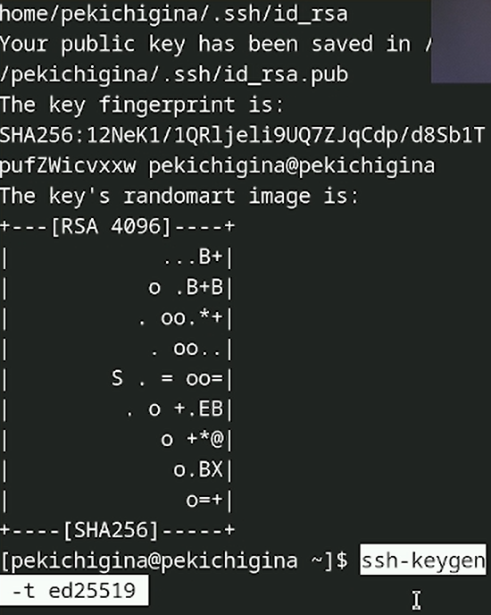{#fig:004 width=70%}

4. Генерируем ключ pgp(рис. [-@fig:005])

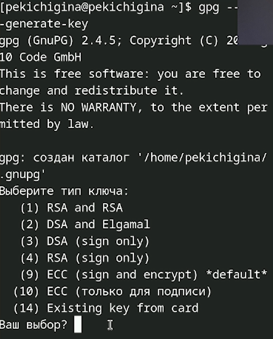{#fig:005 width=70%}

5. Добавление pgp ключа в github

Выводим список ключей и копируем отпечаток приватного ключа(рис. [-@fig:006])

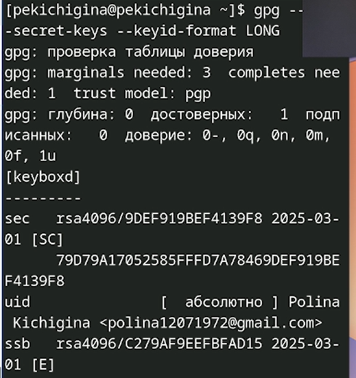{#fig:006 width=70%}

6. Настройка автоматических подписей коммитов git (рис. [-@fig:007])

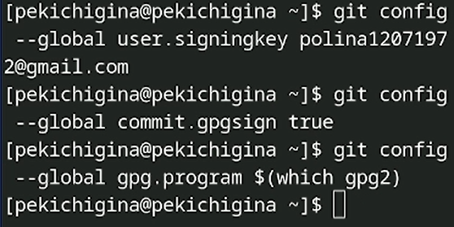{#fig:007 width=70%}

7. Настройка gh(рис. [-@fig:008])

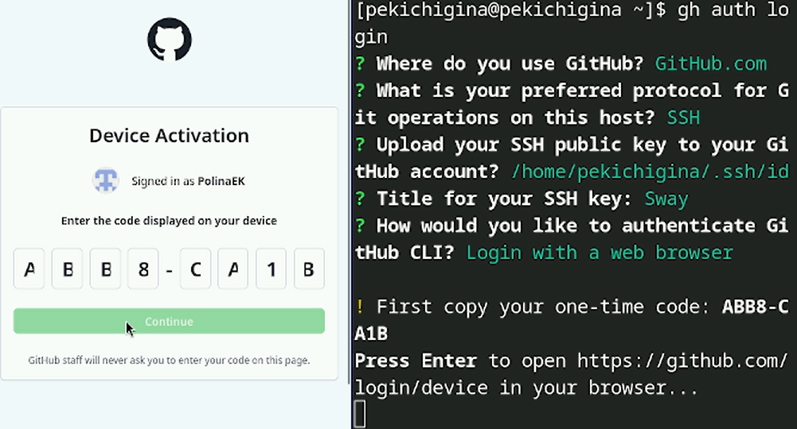{#fig:008 width=70%}

8. Создание репозитория курса на основе шаблона(рис. [-@fig:009])

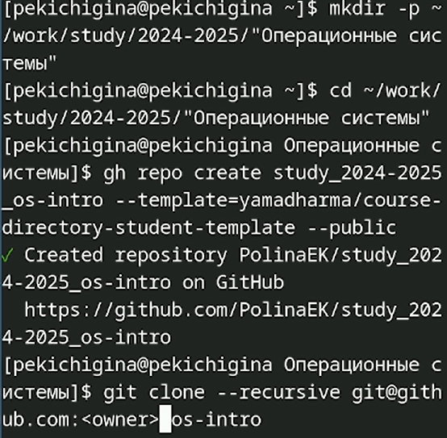{#fig:009 width=70%}
9. Настройка каталога курса(рис. [-@fig:010])

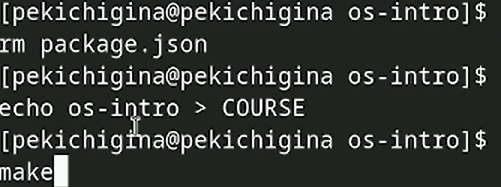{#fig:010 width=70%}

Отправьте файлы на сервер(рис. [-@fig:011])

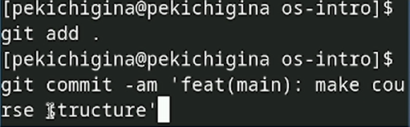{#fig:011 width=70%}

# Выводы

Мы изучили идеологию и применение средств контроля версий и освоили умения по работе с git.

# Ответы на контрольные вопросы
1. Системы контроля версий для отслеживанияизменений в файлах, совместной работы и возврата к предыдущим версиям.
2. Хранилище - место для хранения файлов. Commit - запись изменений в хранилище. История - последовательность всех коммитов. Рабочая копия - локальна копия файлов для редактирования. 
3. Централизованные - один центральный сервер и все работают с ним. Децентрализованные - у каждого полная копия хранилища.
4. Добавление файлов в рабочую область. Commit изменений.
5. Клонирование хранилища, внесение изменений, commit, push.
6. Управление версиями, совместная работа, отслеживание изменений.
7. git add - добавление в индекс, git push - отправка изменений, git pull - получение изменений, get clone - клонирование.
8. Локальный: git init, git add ., git commit -m "Initial commit". Удаленный: git clone ..., git push.
9. Независимые линии разработки. Нужны для эксперементов, разработки новых функций без влияния на основную копию.
10. Исключение файлов из отслеживания. Нужно для временнных файлов, логов, конфиденциальной информации.
