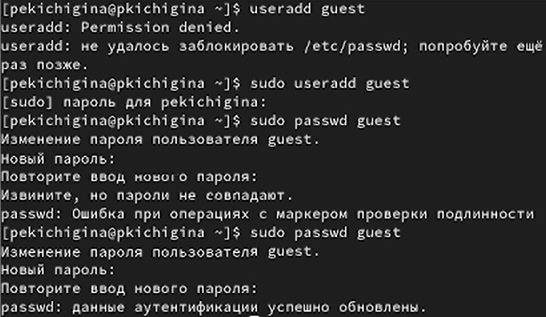
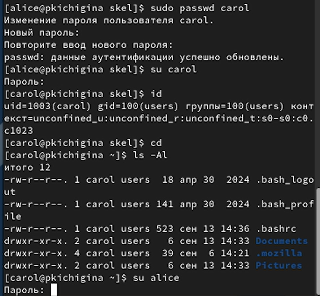

---
## Front matter
title: "Отчёт по лабораторной работе №2"
subtitle: "Отчёт"
author: "Кичигина Полина Евгеньевна"

## Generic otions
lang: ru-RU
toc-title: "Содержание"

## Bibliography
bibliography: bib/cite.bib
csl: pandoc/csl/gost-r-7-0-5-2008-numeric.csl

## Pdf output format
toc: true # Table of contents
toc-depth: 2
lof: true # List of figures
lot: true # List of tables
fontsize: 12pt
linestretch: 1.5
papersize: a4
documentclass: scrreprt
## I18n polyglossia
polyglossia-lang:
  name: russian
  options:
	- spelling=modern
	- babelshorthands=true
polyglossia-otherlangs:
  name: english
## I18n babel
babel-lang: russian
babel-otherlangs: english
## Fonts
mainfont: IBM Plex Serif
romanfont: IBM Plex Serif
sansfont: IBM Plex Sans
monofont: IBM Plex Mono
mathfont: STIX Two Math
mainfontoptions: Ligatures=Common,Ligatures=TeX,Scale=0.94
romanfontoptions: Ligatures=Common,Ligatures=TeX,Scale=0.94
sansfontoptions: Ligatures=Common,Ligatures=TeX,Scale=MatchLowercase,Scale=0.94
monofontoptions: Scale=MatchLowercase,Scale=0.94,FakeStretch=0.9
mathfontoptions:
## Biblatex
biblatex: true
biblio-style: "gost-numeric"
biblatexoptions:
  - parentracker=true
  - backend=biber
  - hyperref=auto
  - language=auto
  - autolang=other*
  - citestyle=gost-numeric
## Pandoc-crossref LaTeX customization
figureTitle: "Рис."
tableTitle: "Таблица"
listingTitle: "Листинг"
lofTitle: "Список иллюстраций"
lotTitle: "Список таблиц"
lolTitle: "Листинги"
## Misc options
indent: true
header-includes:
  - \usepackage{indentfirst}
  - \usepackage{float} # keep figures where there are in the text
  - \floatplacement{figure}{H} # keep figures where there are in the text
---

# Цель работы

Получить представление о работе с учётными записями пользователей и группами
пользователей в операционной системе типа Linux.

# Выполнение лабораторной работы

1. Войдите в систему как обычный пользователь и откройте терминал.
Определите, какую учётную запись пользователя вы используете.
Выведите на экран более подробную информацию. Используйте команду su для переключения к учётной записи root. При запросе
пароля введите пароль пользователя root.
Вернитесь к учётной записи своего пользователя.
Просмотрите в безопасном режиме файл /etc/sudoers (рис. [-@fig:001])

{#fig:001 width=70%}

2. Убедитесь, что в открытом с помощью visudo файле присутствует строка
%wheel ALL=(ALL) ALL
Создайте пользователя alice, входящего в группу wheel. Убедитесь, что пользователь alice добавлен в группу wheel.
Задайте пароль для пользователя alice. Переключитесь на учётную запись пользователя alice. Создайте пользователя bob.
Введите пароль при запросе. Проверьте, что пользователь bob создан.
Установите пароль для пользователя bob (рис. [-@fig:002])

{#fig:002 width=70%}

3. Создание учётных записей пользователей.
Переключитесь в терминале на учётную запись пользователя root. Откройте файл конфигурации /etc/login.defs для редактирования. Перейдите в каталог /etc/skel.
Создайте каталоги Pictures и Documents.
 Измените содержимое файла .bashrc, добавив строку
export EDITOR=/usr/bin/vim
или
export EDITOR=/usr/bin/mceditor
Переключитесь в терминале на учётную запись пользователя alice. Используя утилиту useradd, создайте пользователя carol.
Установите пароль для пользователя carol (рис. [-@fig:003])

{#fig:003 width=70%}

4. Посмотрите и прокомментируйте информацию о пользователе carol, проверьте,
в какую первоначальную группу входит пользователь carol; также убедитесь, что
каталоги Pictures и Documents были созданы в домашнем каталоге пользователя
carol. Переключитесь в терминале на учётную запись пользователя alice(рис. [-@fig:004])

{#fig:004 width=70%}

5. Поясните в отчёте строку записи о пароле пользователя carol в файле. Измените свойства пароля пользователя carol следующим образом.
В этой записи срок действия пароля истекает через 90 дней (-x 90). За три дня до
истечения срока действия пользователь получит предупреждение (-w 3). Пароль дол-
жен использоваться как минимум за 30 дней (-n 30) до того, как его можно будет
изменить.
Убедитесь в изменении в строке с данными о пароле пользователя carol в файле
/etc/shadow. Убедитесь, что идентификатор alice существует во всех трёх файлах. Убедитесь, что идентификатор carol существует не во всех трёх файлах (рис. [-@fig:005])

{#fig:005 width=70%}

6. Работа с группами
 Находясь под учётной записью пользователя alice, создайте группы main и third. Используйте usermod для добавления пользователей alice и bob в группу main,
а carol, dan, dave и david — в группу third. Убедитесь, что пользователь carol правильно добавлен в группу third.
Пользователю carol должна быть назначена основная группа с идентификатором
gid = 100 (users). Определите, в какие вторичные группы входит carol(рис. [-@fig:006])

{#fig:006 width=70%}

# Ответы на контрольные вопросы
1. Информация о UID и группах 
- UID и GID: id [user] или просто id (для текущего пользователя) 
- Список групп: groups [user] или id -Gn [user] 

2. UID пользователя root 
- UID = 0 
- Узнать UID любого пользователя: 
  - id -u [user] 
  - или через записи getent passwd root (первое числовое поле) 

3. Отличие `su` и `sudo` 
- su [user] – смена учётки на другого пользователя (чаще root), требуется его пароль. 
- sudo [cmd] – запуск одной команды с повышенными привилегиями, проверяется пароль текущего пользователя и его право в sudoers. 

4. Файл конфигурации sudo 
- Основной: /etc/sudoers 
- Дополнительно – каталоги /etc/sudoers.d/ с дополнительными фрагментами. 

5. Безопасное изменение /etc/sudoers 
- Использовать visudo (блокировка файла + синтаксическая проверка). 

6. Группа для полного доступа через sudo 
- Пользователь должен состоять в группе wheel (в RHEL/Rocky Linux). 

7. Шаблоны при создании учёток 
- /etc/login.defs (парольная политика: PASS_MAX_DAYS, UID_MIN, и т. п.) 
- /etc/default/useradd (по умолчанию GID, HOME, shell) 
- /etc/skel/ (файлы skeleton-каталога, копируемые в новый HOME) 

8. Хранение данных о группах 
- Первичная группа – поле GID в записи /etc/passwd 
- Дополнительные группы – /etc/group 
  
  Пример для пользователя alice: 
  - /etc/passwd: 
   

     

     → GID=1001 
  - /etc/group: 
   

    
     

     → alice входит в группу developers (GID=1001) как дополнительная. 

9. Команды для изменения параметров пароля 
- passwd – смена пароля, passwd -x N user (максимальный срок) 
- chage – детально задаёт сроки: chage -l user, chage -M 90 user и т. д. 
- usermod -e YYYY-MM-DD user – срок действия учётки 

10. Прямое изменение /etc/group 
- Использовать vigr (или `vipw -g`) – обеспечивает блокировку файла и проверку синтаксиса, предотвращая повреждение. 

# Вывод

Мы получили представление о работе с учётными записями пользователей и группами
пользователей в операционной системе типа Linux.
