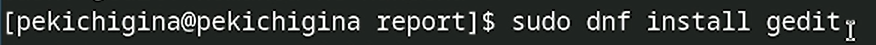
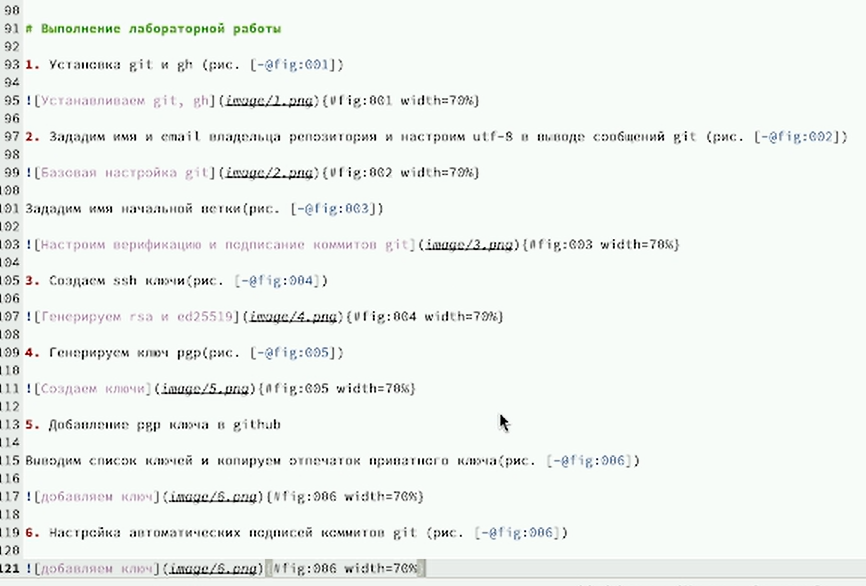
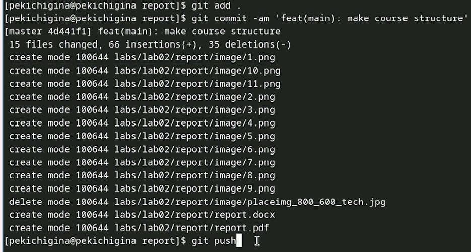

---
## Front matter
lang: ru-RU
title: Лабороторная работа №3
author:
  - Кичигина Полина Евгеньевна
institute:
  - Российский университет дружбы народов, Москва, Россия
date: 05 марта 2025

## i18n babel
babel-lang: russian
babel-otherlangs: english

## Formatting pdf
toc: false
toc-title: Содержание
slide_level: 2
aspectratio: 169
section-titles: true
theme: metropolis
header-includes:
 - \metroset{progressbar=frametitle,sectionpage=progressbar,numbering=fraction}
---

## Цель работы

Научиться оформлять отчёты с помощью легковесного языка разметки Markdown.

## Задание

Сделайте отчёт по предыдущей лабораторной работе в формате Markdown.

## Выполнение лабораторной работы

1. Загружаю команду gedit для редактирования отчета

{#fig:001 width=70%}

## Gedit

Открываю файл для редактирования

{#fig:002 width=70%}

## Редактирование

Редактируем отчет

{#fig:003 width=50%}

## github

Загружаем файлы на github

{#fig:004 width=70%}

## Выводы

Мы научились оформлять отчёты с помощью легковесного языка разметки Markdown.

## {.standout}

Спасибо за внимание!

