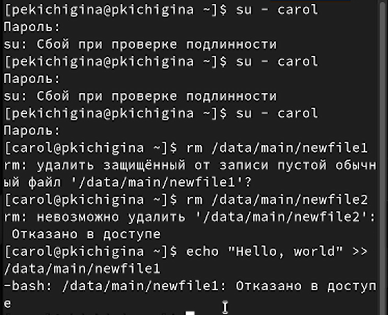

---
## Front matter
lang: ru-RU
title: Лабороторная работа №3
author:
  - Кичигина Полина Евгеньевна
institute:
  - Российский университет дружбы народов, Москва, Россия
date: 20 сентября 2025

## i18n babel
babel-lang: russian
babel-otherlangs: english

## Formatting pdf
toc: false
toc-title: Содержание
slide_level: 2
aspectratio: 169
section-titles: true
theme: metropolis
header-includes:
 - \metroset{progressbar=frametitle,sectionpage=progressbar,numbering=fraction}
---

## Цель работы

Получение навыков настройки базовых и специальных прав доступа для групп пользо
вателей в операционной системе типа Linux.

## Задание

1. Прочитайте справочное описание man по командам chgrp, chmod, getfacl, setfacl.
2. Выполните действия по управлению базовыми разрешениями для групп пользовате-
лей.
3. Выполните действия по управлению специальными разрешениями для групп пользо-
вателей.
4. Выполните действия по управлению расширенными разрешениями с использованием
списков ACL для групп пользователей.

## Выполнение лабораторной работы

1. Требуется создать структуру каталогов с разными разрешениями доступа для разных
групп пользователей.

{#fig:001 width=45%}

## 2. В другом терминале перейдите под учётную запись пользователя. Под пользователем bob попробуйте перейти в каталог /data/main и создать файл emptyfile в этом каталоге. 

{#fig:002 width=70%}

## 3. Откройте новый терминал под пользователем alice. Перейдите в каталог /data/main. Создайте два файла, владельцем которых является alice

{#fig:003 width=70%}

## 4. Откройте терминал с учётной записью root. Установите права на чтение и выполнение в каталоге /data/main для группы third и права на чтение и выполнение для группы main в каталоге /data/third. 

{#fig:004 width=50%}

## 5. Для проверки полномочий группы third в каталоге /data/third войдите в другом терминале под учётной записью члена группы third.

{#fig:005 width=45%}

## Выводы

Мы получили навыки настройки базовых и специальных прав доступа для групп пользо
вателей в операционной системе типа Linux.

## {.standout}

Спасибо за внимание!

