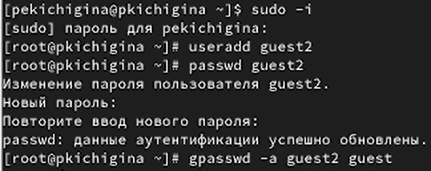
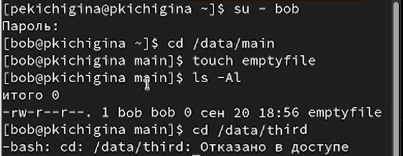

---
## Front matter
lang: ru-RU
title: Лабороторная работа №3
author:
  - Кичигина Полина Евгеньевна
institute:
  - Российский университет дружбы народов, Москва, Россия
date: 20 марта 2026

## i18n babel
babel-lang: russian
babel-otherlangs: english

## Formatting pdf
toc: false
toc-title: Содержание
slide_level: 2
aspectratio: 169
section-titles: true
theme: metropolis
header-includes:
 - \metroset{progressbar=frametitle,sectionpage=progressbar,numbering=fraction}
---

## Цель работы

Получение практических навыков работы в консоли с атрибутами файлов для групп пользователей.

## Выполнение лабораторной работы

В установленной операционной системе создайте учётную запись поль-
зователя guest. Аналогично создайте второго пользователя guest2. Добавьте пользователя guest2 в группу guest.

{#fig:001 width=70%}

##

 Осуществите вход в систему от двух пользователей на двух разных консолях: guest на первой консоли и guest2 на второй консоли. Для обоих пользователей командой pwd определите директорию, в которой вы находитесь. Уточните имя вашего пользователя, его группу, кто входит в неё и к каким группам принадлежит он сам. 

{#fig:002 width=70%}

##

От имени пользователя guest2 выполните регистрацию пользователя
guest2 в группе guest. От имени пользователя guest измените права директории /home/guest,
разрешив все действия для пользователей группы. От имени пользователя guest снимите с директории /home/guest/dir1 все атрибуты и проверьте правильность снятия атрибутов.

{#fig:003 width=70%}

## Выводы

Мы получили практические навыки работы в консоли с атрибутами файлов для групп пользователей.

## {.standout}

Спасибо за внимание!

