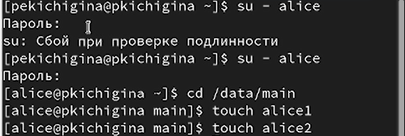
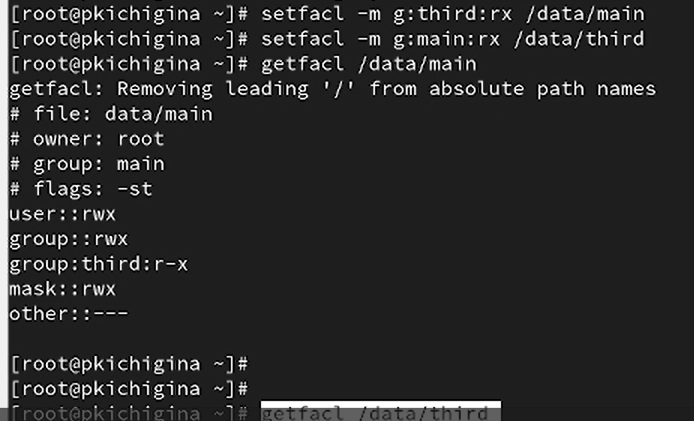

---
## Front matter
title: "Отчёт по лабораторной работе №3"
subtitle: "Отчет"
author: "Кичигина Полина Евгеньевна"

## Generic otions
lang: ru-RU
toc-title: "Содержание"

## Bibliography
bibliography: bib/cite.bib
csl: pandoc/csl/gost-r-7-0-5-2008-numeric.csl

## Pdf output format
toc: true # Table of contents
toc-depth: 2
lof: true # List of figures
lot: true # List of tables
fontsize: 12pt
linestretch: 1.5
papersize: a4
documentclass: scrreprt
## I18n polyglossia
polyglossia-lang:
  name: russian
  options:
	- spelling=modern
	- babelshorthands=true
polyglossia-otherlangs:
  name: english
## I18n babel
babel-lang: russian
babel-otherlangs: english
## Fonts
mainfont: IBM Plex Serif
romanfont: IBM Plex Serif
sansfont: IBM Plex Sans
monofont: IBM Plex Mono
mathfont: STIX Two Math
mainfontoptions: Ligatures=Common,Ligatures=TeX,Scale=0.94
romanfontoptions: Ligatures=Common,Ligatures=TeX,Scale=0.94
sansfontoptions: Ligatures=Common,Ligatures=TeX,Scale=MatchLowercase,Scale=0.94
monofontoptions: Scale=MatchLowercase,Scale=0.94,FakeStretch=0.9
mathfontoptions:
## Biblatex
biblatex: true
biblio-style: "gost-numeric"
biblatexoptions:
  - parentracker=true
  - backend=biber
  - hyperref=auto
  - language=auto
  - autolang=other*
  - citestyle=gost-numeric
## Pandoc-crossref LaTeX customization
figureTitle: "Рис."
tableTitle: "Таблица"
listingTitle: "Листинг"
lofTitle: "Список иллюстраций"
lotTitle: "Список таблиц"
lolTitle: "Листинги"
## Misc options
indent: true
header-includes:
  - \usepackage{indentfirst}
  - \usepackage{float} # keep figures where there are in the text
  - \floatplacement{figure}{H} # keep figures where there are in the text
---

# Цель работы

Получение навыков настройки базовых и специальных прав доступа для групп пользо
вателей в операционной системе типа Linux.
# Задание

1. Прочитайте справочное описание man по командам chgrp, chmod, getfacl, setfacl.
2. Выполните действия по управлению базовыми разрешениями для групп пользовате-
лей.
3. Выполните действия по управлению специальными разрешениями для групп пользо-
вателей.
4. Выполните действия по управлению расширенными разрешениями с использованием
списков ACL для групп пользователей.

# Выполнение лабораторной работы

1. Требуется создать структуру каталогов с разными разрешениями доступа для разных
групп пользователей.Откройте терминал с учётной записью root:
 В корневом каталоге создайте каталоги /data/main и /data/third.
Посмотрите, кто является владельцем этих каталогов. Для этого используйте.
Прежде чем устанавливать разрешения, измените владельцев этих каталогов с root
на main и third соответственно. Установите разрешения, позволяющие владельцам каталогов записывать файлы в эти
каталоги и запрещающие доступ к содержимому каталогов всем другим пользователям
и группам(рис. [-@fig:001])

{#fig:001 width=70%}

2. В другом терминале перейдите под учётную запись пользователя. Под пользователем bob попробуйте перейти в каталог /data/main и создать файл
emptyfile в этом каталоге. Под пользователем bob попробуйте перейти в каталог /data/third и создать файл
emptyfile в этом каталоге.(рис. [-@fig:002])

{#fig:002 width=70%}

3. Откройте новый терминал под пользователем alice.
 Перейдите в каталог /data/main.
Создайте два файла, владельцем которых является alice(рис. [-@fig:003])

{#fig:003 width=70%}

4. Откройте терминал с учётной записью root. Установите права на чтение и выполнение в каталоге /data/main для группы third
и права на чтение и выполнение для группы main в каталоге /data/third. Используйте команду getfacl, чтобы убедиться в правильности установки разреше-
ний(рис. [-@fig:004])

{#fig:004 width=70%}

5. Для проверки полномочий группы third в каталоге /data/third войдите в другом
терминале под учётной записью члена группы third.
Проверьте операции с файлами.
Проверьте, возможно ли осуществить запись в файл(рис. [-@fig:005])

{#fig:005 width=70%}

# Выводы

Мы получили навыки настройки базовых и специальных прав доступа для групп пользо
вателей в операционной системе типа Linux.

