---
## Front matter
lang: ru-RU
title: Лабораторная работа №4
author:
  - Кичигина Полина Евгеньевна
institute:
  - Российский университет дружбы народов, Москва, Россия
date: 07 марта 2025

## i18n babel
babel-lang: russian
babel-otherlangs: english

## Formatting pdf
toc: false
toc-title: Содержание
slide_level: 2
aspectratio: 169
section-titles: true
theme: metropolis
header-includes:
 - \metroset{progressbar=frametitle,sectionpage=progressbar,numbering=fraction}
---

## Цель работы

Получение навыков правильной работы с репозиториями git.

## Задание

Выполнить работу для тестового репозитория.
Преобразовать рабочий репозиторий в репозиторий с git-flow и conventional commits.

## Установка git-flow

Установка из коллекции репозиториев Copr 

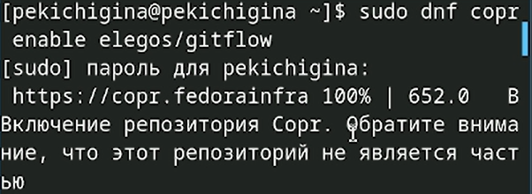{#fig:001 width=70%}

## Установка Node.js

На Node.js базируется программное обеспечение для семантического версионирования и общепринятых коммитов 

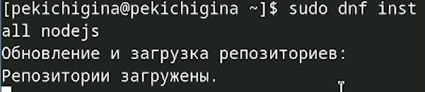{#fig:002 width=70%}

## Настройка Node.js

Для работы с Node.js добавим каталог с исполняемыми файлами, устанавливаемыми yarn, в переменную PATH.Перелогиньтесь 

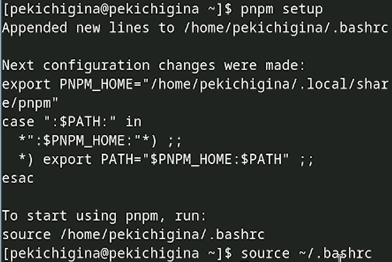{#fig:003 width=50%}

## Общепринятые коммиты

Данная программа используется для помощи в форматировании коммитов 

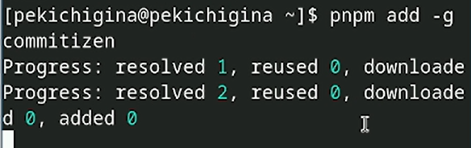{#fig:004 width=70%}

## Общепринятые коммиты

Данная программа используется для помощи в создании логов 

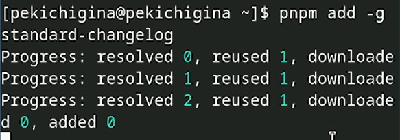{#fig:005 width=70%}

## Практический сценарий использования git

Создайте репозиторий на GitHub. Для примера назовём его git-extended 

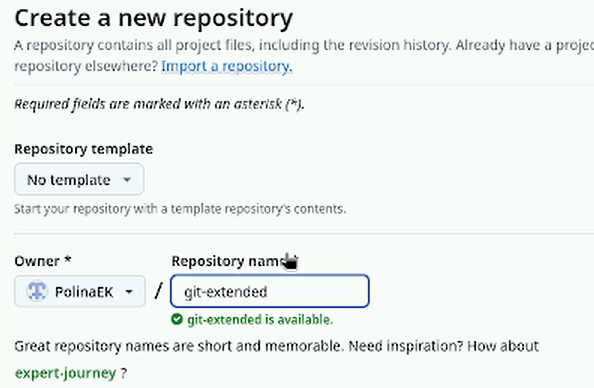{#fig:006 width=50%}

## Практический сценарий использования git

Делаем первый коммит и выкладываем на github 

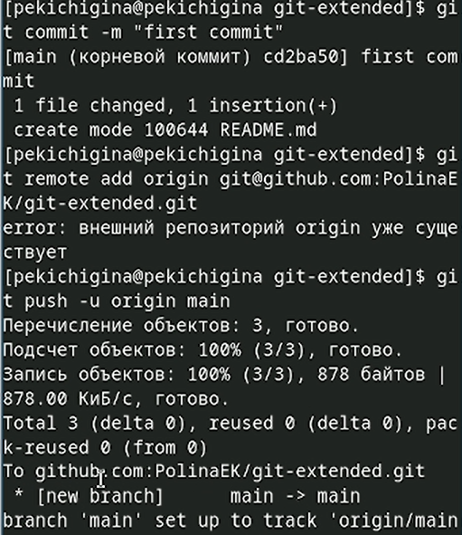{#fig:007 width=35%}

## Конфигурация общепринятых коммитов

Необходимо заполнить несколько параметров пакета.

Сконфигурим формат коммитов. Для этого добавим в файл package.json команду для формирования коммитов 

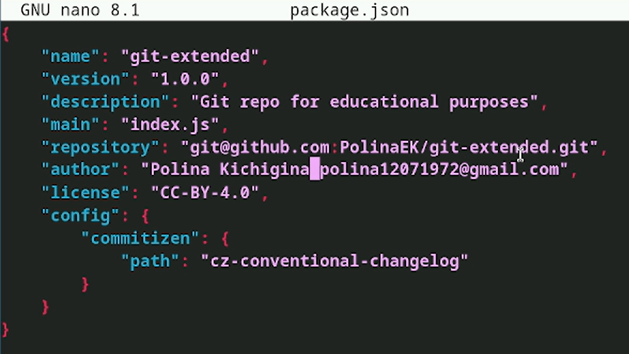{#fig:008 width=50%}

## Конфигурация общепринятых коммитов

Добавим новые файлы, выполним коммит и отправим на github 

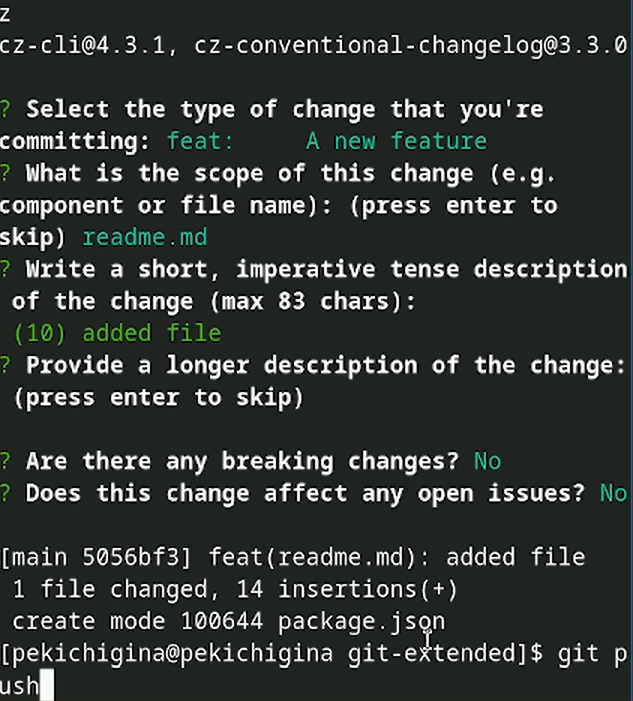{#fig:009 width=35%}

## Конфигурация git-flow

Инициализируем git-flow. Префикс для ярлыков установим в v. Проверьте, что Вы на ветке develop

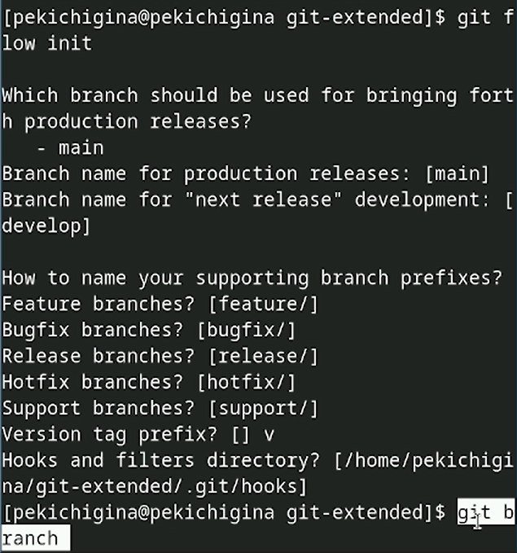{#fig:010 width=35%}

## Конфигурация git-flow

Загрузите весь репозиторий в хранилище и установите внешнюю ветку как вышестоящую для этой ветки

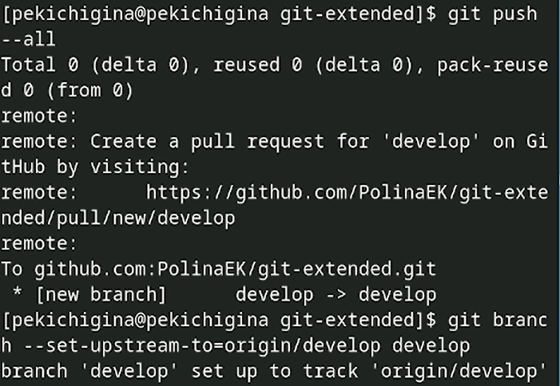{#fig:011 width=50%}

## Конфигурация git-flow

Создадим релиз с версией 1.0.0

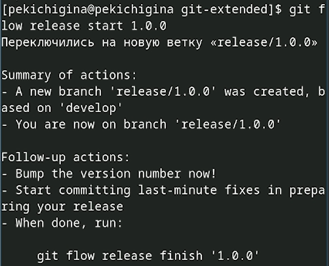{#fig:012 width=50%}

## Конфигурация git-flow

Создадим журнал изменений и добавим журнал изменений в индекс

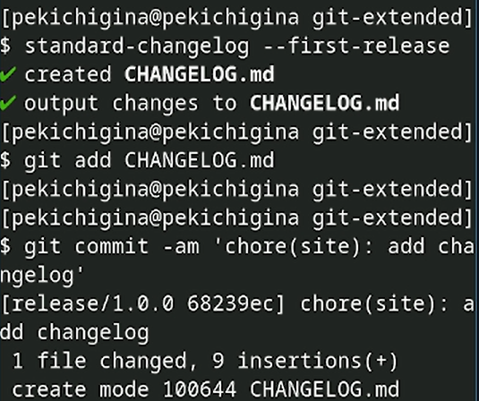{#fig:013 width=40%}

## Конфигурация git-flow

Зальём релизную ветку в основную ветку, отправим данные на github и создадим релиз на github. Для этого будем использовать утилиты работы с github 

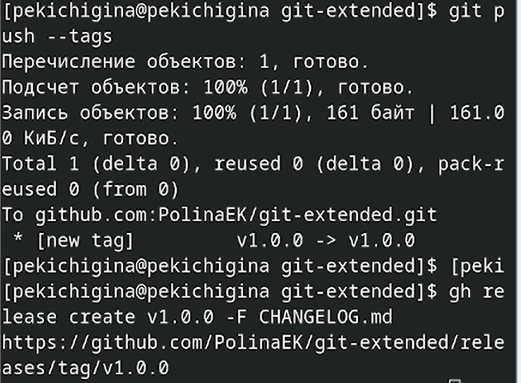{#fig:014 width=50%}

## Работа с репозиторием git

Создадим ветку для новой функциональности. Далее, продолжаем работу c git как обычно.По окончании разработки новой функциональности следующим шагом следует объединить ветку feature_branch c develop 

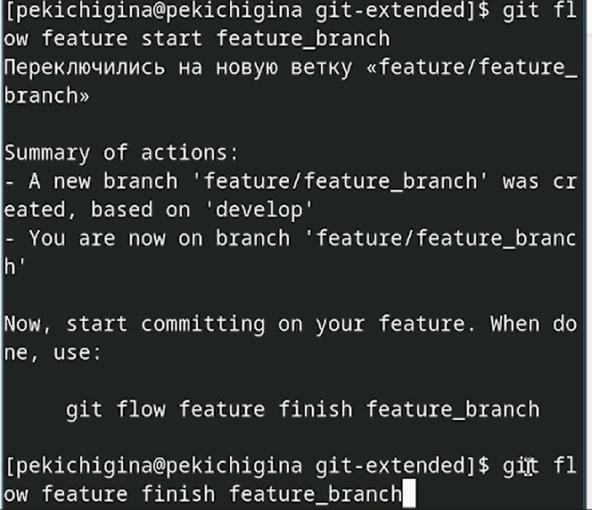{#fig:015 width=35%}

## Создание релиза git-flow

Создадим релиз с версией 1.2.3. Обновите номер версии в файле package.json. Установите её в 1.2.3 

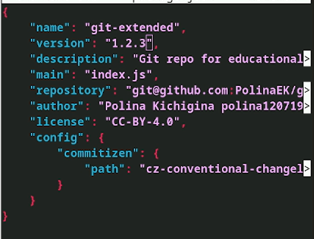{#fig:016 width=40%}

## Создание релиза git-flow

Создадим журнал изменений и добавим журнал изменений в индекс 

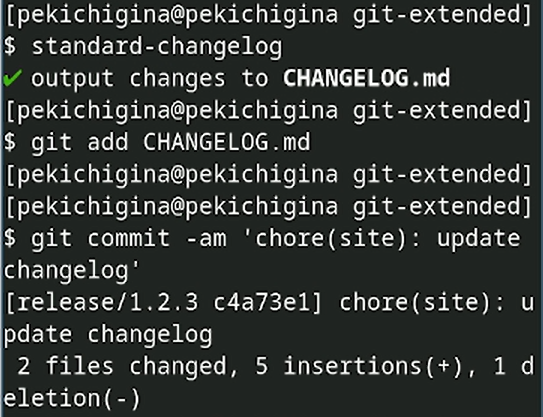{#fig:017 width=50%}

## Создание релиза git-flow

Создадим релиз на github с комментарием из журнала изменений 

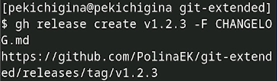{#fig:018 width=70%}

## Выводы

Мы получили навыки правильной работы с репозиториями git.

