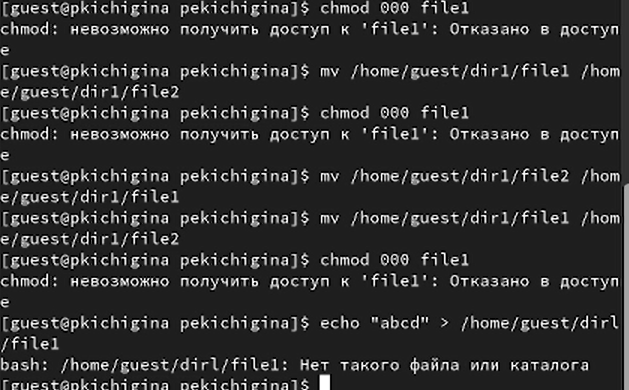

---
## Front matter
lang: ru-RU
title: Лабораторная работа №4
author:
  - Кичигина Полина Евгеньевна
institute:
  - Российский университет дружбы народов, Москва, Россия
date: 4 апреля  2026

## i18n babel
babel-lang: russian
babel-otherlangs: english

## Formatting pdf
toc: false
toc-title: Содержание
slide_level: 2
aspectratio: 169
section-titles: true
theme: metropolis
header-includes:
 - \metroset{progressbar=frametitle,sectionpage=progressbar,numbering=fraction}
---

## Цель работы

Получение практических навыков работы в консоли с расширенными
атрибутами файлов.

## Выполнение лабораторной работы

От имени пользователя guest определите расширенные атрибуты файла
/home/guest/dir1/file1. Установите
на файл file1 права, разрешающие чтение и запись для владельца файла.
Попробуйте установить на файл /home/guest/dir1/file1 расширенный атрибут a от имени пользователя guest.

{#fig:001 width=70%}

##

Зайдите на третью консоль с правами администратора либо повысьте
свои права с помощью команды su. Попробуйте установить расширен-
ный атрибут a на файл /home/guest/dir1/file1 от имени суперполь-
зователя. Выполните дозапись в файл file1 слова «test» .
Попробуйте удалить файл file1 либо стереть имеющуюся в нём информацию.
Попробуйте переименовать файл.

{#fig:002 width=70%}

##

Попробуйте установить на файл file1 права, например, запрещающие чтение и за-
пись для владельца файла. Снимите расширенный атрибут a с файла /home/guest/dirl/file1 от
имени суперпользователя.
Повторите операции, которые вам ранее не удавалось выполнить. 
 Повторите ваши действия по шагам, заменив атрибут «a» атрибутом «i».

{#fig:003 width=60%}

## Выводы

Мы получили навыки работы в консоли с расширенными
атрибутами файлов.
