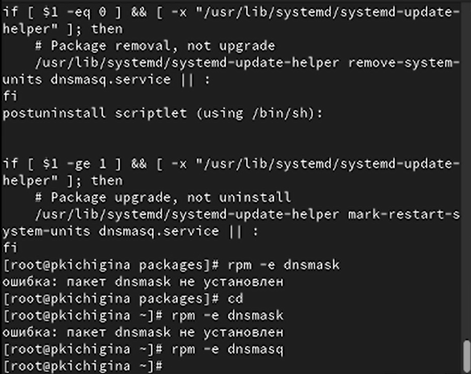

---
## Front matter
lang: ru-RU
title: Лабораторная работа №4
author:
  - Кичигина Полина Евгеньевна
institute:
  - Российский университет дружбы народов, Москва, Россия
date: 29 сентября 2025

## i18n babel
babel-lang: russian
babel-otherlangs: english

## Formatting pdf
toc: false
toc-title: Содержание
slide_level: 2
aspectratio: 169
section-titles: true
theme: metropolis
header-includes:
 - \metroset{progressbar=frametitle,sectionpage=progressbar,numbering=fraction}
---

## Цель работы

Получить навыки работы с репозиториями и менеджерами пакетов.

## Задание

1. Изучите, как и в каких файлах подключаются репозитории для установки программ-
ного обеспечения; изучите основные возможности (поиск, установка, обновление,
удаление пакета, работа с историей действий) команды dnf.
2. Изучите и повторите процесс установки/удаления определённого пакета с использо-
ванием возможностей dnf.
3. Изучите и повторите процесс установки/удаления определённого пакета с использо-
ванием возможностей rpm.

## Выполнение лабораторной работы

1. В консоли перейдите в режим работы суперпользователя (используйте команду su -).

2. Перейдите в каталог /etc/yum.repos.d и изучите содержание каталога и файлов
репозиториев 

{#fig:001 width=40%}

## 3. Получите список имеющихся групп пакетов, затем установите группу пакетов RPM Development Tools.
 Посмотрите историю использования команды dnf 
и отмените последнее, например шестое по счёту, действие 

{#fig:002 width=40%}

## 4. Использование rpm
Используя rpm, определите по имени файла, к какому пакету принадлежит lynx
и получите дополнительную информацию о содержимом пакета 

{#fig:003 width=55%}

## 5. В отдельном терминале под своей учётной записью запустите текстовый браузер lynx, чтобы проверить корректность установки пакета 
{#fig:004 width=50%}

## 6. Вернитесь в терминал с учётной записью root и удалите пакет 

{#fig:005 width=50%}

## Выводы

Мы получили навыки работы с репозиториями и менеджерами пакетов.

