---
## Front matter
title: "Отчёт по лабораторной работе №4"
subtitle: "Отчет"
author: "Кичигина Полина Евгеньевна"

## Generic otions
lang: ru-RU
toc-title: "Содержание"

## Bibliography
bibliography: bib/cite.bib
csl: pandoc/csl/gost-r-7-0-5-2008-numeric.csl

## Pdf output format
toc: true # Table of contents
toc-depth: 2
lof: true # List of figures
lot: true # List of tables
fontsize: 12pt
linestretch: 1.5
papersize: a4
documentclass: scrreprt
## I18n polyglossia
polyglossia-lang:
  name: russian
  options:
	- spelling=modern
	- babelshorthands=true
polyglossia-otherlangs:
  name: english
## I18n babel
babel-lang: russian
babel-otherlangs: english
## Fonts
mainfont: IBM Plex Serif
romanfont: IBM Plex Serif
sansfont: IBM Plex Sans
monofont: IBM Plex Mono
mathfont: STIX Two Math
mainfontoptions: Ligatures=Common,Ligatures=TeX,Scale=0.94
romanfontoptions: Ligatures=Common,Ligatures=TeX,Scale=0.94
sansfontoptions: Ligatures=Common,Ligatures=TeX,Scale=MatchLowercase,Scale=0.94
monofontoptions: Scale=MatchLowercase,Scale=0.94,FakeStretch=0.9
mathfontoptions:
## Biblatex
biblatex: true
biblio-style: "gost-numeric"
biblatexoptions:
  - parentracker=true
  - backend=biber
  - hyperref=auto
  - language=auto
  - autolang=other*
  - citestyle=gost-numeric
## Pandoc-crossref LaTeX customization
figureTitle: "Рис."
tableTitle: "Таблица"
listingTitle: "Листинг"
lofTitle: "Список иллюстраций"
lotTitle: "Список таблиц"
lolTitle: "Листинги"
## Misc options
indent: true
header-includes:
  - \usepackage{indentfirst}
  - \usepackage{float} # keep figures where there are in the text
  - \floatplacement{figure}{H} # keep figures where there are in the text
---

# Цель работы

Получение навыков правильной работы с репозиториями git.

# Задание

Выполнить работу для тестового репозитория.
Преобразовать рабочий репозиторий в репозиторий с git-flow и conventional commits.

# Выполнение лабораторной работы

1. Установка git-flow

Установка из коллекции репозиториев Copr (рис. [-@fig:001])

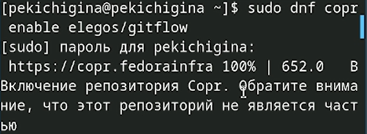{#fig:001 width=70%}

2. Установка Node.js

На Node.js базируется программное обеспечение для семантического версионирования и общепринятых коммитов (рис. [-@fig:002])

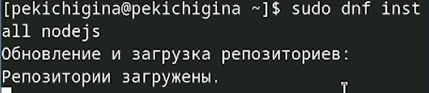{#fig:002 width=70%}

3. Настройка Node.js

Для работы с Node.js добавим каталог с исполняемыми файлами, устанавливаемыми yarn, в переменную PATH.Перелогиньтесь (рис. [-@fig:003])

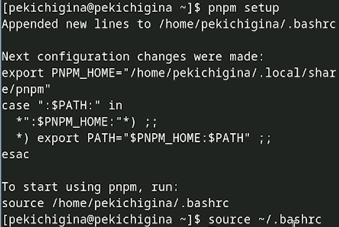{#fig:003 width=70%}

4. Общепринятые коммиты

Данная программа используется для помощи в форматировании коммитов (рис. [-@fig:004])

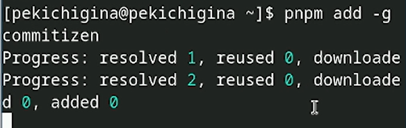{#fig:004 width=70%}

Данная программа используется для помощи в создании логов (рис. [-@fig:005])

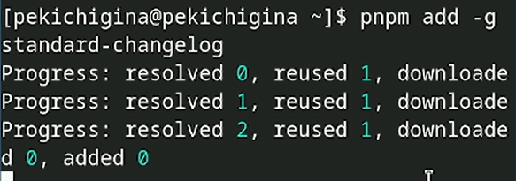{#fig:005 width=70%}

5. Практический сценарий использования git

Создайте репозиторий на GitHub. Для примера назовём его git-extended (рис. [-@fig:006])

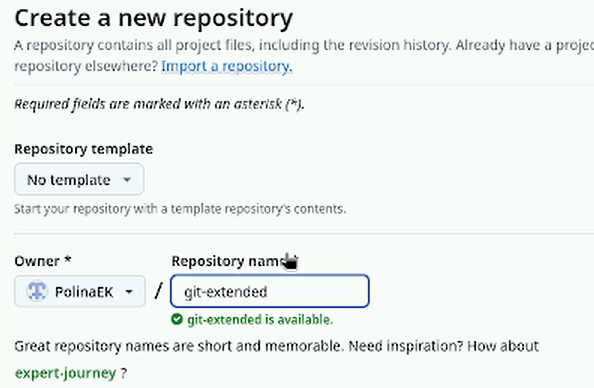{#fig:006 width=70%}

Делаем первый коммит и выкладываем на github (рис. [-@fig:007])

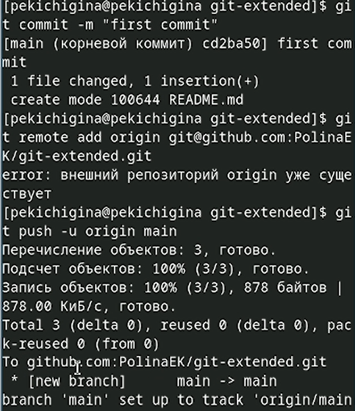{#fig:007 width=70%}

6. Конфигурация общепринятых коммитов

Необходимо заполнить несколько параметров пакета.

    Название пакета.
    Лицензия пакета. Список лицензий для npm: https://spdx.org/licenses/. 
    Предлагается выбирать лицензию CC-BY-4.0.

Сконфигурим формат коммитов. Для этого добавим в файл package.json команду для формирования коммитов (рис. [-@fig:008])

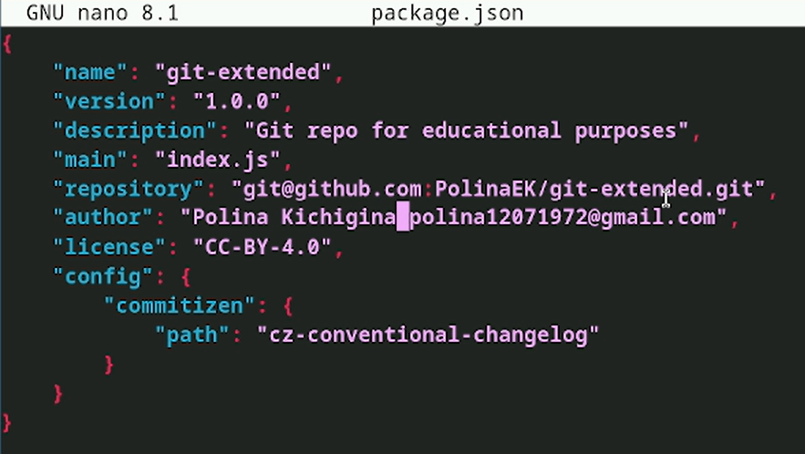{#fig:008 width=70%}

Добавим новые файлы, выполним коммит и отправим на github (рис. [-@fig:009])

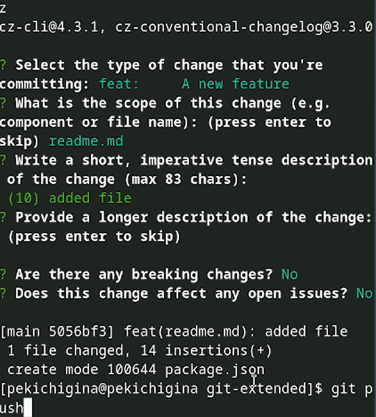{#fig:009 width=70%}

7. Конфигурация git-flow

Инициализируем git-flow. Префикс для ярлыков установим в v. Проверьте, что Вы на ветке develop(рис. [-@fig:010])

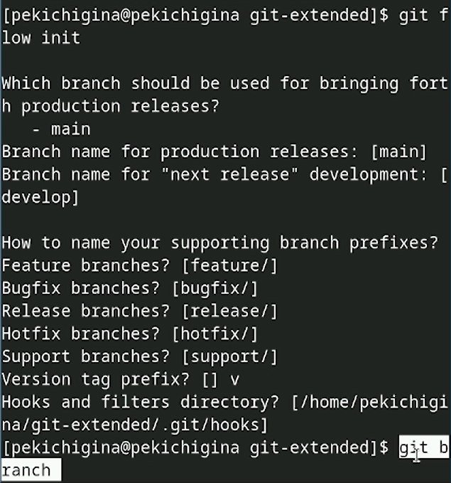{#fig:010 width=70%}

Загрузите весь репозиторий в хранилище и установите внешнюю ветку как вышестоящую для этой ветки(рис. [-@fig:011])

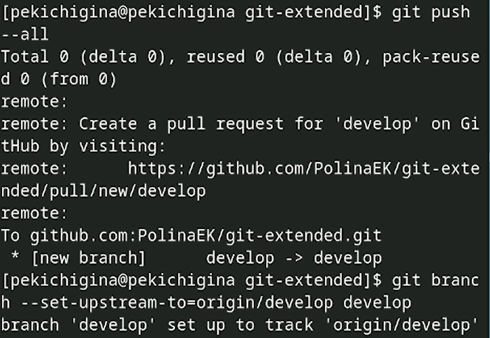{#fig:011 width=70%}

Создадим релиз с версией 1.0.0(рис. [-@fig:012])

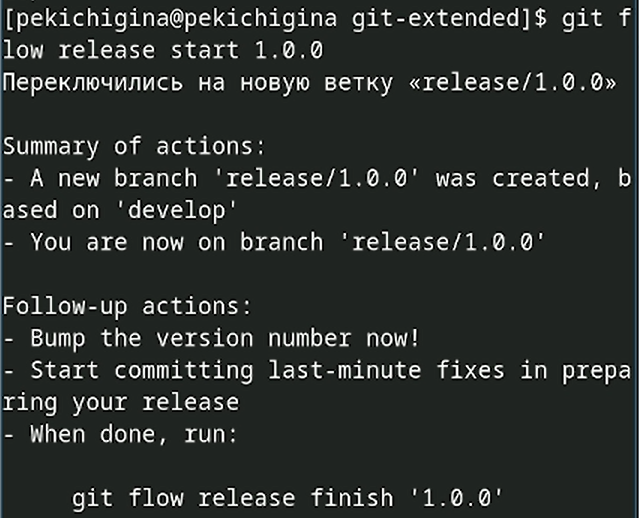{#fig:012 width=70%}

Создадим журнал изменений и добавим журнал изменений в индекс(рис. [-@fig:013])

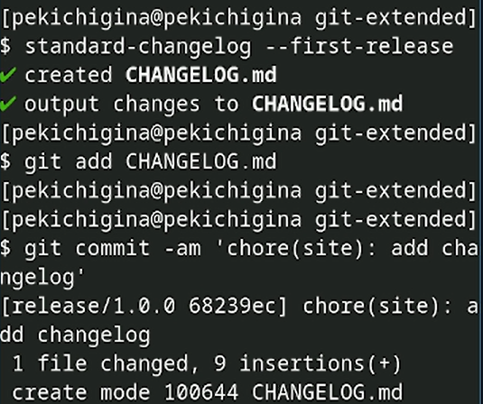{#fig:013 width=70%}

Зальём релизную ветку в основную ветку, отправим данные на github и создадим релиз на github. Для этого будем использовать утилиты работы с github (рис. [-@fig:014])

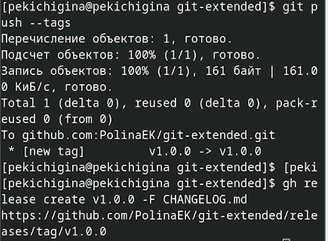{#fig:014 width=70%}

8. Работа с репозиторием git

Создадим ветку для новой функциональности. Далее, продолжаем работу c git как обычно.По окончании разработки новой функциональности следующим шагом следует объединить ветку feature_branch c develop (рис. [-@fig:015])

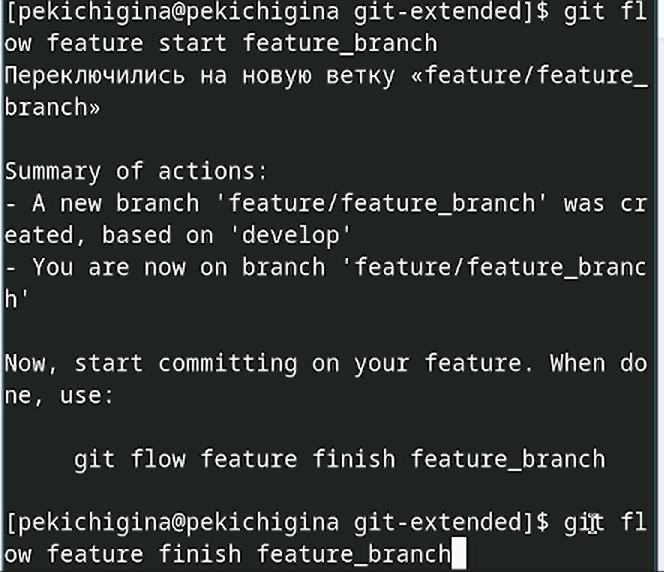{#fig:015 width=70%}

9. Создание релиза git-flow

Создадим релиз с версией 1.2.3. Обновите номер версии в файле package.json. Установите её в 1.2.3 (рис. [-@fig:016])

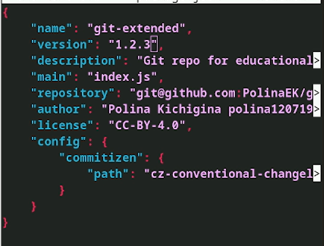{#fig:016 width=70%}

Создадим журнал изменений и добавим журнал изменений в индекс (рис. [-@fig:017])

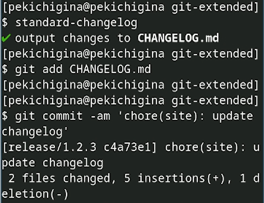{#fig:017 width=70%}

Создадим релиз на github с комментарием из журнала изменений (рис. [-@fig:018])

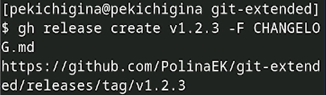{#fig:018 width=70%}

# Выводы

Мы получили навыки правильной работы с репозиториями git.

