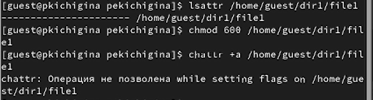
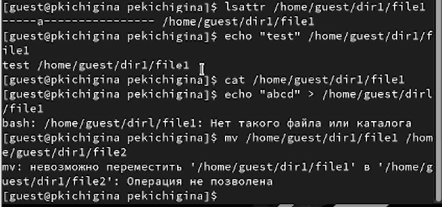
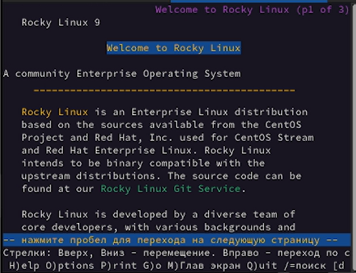

---
## Front matter
title: "Отчёт по лабораторной работе №4"
subtitle: "Отчет"
author: "Кичигина Полина Евгеньевна"

## Generic otions
lang: ru-RU
toc-title: "Содержание"

## Bibliography
bibliography: bib/cite.bib
csl: pandoc/csl/gost-r-7-0-5-2008-numeric.csl

## Pdf output format
toc: true # Table of contents
toc-depth: 2
lof: true # List of figures
lot: true # List of tables
fontsize: 12pt
linestretch: 1.5
papersize: a4
documentclass: scrreprt
## I18n polyglossia
polyglossia-lang:
  name: russian
  options:
	- spelling=modern
	- babelshorthands=true
polyglossia-otherlangs:
  name: english
## I18n babel
babel-lang: russian
babel-otherlangs: english
## Fonts
mainfont: IBM Plex Serif
romanfont: IBM Plex Serif
sansfont: IBM Plex Sans
monofont: IBM Plex Mono
mathfont: STIX Two Math
mainfontoptions: Ligatures=Common,Ligatures=TeX,Scale=0.94
romanfontoptions: Ligatures=Common,Ligatures=TeX,Scale=0.94
sansfontoptions: Ligatures=Common,Ligatures=TeX,Scale=MatchLowercase,Scale=0.94
monofontoptions: Scale=MatchLowercase,Scale=0.94,FakeStretch=0.9
mathfontoptions:
## Biblatex
biblatex: true
biblio-style: "gost-numeric"
biblatexoptions:
  - parentracker=true
  - backend=biber
  - hyperref=auto
  - language=auto
  - autolang=other*
  - citestyle=gost-numeric
## Pandoc-crossref LaTeX customization
figureTitle: "Рис."
tableTitle: "Таблица"
listingTitle: "Листинг"
lofTitle: "Список иллюстраций"
lotTitle: "Список таблиц"
lolTitle: "Листинги"
## Misc options
indent: true
header-includes:
  - \usepackage{indentfirst}
  - \usepackage{float} # keep figures where there are in the text
  - \floatplacement{figure}{H} # keep figures where there are in the text
---

# Цель работы

Получить навыки работы с репозиториями и менеджерами пакетов.

# Задание

1. Изучите, как и в каких файлах подключаются репозитории для установки программ-
ного обеспечения; изучите основные возможности (поиск, установка, обновление,
удаление пакета, работа с историей действий) команды dnf.
2. Изучите и повторите процесс установки/удаления определённого пакета с использо-
ванием возможностей dnf.
3. Изучите и повторите процесс установки/удаления определённого пакета с использо-
ванием возможностей rpm.

# Выполнение лабораторной работы

1. В консоли перейдите в режим работы суперпользователя (используйте команду su -).

2. Перейдите в каталог /etc/yum.repos.d и изучите содержание каталога и файлов
репозиториев (рис. [-@fig:001])

{#fig:001 width=70%}

3. Выведите на экран список пакетов, в названии или описании которых есть слово user.
 Установите nmap, предварительно изучив информацию по имеющимся пакетам.
Удалите nmap.
 Получите список имеющихся групп пакетов, затем установите группу пакетов
RPM Development Tools.
 Посмотрите историю использования команды dnf 
и отмените последнее, например шестое по счёту, действие (рис. [-@fig:002])

{#fig:002 width=70%}

4. Использование rpm
Предположим, что требуется установить текстовый браузер lynx из rpm-пакета.
Скачайте rpm-пакет lynx. Найдите каталог, в который был помещён пакет после загрузки. Перейдите в этот каталог и затем установите rpm-пакет. Определите расположение исполняемого файла. Используя rpm, определите по имени файла, к какому пакету принадлежит lynx
и получите дополнительную информацию о содержимом пакета (рис. [-@fig:003])

{#fig:003 width=70%}

5. В отдельном терминале под своей учётной записью запустите текстовый браузер lynx,
чтобы проверить корректность установки пакета (рис. [-@fig:004])

{#fig:004 width=70%}

6. Вернитесь в терминал с учётной записью root и удалите пакет (рис. [-@fig:005])

{#fig:005 width=70%}

# Выводы

Мы получили навыки работы с репозиториями и менеджерами пакетов.

