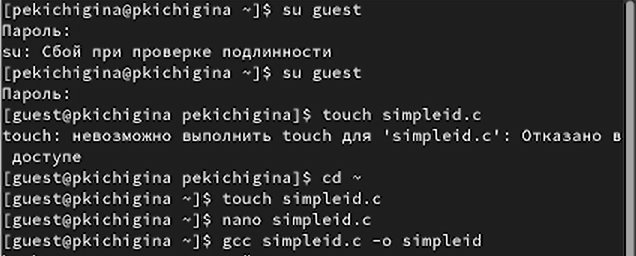
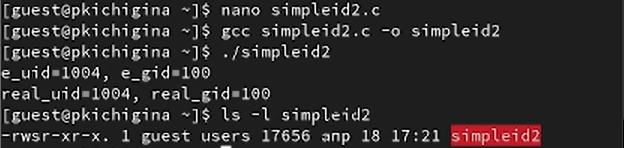
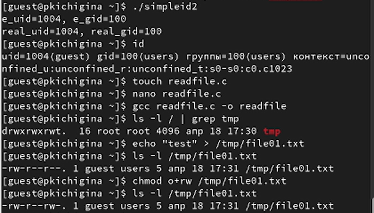

---
## Front matter
lang: ru-RU
title: Лабораторная работа №5
author:
  - Кичигина Полина Евгеньевна
institute:
  - Российский университет дружбы народов, Москва, Россия
date: 18 апреля 2026

## i18n babel
babel-lang: russian
babel-otherlangs: english

## Formatting pdf
toc: false
toc-title: Содержание
slide_level: 2
aspectratio: 169
section-titles: true
theme: metropolis
header-includes:
 - \metroset{progressbar=frametitle,sectionpage=progressbar,numbering=fraction}
---

## Цель работы

Изучение механизмов изменения идентификаторов, применения
SetUID- и Sticky-битов. Получение практических навыков работы в консоли с дополнительными атрибутами. Рассмотрение работы механизма
смены идентификатора процессов пользователей, а также влияние бита
Sticky на запись и удаление файлов.

## Выполнение лабораторной работы

 Войдите в систему от имени пользователя guest.
Создайте программу simpleid.c.
 Скомплилируйте программу и убедитесь, что файл программы создан.
Выполните программу simpleid.

{#fig:001 width=70%}

##

5. Выполните системную программу id
и сравните полученный вами результат с данными предыдущего пункта
задания. Выполните проверку правильности установки новых атрибутов и смены
владельца файла simpleid2. 

{#fig:002 width=70%}

## Исследование Sticky-бита

Выясните, установлен ли атрибут Sticky на директории /tmp. От имени пользователя guest создайте файл file01.txt в директории /tmp
со словом test. Просмотрите атрибуты у только что созданного файла и разрешите чте-
ние и запись для категории пользователей «все остальные».

{#fig:003 width=50%}

##

От пользователя guest2 попробуйте записать в файл /tmp/file01.txt
слово test3, стерев при этом всю имеющуюся в файле информацию. Проверьте содержимое файла. От пользователя guest2 попробуйте удалить файл /tmp/file01.txt.
 Повысьте свои права до суперпользователя и верните атрибут t на ди-
ректорию /tmp.

{#fig:004 width=50%}

## Выводы

Мы изучили механизмы изменения идентификаторов, применения
SetUID- и Sticky-битов. Получение практических навыков работы в консоли с дополнительными атрибутами. Рассмотрение работы механизма
смены идентификатора процессов пользователей, а также влияние бита
Sticky на запись и удаление файлов.

## {.standout}

Спасибо за внимание!
