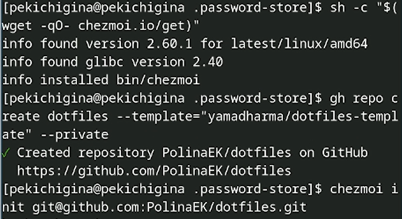

---
## Front matter
lang: ru-RU
title: Лабораторная работа №5
author:
  - Кичигина Полина Евгеньевна
institute:
  - Российский университет дружбы народов, Москва, Россия
date: 15 марта 2025

## i18n babel
babel-lang: russian
babel-otherlangs: english

## Formatting pdf
toc: false
toc-title: Содержание
slide_level: 2
aspectratio: 169
section-titles: true
theme: metropolis
header-includes:
 - \metroset{progressbar=frametitle,sectionpage=progressbar,numbering=fraction}
---

## Цель работы

Настройка рабочей среды Linux.

## Менеджер паролей pass

Установка 

{#fig:001 width=70%}

## Настройка

Ключи GPG и инициализация хранилища

{#fig:002 width=70%}

## Создание репозитория 

Создаем новый репозиторий на github 

{#fig:003 width=50%}

## Синхронизация с git

Создадим структуру git. Также можно задать адрес репозитория на хостинге 

{#fig:004 width=50%}

## Прямые изменения

Следует заметить, что отслеживаются только изменения, сделанные через сам gopass (или pass). Если изменения сделаны непосредственно на файловой системе, необходимо вручную закоммитить и выложить изменения 

{#fig:005 width=70%}

## Настройка интерфейса с броузером

Для взаимодействия с броузером используется интерфейс native messaging. Поэтому кроме плагина к броузеру устанавливается программа, обеспечивающая интерфейс native messaging 

{#fig:006 width=25%}

## Сохранение пароля

Добавить новый пароль, отобразить пароль для указанного имени файла и заменить существующий пароль 

{#fig:007 width=30%}

## Дополнительное программное обеспечение

Установите дополнительное программное обеспечение 

{#fig:008 width=50%}

## Установка

Установка бинарного файла. Скрипт определяет архитектуру процессора и операционную систему и скачивает необходимый файл.
Создадим свой репозиторий для конфигурационных файлов на основе шаблона. Инициализируйте chezmoi с вашим репозиторием dotfiles 

{#fig:009 width=50%}

## Ежедневные операции c chezmoi

Извлеките последние изменения из репозитория и примените их. Извлеките последние изменения из своего репозитория и посмотрите, что изменится, фактически не применяя изменения 

{#fig:010 width=50%}

## Автоматически фиксируйте и отправляйте изменения в репозиторий

Можно автоматически фиксировать и отправлять изменения в исходный каталог в репозиторий. Эта функция отключена по умолчанию. Чтобы включить её, добавьте в файл конфигурации ~/.config/chezmoi/chezmoi.toml следующее 

{#fig:011 width=70%}

## Выводы

Мы научились настраивать рабочую среду Linux.

## {.standout}

Спасибо за внимание!
