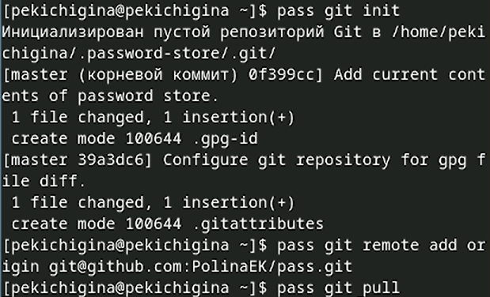
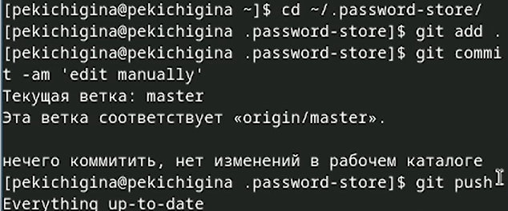
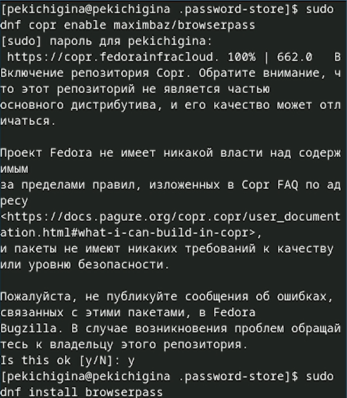
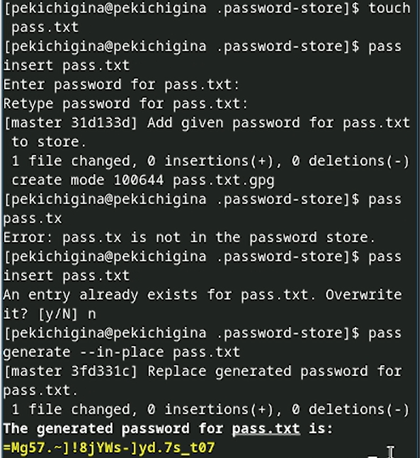
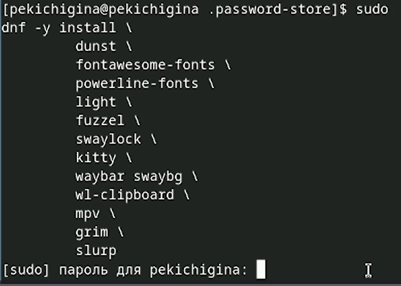
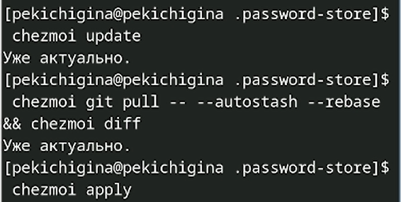
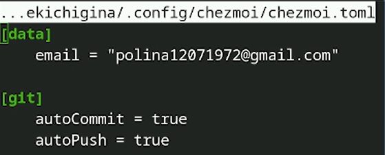

---
## Front matter
title: "Отчёт по лабораторной работе №5"
subtitle: "Отчет"
author: "Кичигина Полина Евгеньевна"

## Generic otions
lang: ru-RU
toc-title: "Содержание"

## Bibliography
bibliography: bib/cite.bib
csl: pandoc/csl/gost-r-7-0-5-2008-numeric.csl

## Pdf output format
toc: true # Table of contents
toc-depth: 2
lof: true # List of figures
lot: true # List of tables
fontsize: 12pt
linestretch: 1.5
papersize: a4
documentclass: scrreprt
## I18n polyglossia
polyglossia-lang:
  name: russian
  options:
	- spelling=modern
	- babelshorthands=true
polyglossia-otherlangs:
  name: english
## I18n babel
babel-lang: russian
babel-otherlangs: english
## Fonts
mainfont: IBM Plex Serif
romanfont: IBM Plex Serif
sansfont: IBM Plex Sans
monofont: IBM Plex Mono
mathfont: STIX Two Math
mainfontoptions: Ligatures=Common,Ligatures=TeX,Scale=0.94
romanfontoptions: Ligatures=Common,Ligatures=TeX,Scale=0.94
sansfontoptions: Ligatures=Common,Ligatures=TeX,Scale=MatchLowercase,Scale=0.94
monofontoptions: Scale=MatchLowercase,Scale=0.94,FakeStretch=0.9
mathfontoptions:
## Biblatex
biblatex: true
biblio-style: "gost-numeric"
biblatexoptions:
  - parentracker=true
  - backend=biber
  - hyperref=auto
  - language=auto
  - autolang=other*
  - citestyle=gost-numeric
## Pandoc-crossref LaTeX customization
figureTitle: "Рис."
tableTitle: "Таблица"
listingTitle: "Листинг"
lofTitle: "Список иллюстраций"
lotTitle: "Список таблиц"
lolTitle: "Листинги"
## Misc options
indent: true
header-includes:
  - \usepackage{indentfirst}
  - \usepackage{float} # keep figures where there are in the text
  - \floatplacement{figure}{H} # keep figures where there are in the text
---

# Цель работы

Настройка рабочей среды Linux.

# Выполнение лабораторной работы

1. Менеджер паролей pass

Установка (рис. [-@fig:001])

{#fig:001 width=70%}

2. Настройка

Ключи GPG и инициализация хранилища (рис. [-@fig:002])

{#fig:002 width=70%}

3. Создание репозитория 

Создаем новый репозиторий на github (рис. [-@fig:003])

{#fig:003 width=70%}

4. Синхронизация с git

Создадим структуру git. Также можно задать адрес репозитория на хостинге (рис. [-@fig:004])

{#fig:004 width=70%}

5. Прямые изменения

Следует заметить, что отслеживаются только изменения, сделанные через сам gopass (или pass). Если изменения сделаны непосредственно на файловой системе, необходимо вручную закоммитить и выложить изменения (рис. [-@fig:005])

{#fig:005 width=70%}

6. Настройка интерфейса с броузером

Для взаимодействия с броузером используется интерфейс native messaging. Поэтому кроме плагина к броузеру устанавливается программа, обеспечивающая интерфейс native messaging (рис. [-@fig:006])

{#fig:006 width=70%}

7. Сохранение пароля

Добавить новый пароль, отобразить пароль для указанного имени файла и заменить существующий пароль (рис. [-@fig:007])

{#fig:007 width=70%}

8. Дополнительное программное обеспечение

Установите дополнительное программное обеспечение (рис. [-@fig:008])

{#fig:008 width=70%}

9. Установка

Установка бинарного файла. Скрипт определяет архитектуру процессора и операционную систему и скачивает необходимый файл.
Создадим свой репозиторий для конфигурационных файлов на основе шаблона. Инициализируйте chezmoi с вашим репозиторием dotfiles (рис. [-@fig:009])

{#fig:009 width=70%}

10. Ежедневные операции c chezmoi

Извлеките последние изменения из репозитория и примените их. Извлеките последние изменения из своего репозитория и посмотрите, что изменится, фактически не применяя изменения (рис. [-@fig:010])

{#fig:010 width=70%}

11. Автоматически фиксируйте и отправляйте изменения в репозиторий

Можно автоматически фиксировать и отправлять изменения в исходный каталог в репозиторий. Эта функция отключена по умолчанию. Чтобы включить её, добавьте в файл конфигурации ~/.config/chezmoi/chezmoi.toml следующее (рис. [-@fig:011])

{#fig:011 width=70%}

# Выводы

Мы научились настраивать рабочую среду Linux.

