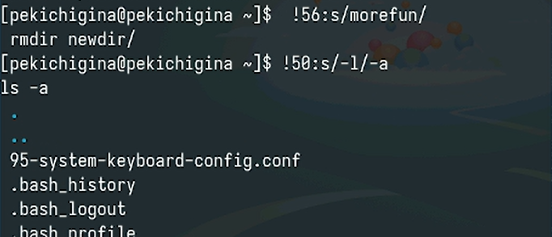

---
## Front matter
lang: ru-RU
title: Лабораторная работа №6
author:
  - Кичигина Полина Евгеньевна
institute:
  - Российский университет дружбы народов, Москва, Россия
date: 20 марта 2025

## i18n babel
babel-lang: russian
babel-otherlangs: english

## Formatting pdf
toc: false
toc-title: Содержание
slide_level: 2
aspectratio: 169
section-titles: true
theme: metropolis
header-includes:
 - \metroset{progressbar=frametitle,sectionpage=progressbar,numbering=fraction}
---

## Цель работы

Приобретение практических навыков взаимодействия пользователя с системой посредством командной строки.

## Определите полное имя вашего домашнего каталога. Далее относительно этого каталога будут выполняться последующие упражнения.

Выполните следующие действия:
Перейдите в каталог /tmp.
Выведите на экран содержимое каталога /tmp. Для этого используйте команду ls
с различными опциями 

{#fig:001 width=50%}

## Определите, есть ли в каталоге /var/spool подкаталог с именем cron? 

{#fig:002 width=70%}

## Выполните следующие действия

В домашнем каталоге создайте новый каталог с именем newdir.
В каталоге ~/newdir создайте новый каталог с именем morefun.
В домашнем каталоге создайте одной командой три новых каталога с именами letters, memos, misk. Затем удалите эти каталоги одной командой.
Попробуйте удалить ранее созданный каталог ~/newdir командой rm. Проверьте, был ли каталог удалён.
Удалите каталог ~/newdir/morefun из домашнего каталога.

{#fig:003 width=30%}

## С помощью команды man определите, какую опцию команды ls нужно использовать для просмотра содержимое не только указанного каталога, но и подкаталогов, входящих в него 

{#fig:004 width=70%}

## Используйте команду man для просмотра описания следующих команд: cd, pwd, mkdir, rmdir, rm

{#fig:005 width=70%}

## Используя информацию, полученную при помощи команды history, выполните модификацию и исполнение нескольких команд из буфера команд 

{#fig:006 width=70%}

## Ответы на контрольные вопросы

1. Интерфейс для взаимодействия с ОС через текстовые команды.
2. pwd пример: pekichigina/home/
3. ls -l 
4. ls -a
5. rm для файла, rmdir для каталога. Одной командой нельзя.
6. С помощью команды history.
7. !номер_команды/старая/новая пример: !50:s/-l/-a
8. ls; pwd
9. Это отмена специального значения символа. Пример: echo "hello\"world\""
10. Подробная информация.
11. Это путь относительно текущего каталога. 
12. С помощью команды man
13. Tab

## Выводы

Мы приобрели практические навыки взаимодействия пользователя с системой посредством командной строки.
