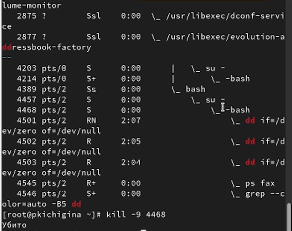

---
## Front matter
lang: ru-RU
title: Лабораторная работа №6
author:
  - Кичигина Полина Евгеньевна
institute:
  - Российский университет дружбы народов, Москва, Россия
date: 11 октября 2025

## i18n babel
babel-lang: russian
babel-otherlangs: english

## Formatting pdf
toc: false
toc-title: Содержание
slide_level: 2
aspectratio: 169
section-titles: true
theme: metropolis
header-includes:
 - \metroset{progressbar=frametitle,sectionpage=progressbar,numbering=fraction}
---

## Цель работы

Получить навыки управления процессами операционной системы.

## Выполнение лабораторной работы

1. Управление заданиями.
Получите полномочия администратора. 
Вы увидите три задания, которые вы только что запустили. Первые два имеют состояние Running, а последнее задание в настоящее время находится в состоянии
Stopped.

{#fig:001 width=40%}

## 2. Управление процессами.

Получите полномочия администратора. Используйте PID одного из процессов dd, чтобы изменить приоритет. 

{#fig:002 width=45%}

## 3. Задание 1.

Увеличьте приоритет одной из этих команд, используя значение приоритета −5.
Измените приоритет того же процесса ещё раз, но используйте на этот раз значение
−15. 
Завершите все процессы dd, которые вы запустили.

{#fig:003 width=45%}

## 4. Задание 2.

 Запустите программу yes в фоновом режиме с подавлением потока вывода.
Запустите программу yes на переднем плане с подавлением потока вывода. 

{#fig:004 width=60%}

## Задание 2 

 Запустите ещё три программы yes в фоновом режиме с подавлением потока вывода.
Убейте два процесса: для одного используйте его PID, а для другого — его идентификатор конкретного задания.
 

{#fig:005 width=50%}

## Выводы

Мы приобрели практические навыки управления процессами операционной системы.
