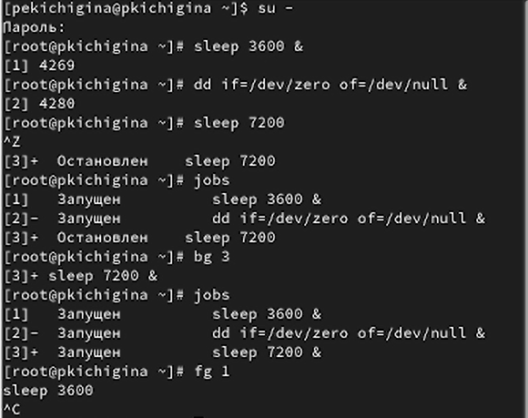
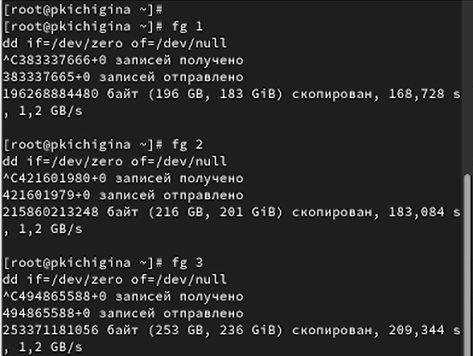
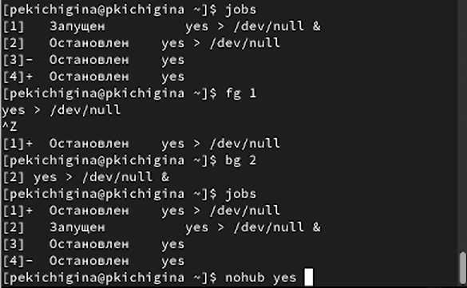
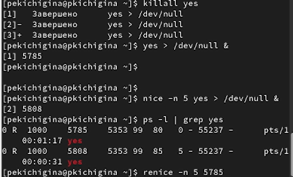

---
## Front matter
title: "Отчет по Лабораторной работе №6"
subtitle: "Отчет"
author: "Кичигина Полина Евгеньевна"

## Generic otions
lang: ru-RU
toc-title: "Содержание"

## Bibliography
bibliography: bib/cite.bib
csl: pandoc/csl/gost-r-7-0-5-2008-numeric.csl

## Pdf output format
toc: true # Table of contents
toc-depth: 2
lof: true # List of figures
lot: true # List of tables
fontsize: 12pt
linestretch: 1.5
papersize: a4
documentclass: scrreprt
## I18n polyglossia
polyglossia-lang:
  name: russian
  options:
	- spelling=modern
	- babelshorthands=true
polyglossia-otherlangs:
  name: english
## I18n babel
babel-lang: russian
babel-otherlangs: english
## Fonts
mainfont: IBM Plex Serif
romanfont: IBM Plex Serif
sansfont: IBM Plex Sans
monofont: IBM Plex Mono
mathfont: STIX Two Math
mainfontoptions: Ligatures=Common,Ligatures=TeX,Scale=0.94
romanfontoptions: Ligatures=Common,Ligatures=TeX,Scale=0.94
sansfontoptions: Ligatures=Common,Ligatures=TeX,Scale=MatchLowercase,Scale=0.94
monofontoptions: Scale=MatchLowercase,Scale=0.94,FakeStretch=0.9
mathfontoptions:
## Biblatex
biblatex: true
biblio-style: "gost-numeric"
biblatexoptions:
  - parentracker=true
  - backend=biber
  - hyperref=auto
  - language=auto
  - autolang=other*
  - citestyle=gost-numeric
## Pandoc-crossref LaTeX customization
figureTitle: "Рис."
tableTitle: "Таблица"
listingTitle: "Листинг"
lofTitle: "Список иллюстраций"
lotTitle: "Список таблиц"
lolTitle: "Листинги"
## Misc options
indent: true
header-includes:
  - \usepackage{indentfirst}
  - \usepackage{float} # keep figures where there are in the text
  - \floatplacement{figure}{H} # keep figures where there are in the text
---

# Цель работы

Получить навыки управления процессами операционной системы.

# Выполнение лабораторной работы

1. Управление заданиями.

Получите полномочия администратора. Введите следующие команды. 
Вы увидите три задания, которые вы только что запустили. Первые два имеют со-
стояние Running, а последнее задание в настоящее время находится в состоянии
Stopped. Для продолжения выполнения задания 3 в фоновом режиме введите
bg 3
С помощью команды jobs посмотрите изменения в статусе заданий.
 Введите Ctrl + c , чтобы отменить задание 1. С помощью команды jobs посмотрите
изменения в статусе заданий.
Проделайте то же самое для отмены заданий 2 и 3.
Откройте второй терминал и под учётной записью своего пользователя введите в нём. Введите exit, чтобы закрыть второй терминал.
 На другом терминале под учётной записью своего пользователя запустите
top.
Вы увидите, что задание dd всё ещё запущено. Для выхода из top используйте q .
 Вновь запустите top и в нём используйте k , чтобы убить задание dd. После этого
выйдите из top (рис. [-@fig:001])

{#fig:001 width=70%}

2. Управление процессами.

Получите полномочия администратора. Используйте PID одного из процессов dd, чтобы изменить приоритет. 
 Введите
ps fax | grep -B5 dd
Параметр -B5 показывает соответствующие запросу строки, включая пять строк до
этого. Поскольку ps fax показывает иерархию отношений между процессами, вы
также увидите оболочку, из которой были запущены все процессы dd, и её PID.
Найдите PID корневой оболочки, из которой были запущены процессы dd, и введите
kill -9 <PID> (рис. [-@fig:002])

{#fig:002 width=70%}

3. Задание 1.

 Запустите команду
dd if=/dev/zero of=/dev/null
трижды как фоновое задание.
Увеличьте приоритет одной из этих команд, используя значение приоритета −5.
Измените приоритет того же процесса ещё раз, но используйте на этот раз значение
−15. 
Завершите все процессы dd, которые вы запустили.(рис. [-@fig:003])

{#fig:003 width=70%}

4. Задание 2.

 Запустите программу yes в фоновом режиме с подавлением потока вывода.
Запустите программу yes на переднем плане с подавлением потока вывода. При-
остановите выполнение программы. Заново запустите программу yes с теми же
параметрами, затем завершите её выполнение.
 Запустите программу yes на переднем плане без подавления потока вывода. При-
остановите выполнение программы. Заново запустите программу yes с теми же
параметрами, затем завершите её выполнение.
 Проверьте состояния заданий, воспользовавшись командой jobs.
Переведите процесс, который у вас выполняется в фоновом режиме, на передний
план, затем остановите его.
 Переведите любой ваш процесс с подавлением потока вывода в фоновый режим.
Проверьте состояния заданий, воспользовавшись командой jobs. Обратите внимание,
что процесс стал выполняющимся (Running) в фоновом режиме.
 Запустите процесс в фоновом режиме таким образом, чтобы он продолжил свою
работу даже после отключения от терминала. (рис. [-@fig:004])

{#fig:004 width=70%}

Закройте окно и заново запустите консоль. Убедитесь, что процесс продолжил свою
работу.
 Получите информацию о запущенных в операционной системе процессах с помощью
утилиты top.
 Запустите ещё три программы yes в фоновом режиме с подавлением потока вывода.
Убейте два процесса: для одного используйте его PID, а для другого — его идентифи-
катор конкретного задания.
 Попробуйте послать сигнал 1 (SIGHUP) процессу, запущенному с помощью nohup,
и обычному процессу.
 Запустите ещё несколько программ yes в фоновом режиме с подавлением потока
вывода.
 Завершите их работу одновременно, используя команду killall.
 Запустите программу yes в фоновом режиме с подавлением потока вывода. Используя
утилиту nice, запустите программу yes с теми же параметрами и с приоритетом,
большим на 5. Сравните абсолютные и относительные приоритеты у этих двух про-
цессов.
 Используя утилиту renice, измените приоритет у одного из потоков yes таким обра-
зом, чтобы у обоих потоков приоритеты были равны. (рис. [-@fig:005])

{#fig:005 width=70%}

# Выводы

Мы приобрели практические навыки управления процессами операционной системы.

