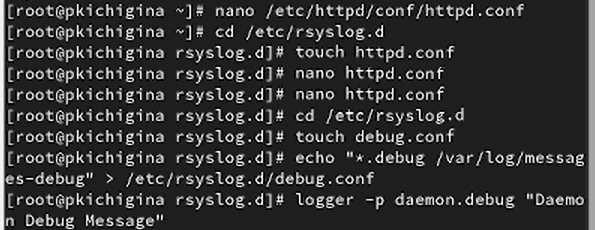
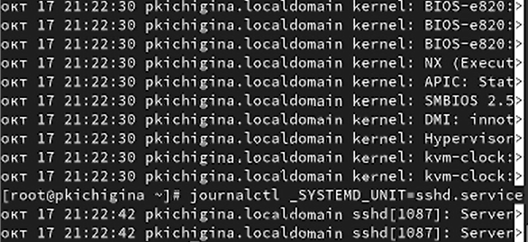
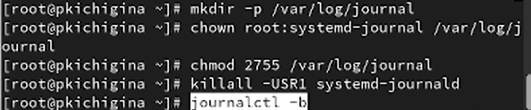

---
## Front matter
lang: ru-RU
title: Лабораторная работа №7
author:
  - Кичигина Полина Евгеньевна
institute:
  - Российский университет дружбы народов, Москва, Россия
date: 17 октября 2025

## i18n babel
babel-lang: russian
babel-otherlangs: english

## Formatting pdf
toc: false
toc-title: Содержание
slide_level: 2
aspectratio: 169
section-titles: true
theme: metropolis
header-includes:
 - \metroset{progressbar=frametitle,sectionpage=progressbar,numbering=fraction}
---

## Цель работы

Получить навыки работы с журналами мониторинга различных событий в системе.

## Задание

1. Продемонстрируйте навыки работы с журналом мониторинга событий в реальном
времени.
2. Продемонстрируйте навыки создания и настройки отдельного файла конфигурации
мониторинга отслеживания событий веб-службы.
3. Продемонстрируйте навыки работы с journalctl.
4. Продемонстрируйте навыки работы с journald.

## Выполнение лабораторной работы

1. Мониторинг журнала системных событий в реальном времени.

{#fig:001 width=70%}

## 2. Изменение правил rsyslog.conf.

По умолчанию веб-служба не регистрирует свои сообщения через rsyslog, а пишет
свой собственный журнал (в каталоге /var/log/httpd). Настройте регистрацию сообще-
ний веб-службы через syslog, создав правило, регистрирующее отладочные сообщения
в отдельном лог-файле.

{#fig:002 width=70%}

##

В третьей вкладке терминала создайте отдельный файл конфигурации для монито-
ринга отладочной информации. 

{#fig:003 width=70%}

## 3. Использование journalctl

Для пролистывания журнала используйте или Enter (построчный просмотр), или про-
бел (постраничный просмотр). Для выхода из просмотра используйте q .
Для просмотра дополнительной информации о модуле sshd введите
journalctl _SYSTEMD_UNIT=sshd.service 

{#fig:004 width=70%}

## 4. Постоянный журнал journald.

По умолчанию журнал journald хранит сообщения в оперативной памяти системы
и записи доступны в каталоге /run/log/journal только до перезагрузки системы.

{#fig:005 width=70%}

## Выводы

Мы получили навыки работы с журналами мониторинга различных событий в системе.

