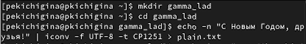
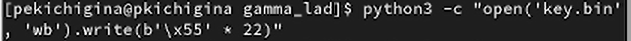

---
## Front matter
title: "Отчет по Лабораторной Работе №7"
subtitle: "Отчет"
author: "Кичигина Полина Евгеньевна"

## Generic otions
lang: ru-RU
toc-title: "Содержание"

## Bibliography
bibliography: bib/cite.bib
csl: pandoc/csl/gost-r-7-0-5-2008-numeric.csl

## Pdf output format
toc: true # Table of contents
toc-depth: 2
lof: true # List of figures
lot: true # List of tables
fontsize: 12pt
linestretch: 1.5
papersize: a4
documentclass: scrreprt
## I18n polyglossia
polyglossia-lang:
  name: russian
  options:
	- spelling=modern
	- babelshorthands=true
polyglossia-otherlangs:
  name: english
## I18n babel
babel-lang: russian
babel-otherlangs: english
## Fonts
mainfont: IBM Plex Serif
romanfont: IBM Plex Serif
sansfont: IBM Plex Sans
monofont: IBM Plex Mono
mathfont: STIX Two Math
mainfontoptions: Ligatures=Common,Ligatures=TeX,Scale=0.94
romanfontoptions: Ligatures=Common,Ligatures=TeX,Scale=0.94
sansfontoptions: Ligatures=Common,Ligatures=TeX,Scale=MatchLowercase,Scale=0.94
monofontoptions: Scale=MatchLowercase,Scale=0.94,FakeStretch=0.9
mathfontoptions:
## Biblatex
biblatex: true
biblio-style: "gost-numeric"
biblatexoptions:
  - parentracker=true
  - backend=biber
  - hyperref=auto
  - language=auto
  - autolang=other*
  - citestyle=gost-numeric
## Pandoc-crossref LaTeX customization
figureTitle: "Рис."
tableTitle: "Таблица"
listingTitle: "Листинг"
lofTitle: "Список иллюстраций"
lotTitle: "Список таблиц"
lolTitle: "Листинги"
## Misc options
indent: true
header-includes:
  - \usepackage{indentfirst}
  - \usepackage{float} # keep figures where there are in the text
  - \floatplacement{figure}{H} # keep figures where there are in the text
---

# Цель работы

Освоить на практике применение режима однократного гаммирования.

# Задание

Нужно подобрать ключ, чтобы получить сообщение «С Новым Годом,
друзья!». Требуется разработать приложение, позволяющее шифровать и
дешифровать данные в режиме однократного гаммирования. Приложение
должно:

1. Определить вид шифротекста при известном ключе и известном откры-
том тексте.
2. Определить ключ, с помощью которого шифротекст может быть преоб-
разован в некоторый фрагмент текста, представляющий собой один из
возможных вариантов прочтения открытого текста.

# Выполнение лабораторной работы

1. Создаем открытый текст. (рис. [-@fig:001])

{#fig:001 width=70%}

2. Создаем ключ. (рис. [-@fig:002])

{#fig:002 width=70%}

3. Шифрование. (рис. [-@fig:003])

{#fig:003 width=70%}

4. Нахождение ключа. (рис. [-@fig:004])

{#fig:004 width=70%}

# Выводы

Мы освоили на практике применение режима однократного гаммирования.

# Ответы на контрольные вопросы

1. Однократное гаммирование — наложение случайной гаммы (ключа) длиной с сообщение по XOR.

2. Недостатки: длина ключа = длине сообщения, проблема передачи ключа, ключ одноразовый.

3. Преимущества: абсолютная стойкость при случайном ключе.

4. Длина ключа = длине текста, иначе не хватит для гаммирования всех символов.

5. Операция XOR — обратима, проста, не меняет длину.

6. По открытому тексту и ключу получить шифротекст: C = P XOR K.

7. По открытому тексту и шифротексту получить ключ: K = C XOR P.

8. Условия абсолютной стойкости: ключ случайный, длина равна сообщению, одноразовый.

