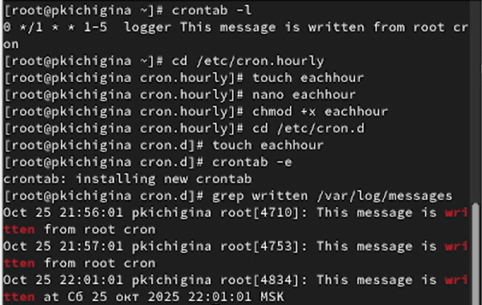

---
## Front matter
title: "Отчёт по лабораторной работе №8"
subtitle: "Отчет"
author: "Кичигина Полина Евгеньевна"

## Generic otions
lang: ru-RU
toc-title: "Содержание"

## Bibliography
bibliography: bib/cite.bib
csl: pandoc/csl/gost-r-7-0-5-2008-numeric.csl

## Pdf output format
toc: true # Table of contents
toc-depth: 2
lof: true # List of figures
lot: true # List of tables
fontsize: 12pt
linestretch: 1.5
papersize: a4
documentclass: scrreprt
## I18n polyglossia
polyglossia-lang:
  name: russian
  options:
	- spelling=modern
	- babelshorthands=true
polyglossia-otherlangs:
  name: english
## I18n babel
babel-lang: russian
babel-otherlangs: english
## Fonts
mainfont: IBM Plex Serif
romanfont: IBM Plex Serif
sansfont: IBM Plex Sans
monofont: IBM Plex Mono
mathfont: STIX Two Math
mainfontoptions: Ligatures=Common,Ligatures=TeX,Scale=0.94
romanfontoptions: Ligatures=Common,Ligatures=TeX,Scale=0.94
sansfontoptions: Ligatures=Common,Ligatures=TeX,Scale=MatchLowercase,Scale=0.94
monofontoptions: Scale=MatchLowercase,Scale=0.94,FakeStretch=0.9
mathfontoptions:
## Biblatex
biblatex: true
biblio-style: "gost-numeric"
biblatexoptions:
  - parentracker=true
  - backend=biber
  - hyperref=auto
  - language=auto
  - autolang=other*
  - citestyle=gost-numeric
## Pandoc-crossref LaTeX customization
figureTitle: "Рис."
tableTitle: "Таблица"
listingTitle: "Листинг"
lofTitle: "Список иллюстраций"
lotTitle: "Список таблиц"
lolTitle: "Листинги"
## Misc options
indent: true
header-includes:
  - \usepackage{indentfirst}
  - \usepackage{float} # keep figures where there are in the text
  - \floatplacement{figure}{H} # keep figures where there are in the text
---

# Цель работы

Ознакомление с инструментами поиска файлов и фильтрации текстовых данных. Приобретение практических навыков: по управлению процессами (и заданиями), по проверке использования диска и обслуживанию файловых систем.

# Выполнение лабораторной работы

1. Осуществите вход в систему, используя соответствующее имя пользователя. Запишите в файл file.txt названия файлов, содержащихся в каталоге /etc. Допишите в этот же файл названия файлов, содержащихся в вашем домашнем каталоге (рис. [-@fig:001])

{#fig:001 width=70%}

2. Выведите имена всех файлов из file.txt, имеющих расширение .conf, после чего запишите их в новый текстовой файл conf.txt (рис. [-@fig:002])

{#fig:002 width=70%}

3. Определите, какие файлы в вашем домашнем каталоге имеют имена, начинавшиеся с символа c? Предложите несколько вариантов, как это сделать (рис. [-@fig:003])

{#fig:003 width=70%}

4. Выведите на экран (по странично) имена файлов из каталога /etc, начинающиеся с символа h. Запустите в фоновом режиме процесс, который будет записывать в файл ~/logfile файлы, имена которых начинаются с log (рис. [-@fig:004])

{#fig:004 width=70%}

5. Удалите файл ~/logfile. Запустите из консоли в фоновом режиме редактор gedit. Определите идентификатор процесса gedit, используя команду ps, конвейер и фильтр grep. Как ещё можно определить идентификатор процесса? Прочтите справку (man) команды kill, после чего используйте её для завершения процесса gedit. Выполните команды df и du, предварительно получив более подробную информацию об этих командах, с помощью команды man (рис. [-@fig:005])

{#fig:005 width=70%}

6. Воспользовавшись справкой команды find, выведите имена всех директорий, имеющихся в вашем домашнем каталоге (рис. [-@fig:006])

{#fig:006 width=70%}

# Выводы

Мы ознакомились с инструментами поиска файлов и фильтрации текстовых данных. Приобрели практические навыки: по управлению процессами (и заданиями), по проверке использования диска и обслуживанию файловых систем.

# Ответы на контрольные вопросы

1. Потоки ввода/вывода: Стандартный ввод (stdin), стандартный вывод (stdout), стандартный вывод ошибок (stderr).

2. > vs. >>: > перенаправляет вывод, перезаписывая файл. >> перенаправляет вывод, добавляя его в конец файла.

3. Конвейер: Последовательное соединение команд, где вывод одной команды становится вводом для следующей (используется символ |).

4. Процесс vs. Программа: Программа - это набор инструкций. Процесс - это выполняющийся экземпляр программы.

5. PID и GID: PID - идентификатор процесса. GID - идентификатор группы.

6. Задачи и управление: Задачи - фоновые процессы. Управление: bg (запустить в фоне), fg (вернуть на передний план), jobs (список).

7. top/htop: Мониторинг процессов. top - стандартная, htop - интерактивная с удобным интерфейсом.

8. Поиск файлов: find. Пример: find /path/to/search -name "filename.txt" (поиск по имени). Характеристика: поиск файлов по разным критериям (имя, размер, тип, дата и т.д.).

9. Поиск по содержанию: Да, с помощью grep. Пример: grep "search_string" /path/to/file.

10. Свободная память (диск): df -h.

11. Объем домашнего каталога: du -sh ~.

12. Удаление зависшего процесса: kill -9 PID (где PID - идентификатор процесса).

