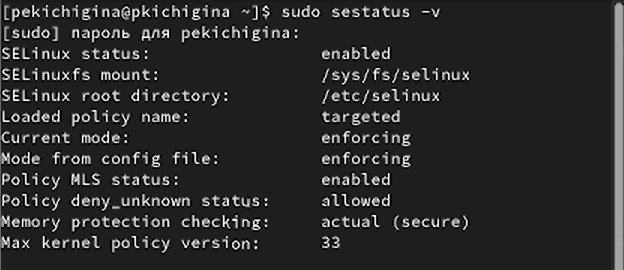
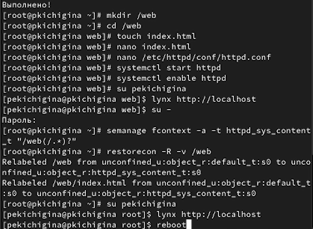
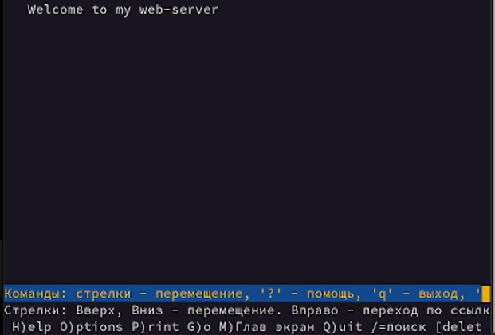
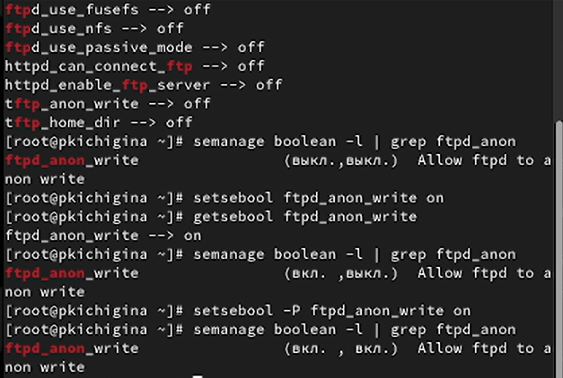

---
## Front matter
title: "Отчёт по лабораторной работе №9"
subtitle: "Отчет"
author: "Кичигина Полина Евгеньевна"

## Generic otions
lang: ru-RU
toc-title: "Содержание"

## Bibliography
bibliography: bib/cite.bib
csl: pandoc/csl/gost-r-7-0-5-2008-numeric.csl

## Pdf output format
toc: true # Table of contents
toc-depth: 2
lof: true # List of figures
lot: true # List of tables
fontsize: 12pt
linestretch: 1.5
papersize: a4
documentclass: scrreprt
## I18n polyglossia
polyglossia-lang:
  name: russian
  options:
	- spelling=modern
	- babelshorthands=true
polyglossia-otherlangs:
  name: english
## I18n babel
babel-lang: russian
babel-otherlangs: english
## Fonts
mainfont: IBM Plex Serif
romanfont: IBM Plex Serif
sansfont: IBM Plex Sans
monofont: IBM Plex Mono
mathfont: STIX Two Math
mainfontoptions: Ligatures=Common,Ligatures=TeX,Scale=0.94
romanfontoptions: Ligatures=Common,Ligatures=TeX,Scale=0.94
sansfontoptions: Ligatures=Common,Ligatures=TeX,Scale=MatchLowercase,Scale=0.94
monofontoptions: Scale=MatchLowercase,Scale=0.94,FakeStretch=0.9
mathfontoptions:
## Biblatex
biblatex: true
biblio-style: "gost-numeric"
biblatexoptions:
  - parentracker=true
  - backend=biber
  - hyperref=auto
  - language=auto
  - autolang=other*
  - citestyle=gost-numeric
## Pandoc-crossref LaTeX customization
figureTitle: "Рис."
tableTitle: "Таблица"
listingTitle: "Листинг"
lofTitle: "Список иллюстраций"
lotTitle: "Список таблиц"
lolTitle: "Листинги"
## Misc options
indent: true
header-includes:
  - \usepackage{indentfirst}
  - \usepackage{float} # keep figures where there are in the text
  - \floatplacement{figure}{H} # keep figures where there are in the text
---

# Цель работы

Получить навыки работы с контекстом безопасности и политиками SELinux.

# Задание

1. Продемонстрируйте навыки по управлению режимами SELinux.
2. Продемонстрируйте навыки по восстановлению контекста безопасности SELinux.
3. Настройте контекст безопасности для нестандартного расположения файлов веб-
службы.
4. Продемонстрируйте навыки работы с переключателями SELinux.

# Выполнение лабораторной работы

1. Управление режимами SELinux.

Просмотрите текущую информацию о состоянии SELinux. Посмотрите, в каком режиме работает SELinux. Измените режим работы SELinux на разрешающий (Permissive). В файле /etc/sysconfig/selinux с помощью редактора установите SELINUX=disabled. Перезагрузите систему.
 Посмотрите статус SELinux. Попробуйте переключить режим работы SELinux. Откройте файл /etc/sysconfig/selinux с помощью редактора и установите: SELINUX=enforcing. Перезагрузите систему.
После перезагрузки в терминале с полномочиями администратора просмотрите текущую информацию о состоянии SELinux.
Убедитесь, что система работает в принудительном режиме (enforcing) использования
SELinux.(рис. [-@fig:001])

{#fig:001 width=70%}

2. Использование restorecon для восстановления контекста
безопасности.

Посмотрите контекст безопасности файла /etc/hosts. Скопируйте файл /etc/hosts в домашний каталог.
Проверьте контекст файла ~/hosts. Попытайтесь перезаписать существующий файл hosts из домашнего каталога в каталог /etc. Убедитесь, что тип контекста по-прежнему установлен на admin_home_t. Исправьте контекст безопасности. Убедитесь, что тип контекста изменился. Для массового исправления контекста безопасности на файловой системе введите touch /.autorelabel и перезагрузите систему. (рис. [-@fig:002])

{#fig:002 width=70%}

3. Настройка контекста безопасности для нестандартного
расположения файлов веб-сервера.

 Установите необходимое программное обеспечение. Создайте новое хранилище для файлов web-сервера. Создайте файл index.html в каталоге с контентом веб-сервера. Запустите веб-сервер и службу httpd. В терминале под учётной записью своего пользователя при обращении к веб-серверу в текстовом браузере lynx вы увидите веб-страницу Red Hat по умолчанию, а не содержимое только что созданного файла index.html.(рис. [-@fig:003])

{#fig:003 width=70%}

В терминале с полномочиями администратора примените новую метку контекста
к /web. Восстановите контекст безопасности. В терминале под учётной записью своего пользователя снова обратитесь к веб-серверу.
Теперь вы получите доступ к своей пользовательской веб-странице. Если этого не
произошло, то перегрузите систему и снова попытайтесь получить доступ к своей
пользовательской веб-странице. В случае успеха на экране должна быть отображена
запись «Welcome to my web-server».(рис. [-@fig:004])

{#fig:004 width=70%}

4. Работа с переключателями SELinux.

 Посмотрите список переключателей SELinux для службы ftp. Для службы ftpd_anon посмотрите список переключателей с пояснением, за что
отвечает каждый переключатель, включён он или выключен. Измените текущее значение переключателя для службы ftpd_anon_write с off на
on. Повторно посмотрите список переключателей SELinux для службы ftpd_anon_write. Посмотрите список переключателей с пояснением.
Обратите внимание, что настройка времени выполнения включена, но постоянная
настройка по-прежнему отключена.
 Измените постоянное значение переключателя для службы ftpd_anon_write с off
на on. Посмотрите список переключателей. (рис. [-@fig:005])

{#fig:005 width=70%}

# Выводы

Мы получили навыки работы с контекстом безопасности и политиками SELinux.

