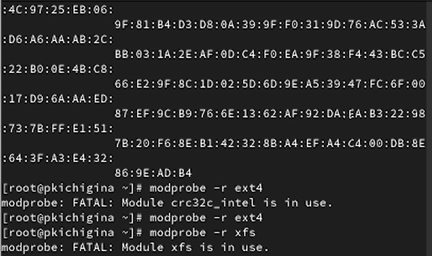
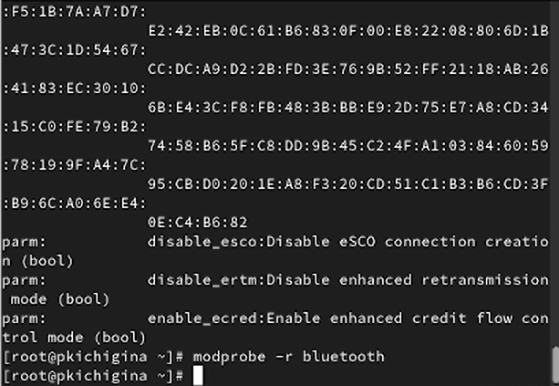
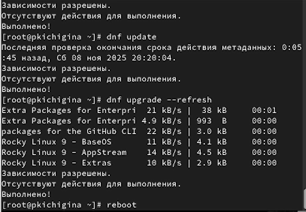

---
## Front matter
lang: ru-RU
title: Лабораторная работа №10
author:
  - Кичигина Полина Евгеньевна
institute:
  - Российский университет дружбы народов, Москва, Россия
date: 8 ноября 2025

## i18n babel
babel-lang: russian
babel-otherlangs: english

## Formatting pdf
toc: false
toc-title: Содержание
slide_level: 2
aspectratio: 169
section-titles: true
theme: metropolis
header-includes:
 - \metroset{progressbar=frametitle,sectionpage=progressbar,numbering=fraction}
---

## Цель работы

Получить навыки работы с утилитами управления модулями ядра операционной системы.

## Задание

1. Продемонстрируйте навыки работы по управлению модулями ядра.

2. Продемонстрируйте навыки работы по загрузке модулей ядра с параметрами.

## Выполнение лабораторной работы. Задание 1

1. Управление модулями ядра из командной строки. Посмотрите, какие устройства имеются в вашей системе и какие модули ядра с нимисвязаны. Загрузите модуль ядра ext4. Убедитесь, что модуль загружен, посмотрев список загруженных модулей.

{#fig:001 width=50%}

##
Посмотрите информацию о модуле ядра ext4.
Попробуйте выгрузить модуль ядра ext4.
Возможно команду потребуется ввести несколько раз. 
Попробуйте выгрузить модуль ядра xfs.
Обратите внимание, что вы получаете сообщение об ошибке, поскольку модуль ядра
в данный момент используется. 

{#fig:002 width=60%}

## 2. Загрузка модулей ядра с параметрами.

 Посмотрите, загружен ли модуль bluetooth. Загрузите модуль ядра bluetooth. Посмотрите список модулей ядра, отвечающих за работу с Bluetooth. Посмотрите информацию о модуле bluetooth.
 Выгрузите модуль ядра bluetooth. 

{#fig:003 width=45%}

## 3. Обновление ядра системы.

Посмотрите версию ядра, используемую в операционной системе. Выведите на экран список пакетов, относящихся к ядру операционной системы. Обновите ядро операционной системы, а затем саму операционную систему. Перегрузите систему. 

{#fig:004 width=45%}

##

Посмотрите версию ядра, используемую в операционной системы.

{#fig:005 width=70%}

## Выводы

Мы получили навыки работы с утилитами управления модулями ядра операционной системы.
