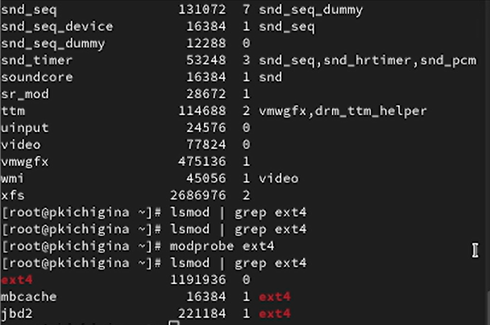
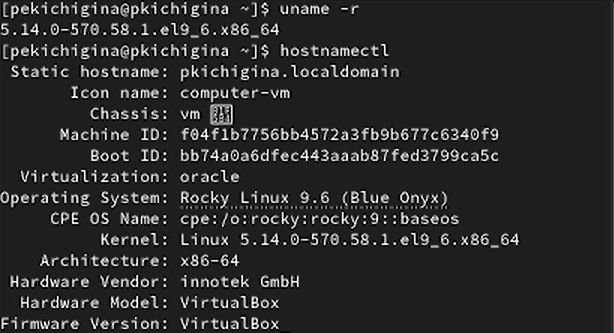

---
## Front matter
title: "Отчёт по лабораторной работе №10"
subtitle: "Отчет"
author: "Кичигина Полина Евгеньевна"

## Generic otions
lang: ru-RU
toc-title: "Содержание"

## Bibliography
bibliography: bib/cite.bib
csl: pandoc/csl/gost-r-7-0-5-2008-numeric.csl

## Pdf output format
toc: true # Table of contents
toc-depth: 2
lof: true # List of figures
lot: true # List of tables
fontsize: 12pt
linestretch: 1.5
papersize: a4
documentclass: scrreprt
## I18n polyglossia
polyglossia-lang:
  name: russian
  options:
	- spelling=modern
	- babelshorthands=true
polyglossia-otherlangs:
  name: english
## I18n babel
babel-lang: russian
babel-otherlangs: english
## Fonts
mainfont: IBM Plex Serif
romanfont: IBM Plex Serif
sansfont: IBM Plex Sans
monofont: IBM Plex Mono
mathfont: STIX Two Math
mainfontoptions: Ligatures=Common,Ligatures=TeX,Scale=0.94
romanfontoptions: Ligatures=Common,Ligatures=TeX,Scale=0.94
sansfontoptions: Ligatures=Common,Ligatures=TeX,Scale=MatchLowercase,Scale=0.94
monofontoptions: Scale=MatchLowercase,Scale=0.94,FakeStretch=0.9
mathfontoptions:
## Biblatex
biblatex: true
biblio-style: "gost-numeric"
biblatexoptions:
  - parentracker=true
  - backend=biber
  - hyperref=auto
  - language=auto
  - autolang=other*
  - citestyle=gost-numeric
## Pandoc-crossref LaTeX customization
figureTitle: "Рис."
tableTitle: "Таблица"
listingTitle: "Листинг"
lofTitle: "Список иллюстраций"
lotTitle: "Список таблиц"
lolTitle: "Листинги"
## Misc options
indent: true
header-includes:
  - \usepackage{indentfirst}
  - \usepackage{float} # keep figures where there are in the text
  - \floatplacement{figure}{H} # keep figures where there are in the text
---

# Цель работы

Получить навыки работы с утилитами управления модулями ядра операционной системы.

# Задание

1. Продемонстрируйте навыки работы по управлению модулями ядра.

2. Продемонстрируйте навыки работы по загрузке модулей ядра с параметрами.

# Выполнение лабораторной работы. Задание 1

1. Управление модулями ядра из командной строки.

Запустите терминал и получите полномочия администратора. Посмотрите, какие устройства имеются в вашей системе и какие модули ядра с ними
связаны. Посмотрите, какие модули ядра загружены. Посмотрите, загружен ли модуль ext4. Загрузите модуль ядра ext4.
Убедитесь, что модуль загружен, посмотрев список загруженных модулей (рис. [-@fig:001])

{#fig:001 width=70%}

Посмотрите информацию о модуле ядра ext4.
Обратите внимание, что у этого модуля нет параметров.
Попробуйте выгрузить модуль ядра ext4.
Возможно команду потребуется ввести несколько раз. В отчёте отразите, какую ин-
формацию выдаёт система.
Попробуйте выгрузить модуль ядра xfs.
Обратите внимание, что вы получаете сообщение об ошибке, поскольку модуль ядра
в данный момент используется. (рис. [-@fig:002]).

{#fig:002 width=70%}

2. Загрузка модулей ядра с параметрами.

 Запустите терминал и получите полномочия администратора.
 Посмотрите, загружен ли модуль bluetooth. Загрузите модуль ядра bluetooth. Посмотрите список модулей ядра, отвечающих за работу с Bluetooth. Посмотрите информацию о модуле bluetooth.
 Выгрузите модуль ядра bluetooth. (рис. [-@fig:003])

{#fig:003 width=70%}

3. Обновление ядра системы.

Rocky Linux является нисходящей версией RHEL. Это означает, что данный дистрибутив
достаточно стабилен, но имеет устаревшие пакеты с точки зрения функциональности.
 Запустите терминал и получите полномочия администратора. Посмотрите версию ядра, используемую в операционной системе. Выведите на экран список пакетов, относящихся к ядру операционной системы. Обновите систему, чтобы убедиться, что все существующие пакеты обновлены, так
как это важно при установке/обновлении ядер Linux и избежания конфликтов. Обновите ядро операционной системы, а затем саму операционную систему. Перегрузите систему. При загрузке выберите новое ядро.(рис. [-@fig:004])

{#fig:004 width=70%}

Посмотрите версию ядра, используемую в операционной системы.(рис. [-@fig:005])

{#fig:005 width=70%}

# Выводы

Мы получили навыки работы с утилитами управления модулями ядра операционной системы.
