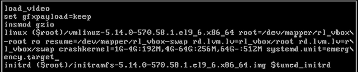
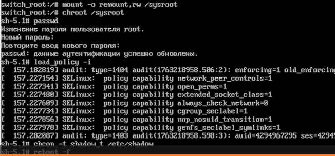

---
## Front matter
lang: ru-RU
title: Лабораторная работа №11
author:
  - Кичигина Полина Евгеньевна
institute:
  - Российский университет дружбы народов, Москва, Россия
date: 15 ноября 2025

## i18n babel
babel-lang: russian
babel-otherlangs: english

## Formatting pdf
toc: false
toc-title: Содержание
slide_level: 2
aspectratio: 169
section-titles: true
theme: metropolis
header-includes:
 - \metroset{progressbar=frametitle,sectionpage=progressbar,numbering=fraction}
---

## Цель работы

Получить навыки работы с загрузчиком системы GRUB2.

## Задание

1. Продемонстрируйте навыки по изменению параметров GRUB и записи изменений
в файл конфигурации.
2. Продемонстрируйте навыки устранения неполадок при работе с GRUB.
3. Продемонстрируйте навыки работы с GRUB без использования root.

## Выполнение лабораторной работы

1. Mодификация параметров GRUB2.

Запустите терминал и получите полномочия администратора. В файле /etc/default/grub установите параметр отображения меню загрузки в течение 10 секунд.Сохраните изменения в файле и закройте редактор.
Запишите изменения в GRUB2, введя в командной строке. Перезагрузите систему.

{#fig:001 width=70%}

## 2. Устранения неполадок.

Запустите (перегрузите) систему. Как только появится меню GRUB, выберите строку
с текущей версией ядра в меню и нажмите e для редактирования.
Прокрутите вниз до строки, начинающейся с linux ($root)/vmlinuz-. В конце этой строки введите
 systemd.unit=rescue.target и удалите опции rhgb и quit.
Нажмите Ctrl + x для продолжения процесса загрузки.

{#fig:002 width=70%}

##

Введите пароль пользователя root при появлении запроса.
Посмотрите список всех файлов модулей, которые загружены в настоящее время.
Вы можете видеть, что загружена базовая системная среда.
Посмотрите задействованные переменные среды оболочки. Перегрузите систему.

{#fig:003 width=70%}

##

Как только отобразится меню GRUB, ещё раз нажмите e на строке с текущей версией
ядра, чтобы войти в режим редактора. В конце строки, загружающей ядро, введите
systemd.unit=emergency.target и удалите опции rhgb и quit.Введите пароль пользователя root при появлении запроса.Посмотрите список всех загруженных файлов модулей.
Обратите внимание, что количество загружаемых файлов модулей уменьшилось до
минимума.Перегрузите систему.

{#fig:004 width=70%}

## 3. Сброс пароля root.

Запустите (перегрузите) компьютер. Когда отобразится меню GRUB, выберите в меню
строку с текущей версией ядра системы и нажмите e , чтобы войти в режим редактора.
В конце строки, загружающей ядро, введите rd.break и удалите опции rhgb и quit.

{#fig:005 width=70%}

##

Сделайте содержимое каталога /sysimage новым корневым каталогом. Теперь вы можете ввести команду задания пароля и установить новый пароль для пользователя root.
На этом этапе вы должны загрузить политику SELinux. Теперь вы можете вручную установить правильный тип контекста для /etc/shadow. Перезагрузите систему с помощью команды reboot -f и войдите в систему
с изменённым паролем для пользователя root.

{#fig:006 width=70%}

## Выводы

Мы получили навыки работы с загрузчиком системы GRUB2.

