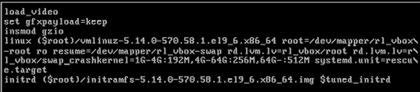
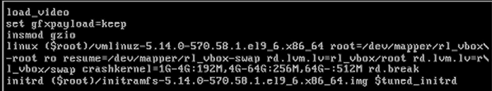

---
## Front matter
title: "Отчёт по лабораторной работе №11"
subtitle: "Отчет"
author: "Кичигина Полина Евгеньевна"

## Generic otions
lang: ru-RU
toc-title: "Содержание"

## Bibliography
bibliography: bib/cite.bib
csl: pandoc/csl/gost-r-7-0-5-2008-numeric.csl

## Pdf output format
toc: true # Table of contents
toc-depth: 2
lof: true # List of figures
lot: true # List of tables
fontsize: 12pt
linestretch: 1.5
papersize: a4
documentclass: scrreprt
## I18n polyglossia
polyglossia-lang:
  name: russian
  options:
	- spelling=modern
	- babelshorthands=true
polyglossia-otherlangs:
  name: english
## I18n babel
babel-lang: russian
babel-otherlangs: english
## Fonts
mainfont: IBM Plex Serif
romanfont: IBM Plex Serif
sansfont: IBM Plex Sans
monofont: IBM Plex Mono
mathfont: STIX Two Math
mainfontoptions: Ligatures=Common,Ligatures=TeX,Scale=0.94
romanfontoptions: Ligatures=Common,Ligatures=TeX,Scale=0.94
sansfontoptions: Ligatures=Common,Ligatures=TeX,Scale=MatchLowercase,Scale=0.94
monofontoptions: Scale=MatchLowercase,Scale=0.94,FakeStretch=0.9
mathfontoptions:
## Biblatex
biblatex: true
biblio-style: "gost-numeric"
biblatexoptions:
  - parentracker=true
  - backend=biber
  - hyperref=auto
  - language=auto
  - autolang=other*
  - citestyle=gost-numeric
## Pandoc-crossref LaTeX customization
figureTitle: "Рис."
tableTitle: "Таблица"
listingTitle: "Листинг"
lofTitle: "Список иллюстраций"
lotTitle: "Список таблиц"
lolTitle: "Листинги"
## Misc options
indent: true
header-includes:
  - \usepackage{indentfirst}
  - \usepackage{float} # keep figures where there are in the text
  - \floatplacement{figure}{H} # keep figures where there are in the text
---

# Цель работы

Получить навыки работы с загрузчиком системы GRUB2.

# Задание

1. Продемонстрируйте навыки по изменению параметров GRUB и записи изменений
в файл конфигурации.
2. Продемонстрируйте навыки устранения неполадок при работе с GRUB.
3. Продемонстрируйте навыки работы с GRUB без использования root.

# Выполнение лабораторной работы

1. Mодификация параметров GRUB2.

Запустите терминал и получите полномочия администратора. В файле /etc/default/grub установите параметр отображения меню загрузки в течение 10 секунд.
Сохраните изменения в файле и закройте редактор.
Запишите изменения в GRUB2, введя в командной строке. Перезагрузите систему и убедитесь, что при загрузке вы видите прокрутку загрузочных сообщений. Если вы не наблюдаете меню GRUB, то в файле /etc/default/grub
удалите из строки указания параметров запуска ядра системы GRUB_CMDLINE_LINUX
параметры rhgb и quiet, которые отвечают за показ графической заставки при запус-
ке системы (для дистрибутивов, основанных на Red Hat), скрывая процесс загрузки от
пользователя. Сохраните изменения в файле и закройте редактор. Запишите измене-
ния в GRUB2.(рис. [-@fig:001])

{#fig:001 width=70%}

2. Устранения неполадок.

Запустите (перегрузите) систему. Как только появится меню GRUB, выберите строку
с текущей версией ядра в меню и нажмите e для редактирования.
Прокрутите вниз до строки, начинающейся с linux ($root)/vmlinuz-. Эта строка
загружает ядро системы. В конце этой строки введите
 systemd.unit=rescue.target
 и удалите опции rhgb и quit из этой строки, если они там есть.
Нажмите Ctrl + x для продолжения процесса загрузки. (рис. [-@fig:002])

{#fig:002 width=70%}

Введите пароль пользователя root при появлении запроса.
Посмотрите список всех файлов модулей, которые загружены в настоящее время.
Вы можете видеть, что загружена базовая системная среда.
Посмотрите задействованные переменные среды оболочки. Перегрузите систему.(рис. [-@fig:003])

{#fig:003 width=70%}

Как только отобразится меню GRUB, ещё раз нажмите e на строке с текущей версией
ядра, чтобы войти в режим редактора. В конце строки, загружающей ядро, введите
systemd.unit=emergency.target
и удалите опции rhgb и quit из этой строки, если они там есть.
Нажмите Ctrl + x для продолжения процесса загрузки.
 Введите пароль пользователя root при появлении запроса.
 После успешного входа в систему посмотрите список всех загруженных файлов модулей.
Обратите внимание, что количество загружаемых файлов модулей уменьшилось до
минимума.
Перегрузите систему.(рис. [-@fig:004])

{#fig:004 width=70%}

3. Сброс пароля root.

Обычный сценарий для администратора Linux заключается в том, что пароль root
отсутствует. Если это произойдёт, вам необходимо сбросить его. Единственный способ
сделать это — загрузить систему в минимальном режиме, который позволяет войти
в систему без ввода пароля. Для этого выполните следующие действия.
Запустите (перегрузите) компьютер. Когда отобразится меню GRUB, выберите в меню
строку с текущей версией ядра системы и нажмите e , чтобы войти в режим редактора.
В конце строки, загружающей ядро, введите
rd.break
и удалите опции rhgb и quit из этой строки, если они там есть.
 Нажмите Ctrl + x для продолжения процесса загрузки.(рис. [-@fig:005])

{#fig:005 width=70%}

Этап загрузки системы остановится в момент загрузки initramfs, непосредственно
перед монтированием корневой файловой системы в каталоге /.
Сделайте содержимое каталога /sysimage новым корневым каталогом. Теперь вы можете ввести команду задания пароля
и установить новый пароль для пользователя root.
Поскольку на этом очень раннем этапе загрузки SELinux ещё не активирован, то тип
контекста SELinux для файла /etc/shadow будет испорчен. Если вы перезагрузитесь
в этот момент, то никто не сможет войти в систему. Поэтому вы должны убедиться,
что тип контекста установлен правильно. Чтобы сделать это, на этом этапе вы должны
загрузить политику SELinux. Теперь вы можете вручную установить правильный тип контекста для /etc/shadow.
Перезагрузите систему с помощью команды reboot -f и войдите в систему
с изменённым паролем для пользователя root. Опция -f (--force) означает при-
нудительную немедленную остановку, выключение или перезагрузку. При указании
один раз это приводит к немедленному, но чистому завершению работы системным
менеджером. Если указано дважды, это приводит к немедленному завершению работы
без обращения к системному менеджеру.(рис. [-@fig:006])

{#fig:006 width=70%}

# Выводы

Мы получили навыки работы с загрузчиком системы GRUB2.

