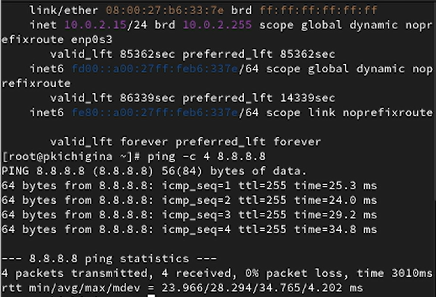

---
## Front matter
lang: ru-RU
title: Лабораторная работа №12
author:
  - Кичигина Полина Евгеньевна
institute:
  - Российский университет дружбы народов, Москва, Россия
date: 22 ноября 2025

## i18n babel
babel-lang: russian
babel-otherlangs: english

## Formatting pdf
toc: false
toc-title: Содержание
slide_level: 2
aspectratio: 169
section-titles: true
theme: metropolis
header-includes:
 - \metroset{progressbar=frametitle,sectionpage=progressbar,numbering=fraction}
---

## Цель работы

Получить навыки настройки сетевых параметров системы.

## Задание

1. Продемонстрируйте навыки использования утилиты ip.
2. Продемонстрируйте навыки использования утилиты nmcli.

## Выполнение лабораторной работы

1. Проверка конфигурации сети.
Выведите на экран информацию о существующих сетевых подключениях,Определите IPv4-адрес устройства и обозначение сетевого адаптера. Используйте команду ping для проверки правильности подключения к Интернету. 

{#fig:001 width=50%}

## 

Добавьте дополнительный адрес к вашему интерфейсу. Проверьте, что адрес добавился. Сравните вывод информации от утилиты ip и от команды ifconfig. Выведите на экран список всех прослушиваемых системой портов UDP и TCP. 

{#fig:002 width=60%}

## 2. Управление сетевыми подключениями с помощью nmcli. 

 Выведите на экран информацию о текущих
соединениях.Переключитесь на статическое соединение. Вернитесь к соединению dhcp.
Проверьте успешность переключения при помощи nmcli connection show
и ip addr 

{#fig:003 width=45%}

## 3. Изменение параметров соединения с помощью nmcli.

Отключите автоподключение статического соединения. Добавьте DNS-сервер в статическое соединение.
Посмотрите настройки сетевых соединений в графическом интерфейсе операционной
системы.
Переключитесь на первоначальное сетевое соединение 

{#fig:004 width=50%}

## Выводы

Мы получить навыки настройки сетевых параметров системы.

