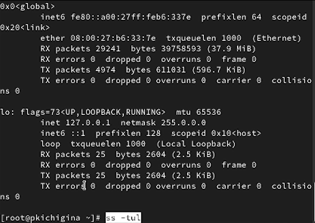
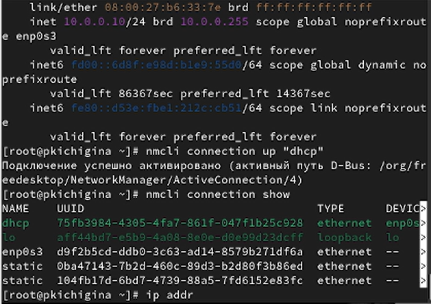
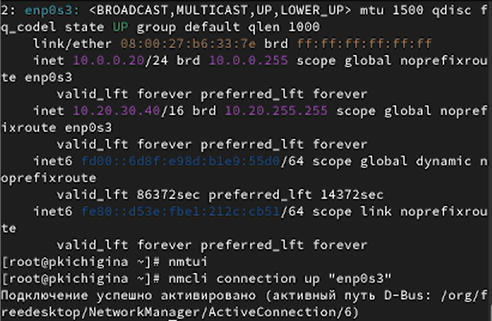

---
## Front matter
title: "Отчёт по лабораторной работе №12"
subtitle: "Отчет"
author: "Кичигина Полина Евгеньевна"

## Generic otions
lang: ru-RU
toc-title: "Содержание"

## Bibliography
bibliography: bib/cite.bib
csl: pandoc/csl/gost-r-7-0-5-2008-numeric.csl

## Pdf output format
toc: true # Table of contents
toc-depth: 2
lof: true # List of figures
lot: true # List of tables
fontsize: 12pt
linestretch: 1.5
papersize: a4
documentclass: scrreprt
## I18n polyglossia
polyglossia-lang:
  name: russian
  options:
	- spelling=modern
	- babelshorthands=true
polyglossia-otherlangs:
  name: english
## I18n babel
babel-lang: russian
babel-otherlangs: english
## Fonts
mainfont: IBM Plex Serif
romanfont: IBM Plex Serif
sansfont: IBM Plex Sans
monofont: IBM Plex Mono
mathfont: STIX Two Math
mainfontoptions: Ligatures=Common,Ligatures=TeX,Scale=0.94
romanfontoptions: Ligatures=Common,Ligatures=TeX,Scale=0.94
sansfontoptions: Ligatures=Common,Ligatures=TeX,Scale=MatchLowercase,Scale=0.94
monofontoptions: Scale=MatchLowercase,Scale=0.94,FakeStretch=0.9
mathfontoptions:
## Biblatex
biblatex: true
biblio-style: "gost-numeric"
biblatexoptions:
  - parentracker=true
  - backend=biber
  - hyperref=auto
  - language=auto
  - autolang=other*
  - citestyle=gost-numeric
## Pandoc-crossref LaTeX customization
figureTitle: "Рис."
tableTitle: "Таблица"
listingTitle: "Листинг"
lofTitle: "Список иллюстраций"
lotTitle: "Список таблиц"
lolTitle: "Листинги"
## Misc options
indent: true
header-includes:
  - \usepackage{indentfirst}
  - \usepackage{float} # keep figures where there are in the text
  - \floatplacement{figure}{H} # keep figures where there are in the text
---

# Цель работы

Получить навыки настройки сетевых параметров системы.

# Задание

1. Продемонстрируйте навыки использования утилиты ip.
2. Продемонстрируйте навыки использования утилиты nmcli.

# Выполнение лабораторной работы

1. Проверка конфигурации сети.

Получите полномочия администратора. Выведите на экран информацию о существующих сетевых подключениях, а также статистику о количестве отправленных пакетов и связанных с ними сообщениях об
ошибках. Выведите на экран информацию о текущих маршрутах. Выведите на экран информацию о текущих назначениях адресов для сетевых интерфейсов на устройстве. Определите
IPv4-адрес устройства и обозначение сетевого адаптера.
 Используйте команду ping для проверки правильности подключения к Интернету. (рис. [-@fig:001]).

{#fig:001 width=70%}

Добавьте дополнительный адрес к вашему интерфейсу. Проверьте, что адрес добавился. Сравните вывод информации от утилиты ip и от команды ifconfig. Выведите на экран список всех прослушиваемых системой портов UDP и TCP. (рис. [-@fig:002])

{#fig:002 width=70%}

2. Управление сетевыми подключениями с помощью nmcli. 

Получите полномочия администратора. Выведите на экран информацию о текущих
соединениях. Добавьте Ethernet-соединение с именем dhcp к интерфейсу. Добавьте к этому же интерфейсу Ethernet-соединение с именем static, статическим
IPv4-адресом адаптера и статическим адресом шлюза. Выведите информацию о текущих соединениях. Переключитесь на статическое соединение. Вернитесь к соединению dhcp.
Проверьте успешность переключения при помощи nmcli connection show
и ip addr (рис. [-@fig:003])

{#fig:003 width=70%}

3. Изменение параметров соединения с помощью nmcli.

Отключите автоподключение статического соединения. Добавьте DNS-сервер в статическое соединение.
Обратите внимание, что при добавлении сетевого подключения используется ip4,
а при изменении параметров для существующего соединения используется ipv4.
Для добавления второго и последующих элементов для тех же параметров использу-
ется знак +. Если этот знак проигнорировать, то произойдёт замена, а не добавление
элемента. Добавьте второй DNS-сервер. Измените IP-адрес статического соединения. Добавьте другой IP-адрес для статического соединения. После изменения свойств соединения активируйте его.
Проверьте успешность переключения при помощи nmcli con show и ip addr.
Используя nmtui, посмотрите и опишите в отчёте настройки сети на устройстве.
Посмотрите настройки сетевых соединений в графическом интерфейсе операционной
системы.
Переключитесь на первоначальное сетевое соединение (рис. [-@fig:004])

{#fig:004 width=70%}

# Выводы

Мы получить навыки настройки сетевых параметров системы.

