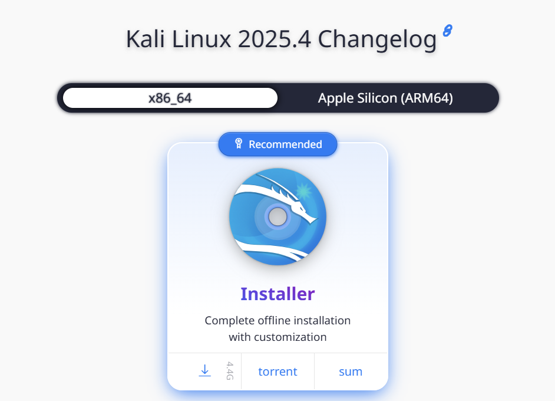
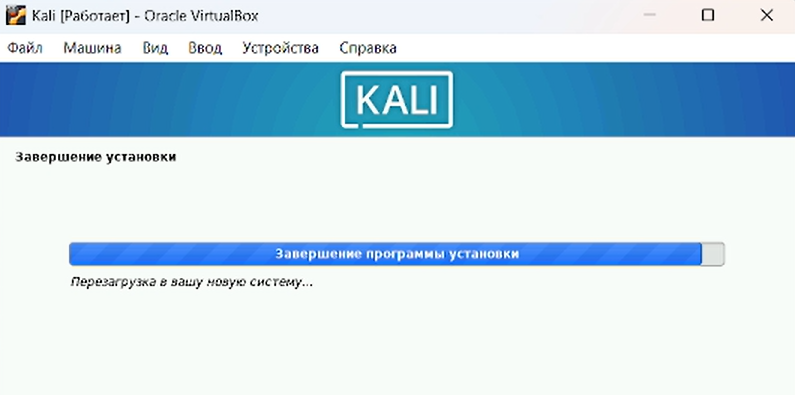
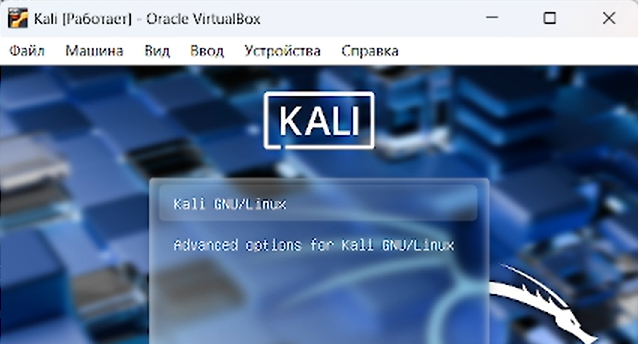

---
## Front matter
lang: ru-RU
title: Первый этап реализации проекта
subtitle: Тестирование веб приложений
author:
  - Кичигина Полина Евгеньевна
institute:
  - Российский университет дружбы народов, Москва, Россия
date: 07 марта 2026

## i18n babel
babel-lang: russian
babel-otherlangs: english

## Formatting pdf
toc: false
toc-title: Содержание
slide_level: 2
aspectratio: 169
section-titles: true
theme: metropolis
header-includes:
 - \metroset{progressbar=frametitle,sectionpage=progressbar,numbering=fraction}
---

## Цель работы

Этап 1. Установка Kali Linux

    Установите дистрибутив Kali Linux в виртуальную машину.
    
    В качестве среды виртуализации предлагается использовать VirtualBox.
    
    Сайт Kali Linux: https://www.kali.org/ 
    
    Учётные данные по умолчанию:
    
        логин: root;
        
        пароль: toor.

## Выполнение первого этапа

1. Скачиваем iso образ диска.

{#fig:001 width=50%}

##

2. Настраиваем операционную систему.

{#fig:002 width=70%}

##

3. Ждем загрузку.

{#fig:003 width=70%}

##

4. Запускаем операционную систему.

{#fig:004 width=70%}

## Выводы

Мы научились устанавливать дистрибутив Kali Linux в виртуальную машину.

## {.standout}

Спасибо за внимание!

