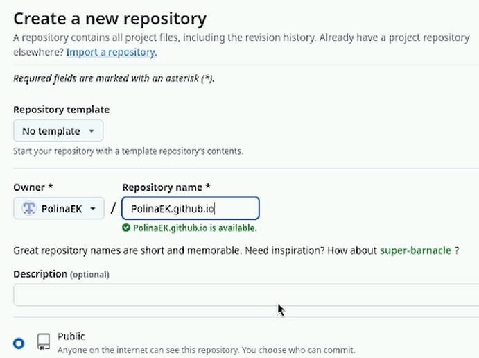

---
## Front matter
lang: ru-RU
title: Первый этап реализации проекта
subtitle: Персональный сайт научного работника
author:
  - Кичигина Полина Евгеньевна
institute:
  - Российский университет дружбы народов, Москва, Россия
date: 08 марта 2025

## i18n babel
babel-lang: russian
babel-otherlangs: english

## Formatting pdf
toc: false
toc-title: Содержание
slide_level: 2
aspectratio: 169
section-titles: true
theme: metropolis
header-includes:
 - \metroset{progressbar=frametitle,sectionpage=progressbar,numbering=fraction}
---

## Цель работы

Размещение на Github pages заготовки для персонального сайта.

## Задание

Установить необходимое программное обеспечение.
Скачать шаблон темы сайта.
Разместить его на хостинге git.
Установить параметр для URLs сайта.
Разместить заготовку сайта на Github pages.

## hugo

 Скачиваем исполняемый файл hugo 

{#fig:001 width=37%}

## репозиторий blog 

Создаем новый репозиторий "blog" при помощи шаблона 

{#fig:002 width=50%}

## Разархивация

Разархивируем скачанный файл и переместим в usr/local/bin 

{#fig:003 width=70%}

## Клонирование

 Клонируем наш новый репозиторий 

{#fig:004 width=70%}

## go

Производим установку "go" 

{#fig:005 width=70%}

## Выполняем команду hugo 

{#fig:006 width=70%}

## Удаление каталога "public" 

{#fig:007 width=70%}

## Ссылка на локальный сайт 

Вводим команду hugo server и получаем ссылку на наш локальный сайт 

{#fig:008 width=70%} 

## Репозиторий со специальным названием

Создаем новый репозиторий со специальным названием 

{#fig:009 width=50%}

## Клонируем репозиторий 

{#fig:010 width=70%}

## Отправляем Файлы на github 

{#fig:011 width=70%}

## Подключение каталога к репозиторию

Выполняем команду для подключения каталога public к новому репозиторию 

{#fig:012 width=70%}

## Автоматическая генерация файлов

С помощью команды hugo генерируем файлы в папку public 

{#fig:013 width=70%}

## Синхронизация файлов

 Синхронизируем файлы из каталога  public с репозиторием. После загружаем файлы в репозиторий 

{#fig:014 width=70%}

## Переходим на github и обновляем страницу репозитория 

{#fig:015 width=70%}

## Копируем ссылку на наш сайт и переходим на него 

{#fig:016 width=50%}

## Выводы

Мы научились размещать на Github pages заготовки для персонального сайта.

## {.standout}

Спасибо за внимание!

