---
## Front matter
title: "Отчет по первому этапу реализации проекта"
subtitle: "Персональный сайт научного работкника"
author: "Кичигина Полина Евгеньевна"

## Generic otions
lang: ru-RU
toc-title: "Содержание"

## Bibliography
bibliography: bib/cite.bib
csl: pandoc/csl/gost-r-7-0-5-2008-numeric.csl

## Pdf output format
toc: true # Table of contents
toc-depth: 2
lof: true # List of figures
lot: true # List of tables
fontsize: 12pt
linestretch: 1.5
papersize: a4
documentclass: scrreprt
## I18n polyglossia
polyglossia-lang:
  name: russian
  options:
	- spelling=modern
	- babelshorthands=true
polyglossia-otherlangs:
  name: english
## I18n babel
babel-lang: russian
babel-otherlangs: english
## Fonts
mainfont: IBM Plex Serif
romanfont: IBM Plex Serif
sansfont: IBM Plex Sans
monofont: IBM Plex Mono
mathfont: STIX Two Math
mainfontoptions: Ligatures=Common,Ligatures=TeX,Scale=0.94
romanfontoptions: Ligatures=Common,Ligatures=TeX,Scale=0.94
sansfontoptions: Ligatures=Common,Ligatures=TeX,Scale=MatchLowercase,Scale=0.94
monofontoptions: Scale=MatchLowercase,Scale=0.94,FakeStretch=0.9
mathfontoptions:
## Biblatex
biblatex: true
biblio-style: "gost-numeric"
biblatexoptions:
  - parentracker=true
  - backend=biber
  - hyperref=auto
  - language=auto
  - autolang=other*
  - citestyle=gost-numeric
## Pandoc-crossref LaTeX customization
figureTitle: "Рис."
tableTitle: "Таблица"
listingTitle: "Листинг"
lofTitle: "Список иллюстраций"
lotTitle: "Список таблиц"
lolTitle: "Листинги"
## Misc options
indent: true
header-includes:
  - \usepackage{indentfirst}
  - \usepackage{float} # keep figures where there are in the text
  - \floatplacement{figure}{H} # keep figures where there are in the text
---

# Цель работы

Размещение на Github pages заготовки для персонального сайта.

# Задание

Установить необходимое программное обеспечение.
Скачать шаблон темы сайта.
Разместить его на хостинге git.
Установить параметр для URLs сайта.
Разместить заготовку сайта на Github pages.

# Выполнение первого этапа

1. Скачиваем исполняемый файл hugo (рис. [-@fig:001])

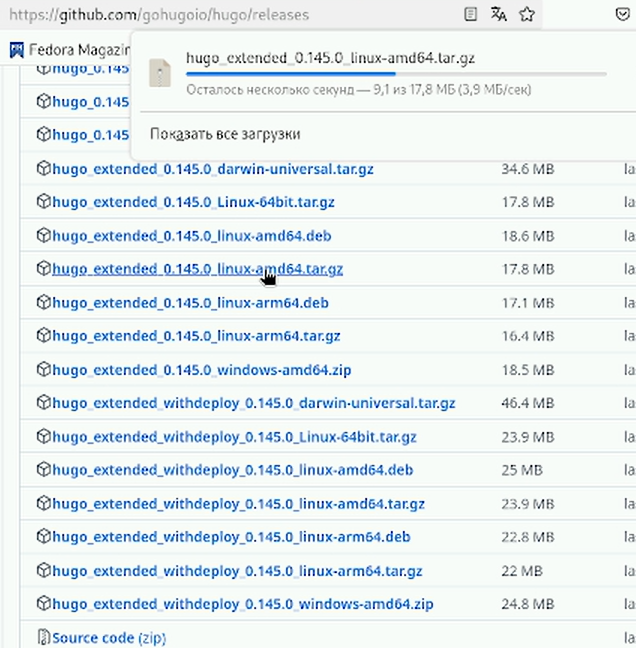{#fig:001 width=70%}

2. Создаем новый репозиторий "blog" при помощи шаблона (рис. [-@fig:002])

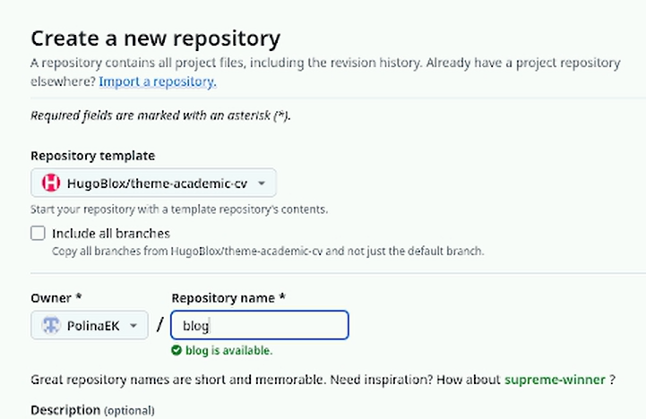{#fig:002 width=70%}

3. Разархивируем скачанный файл и переместим в usr/local/bin (рис. [-@fig:003])

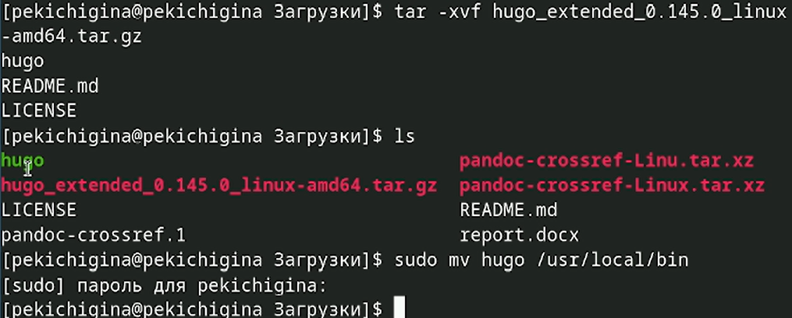{#fig:003 width=70%}

4. Клонируем наш новый репозиторий (рис. [-@fig:004])

{#fig:004 width=70%}

5. Производим установку "go" (рис. [-@fig:005])

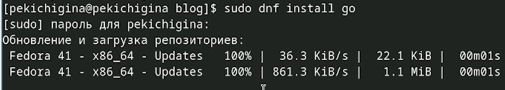{#fig:005 width=70%}

6. Выполняем команду hugo (рис. [-@fig:006])

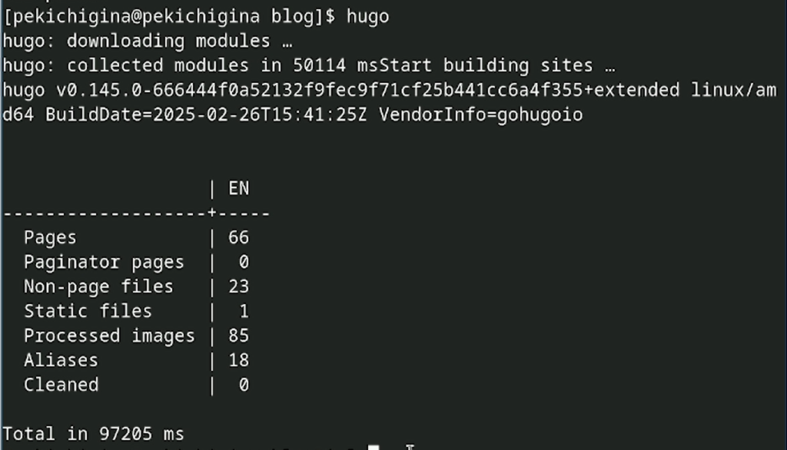{#fig:006 width=70%}

7. Выполняем удаление каталога "public" (рис. [-@fig:007])

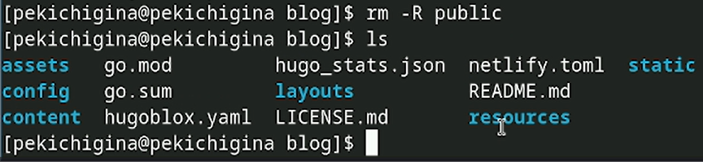{#fig:007 width=70%}

8. Вводим команду hugo server и получаем ссылку на наш локальный сайт (рис. [-@fig:008])

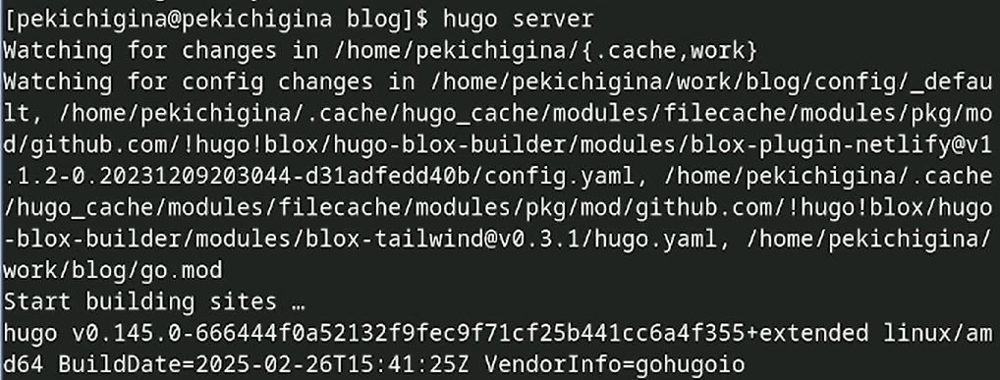{#fig:008 width=70%} 

9. Создаем новый репозиторий со специальным названием (рис. [-@fig:009])

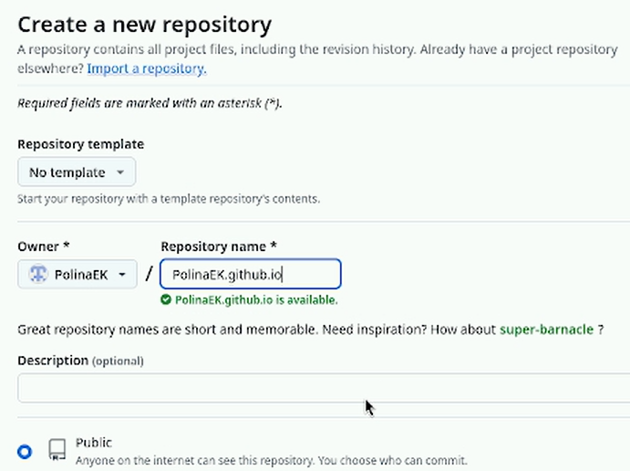{#fig:009 width=70%}

10. Клонируем репозиторий (рис. [-@fig:010])

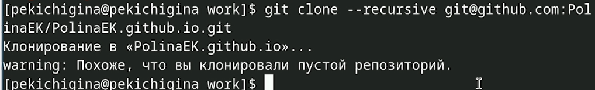{#fig:010 width=70%}

11. Отправляем Файлы на github (рис. [-@fig:011])

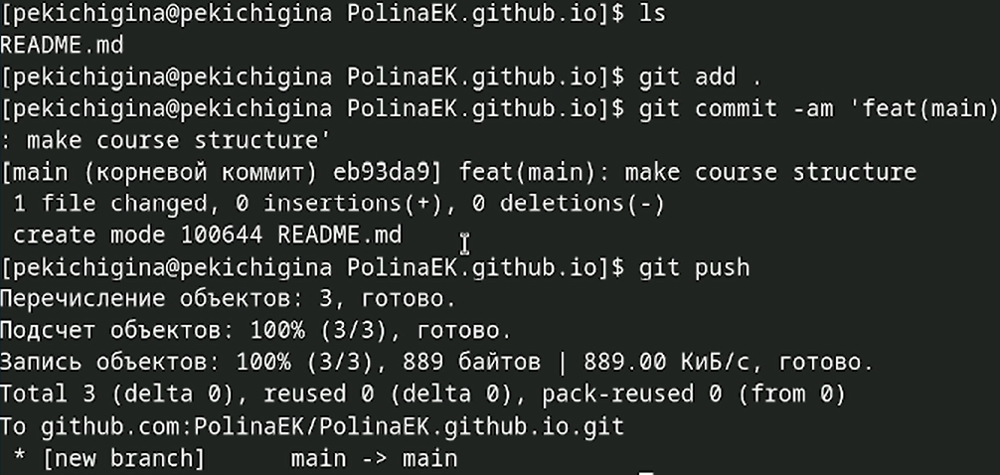{#fig:011 width=70%}

12. Выполняем команду для подключения каталога public к новому репозиторию (рис. [-@fig:012])

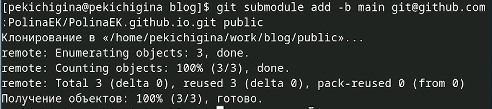{#fig:012 width=70%}

13. С помощью команды hugo генерируем файлы в папку public (рис. [-@fig:013])

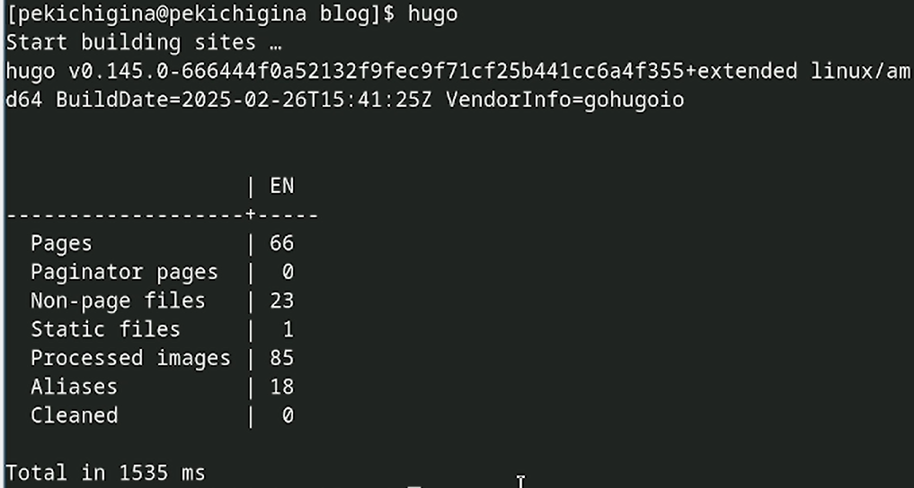{#fig:013 width=70%}

14. Синхронизируем файлы из каталога  public с репозиторием. После загружаем файлы в репозиторий (рис. [-@fig:014])

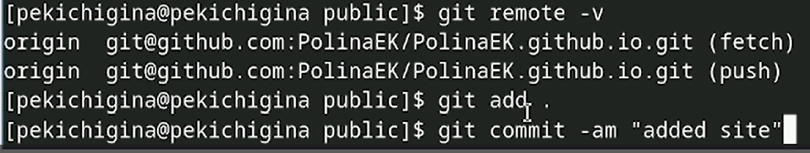{#fig:014 width=70%}

15. Переходим на github и обновляем страницу репозитория (рис. [-@fig:015])

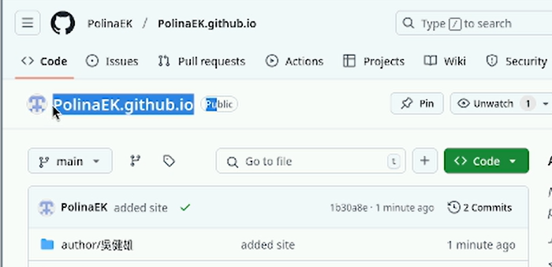{#fig:015 width=70%}

16. Копируем ссылку на наш сайт и переходим на него (рис. [-@fig:016])

{#fig:016 width=70%}

# Выводы

Мы научились размещать на Github pages заготовки для персонального сайта.

