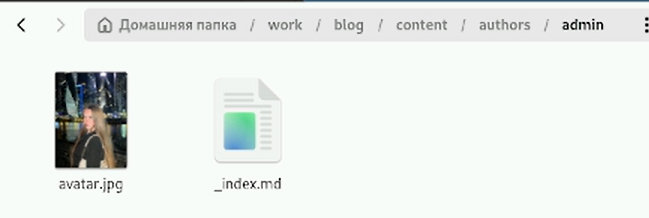
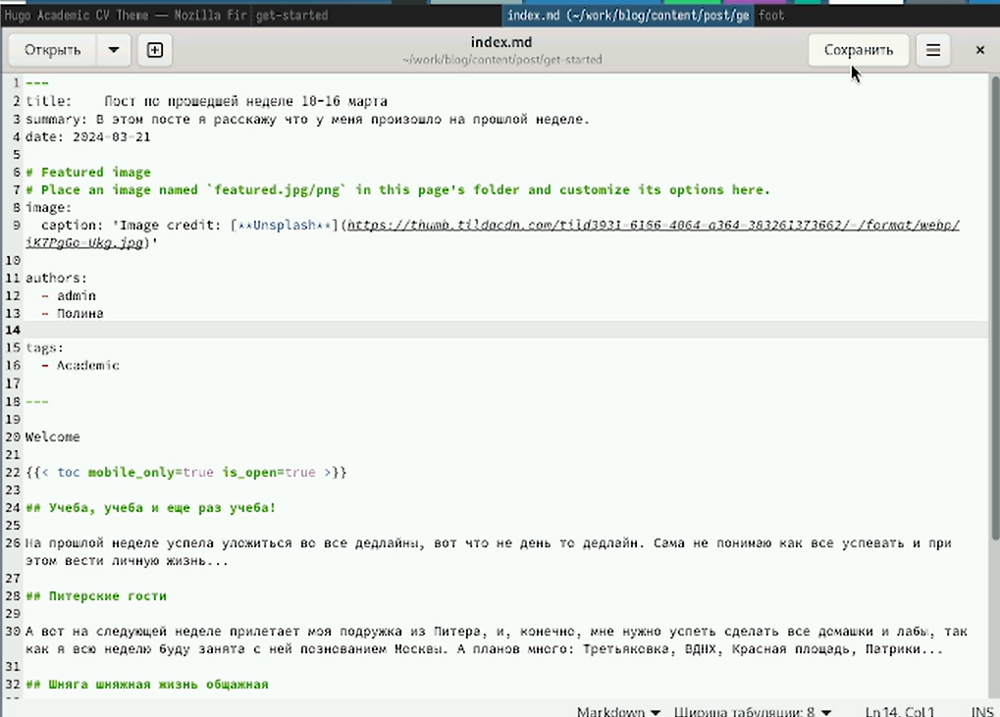
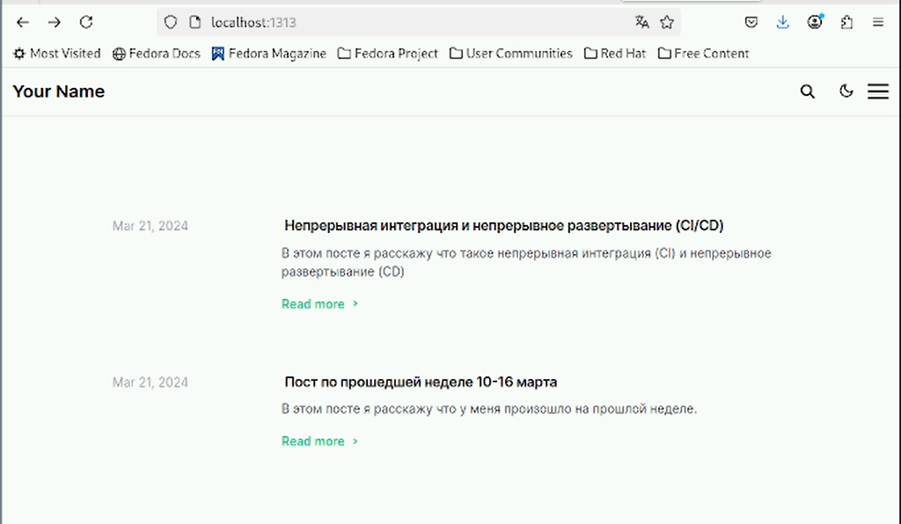
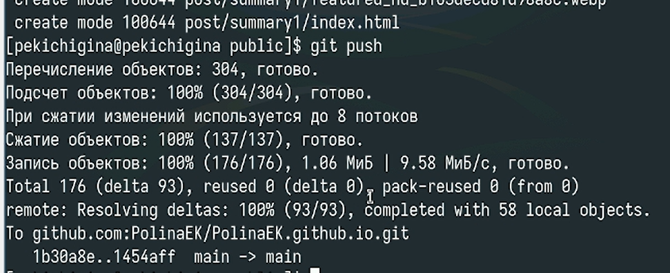
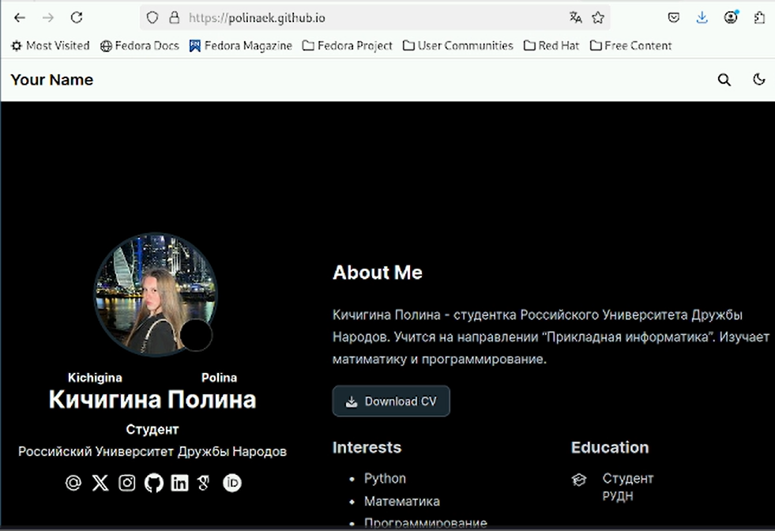

---
## Front matter
lang: ru-RU
title: Второй этап реализации проекта
subtitle: Персональный сайт научного работника
author:
  - Кичигина Полина Евгеньевна
institute:
  - Российский университет дружбы народов, Москва, Россия
date: 21 марта 2025

## i18n babel
babel-lang: russian
babel-otherlangs: english

## Formatting pdf
toc: false
toc-title: Содержание
slide_level: 2
aspectratio: 169
section-titles: true
theme: metropolis
header-includes:
 - \metroset{progressbar=frametitle,sectionpage=progressbar,numbering=fraction}
---

## Цель работы

Добавить к сайту данные о себе.

## Задание

Добавить к сайту данные о себе.

Список добавляемых данных.

Разместить фотографию владельца сайта.

Разместить краткое описание владельца сайта (Biography).

Добавить информацию об интересах (Interests).

Добавить информацию от образовании (Education).

Сделать пост по прошедшей неделе.

Добавить пост на тему: Непрерывная интеграция и непрерывное развертывание (CI/CD).

## Выполнение

Добавляем фотографию и дополняем биографию 

{#fig:001 width=70%}

## Пишем пост по прошедшей неделе и пост на тему по выбору 

{#fig:002 width=55%}

## Размещаем на сайте обновленную информацию и посты 

{#fig:003 width=70%}

## Загружаем файлы на github 

{#fig:004 width=70%}

## Наблюдаем итог работы 

{#fig:005 width=60%}

## Выводы

Мы научились добавлять к сайту информацию о себе и писать посты.
