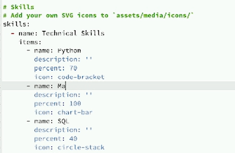
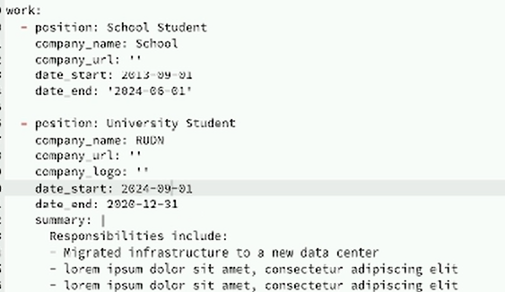
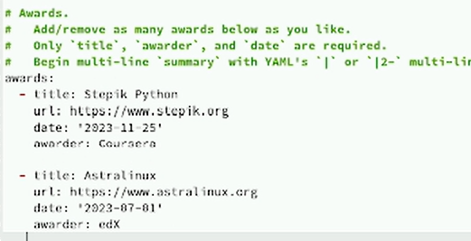
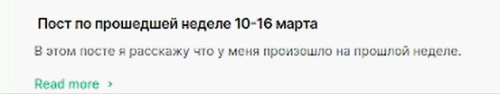
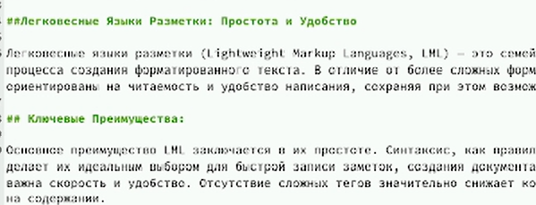

---
## Front matter
lang: ru-RU
title: Третий этап реализации проекта
subtitle: Персональный сайт научного работника
author:
  - Кичигина Полина Евгеньевна
institute:
  - Российский университет дружбы народов, Москва, Россия
date: 21 марта 2025

## i18n babel
babel-lang: russian
babel-otherlangs: english

## Formatting pdf
toc: false
toc-title: Содержание
slide_level: 2
aspectratio: 169
section-titles: true
theme: metropolis
header-includes:
 - \metroset{progressbar=frametitle,sectionpage=progressbar,numbering=fraction}
---

## Цель работы

Добавить к сайту данные о себе.

## Задание 

Добавить к сайту достижения.

## Выполнение. Список достижений.

Добавить информацию о навыках (Skills)

{#fig:001 width=50%}

## Добавить информацию об опыте (Experience)

{#fig:002 width=70%}
        
## Добавить информацию о достижениях (Accomplishments)

{#fig:003 width=70%}

## Сделать пост по прошедшей неделе

{#fig:004 width=70%}

## Добавить пост на тему по выбору:
        
Легковесные языки разметки

{#fig:005 width=70%}

## Выводы

Мы научились добавлять к сайту информацию о себе и писать посты.
