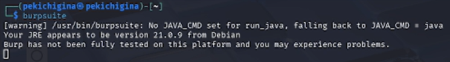
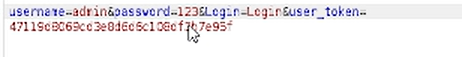
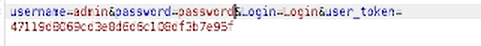

---
## Front matter
lang: ru-RU
title: Пятый этап реализации проекта
subtitle: Тестирование веб приложений
author:
  - Кичигина Полина Евгеньевна
institute:
  - Российский университет дружбы народов, Москва, Россия
date: 16 мая 2026

## i18n babel
babel-lang: russian
babel-otherlangs: english

## Formatting pdf
toc: false
toc-title: Содержание
slide_level: 2
aspectratio: 169
section-titles: true
theme: metropolis
header-includes:
 - \metroset{progressbar=frametitle,sectionpage=progressbar,numbering=fraction}
---

## Цель работы

Burp Suite представляет собой набор мощных инструментов безопасности веб-приложений, которые демонстрируют реальные возможности злоумышленника, проникающего в веб-приложения. 

## Выполнение 

Запускаем Burp Suite в терминале.

{#fig:001 width=70%}

##
     
Включаем intercept в Burp Suite. Пишем логин и неверный пароль на сайте DVWA.

{#fig:002 width=70%}

##

Перехватываем запрос с неверным паролем.

{#fig:003 width=70%}

##

Модификация параметра password в Burp Suite.

{#fig:004 width=70%}

##

Успешный вход в DVWA после модификации запроса.

{#fig:005 width=70%}

## Выводы

Мы научились пользоваться Burp Suite.
